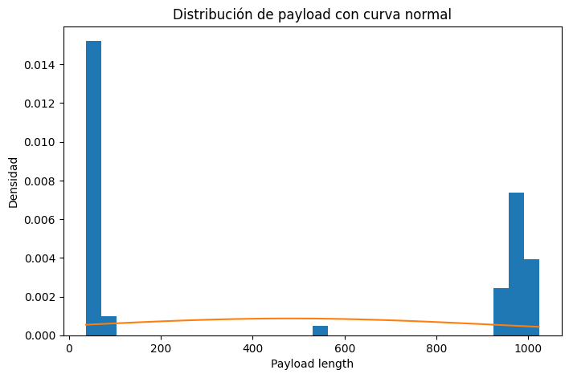
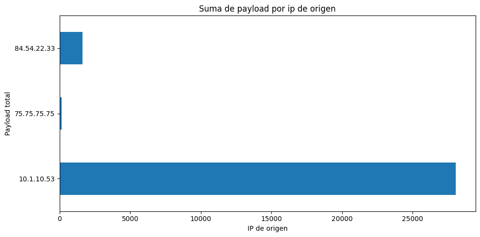
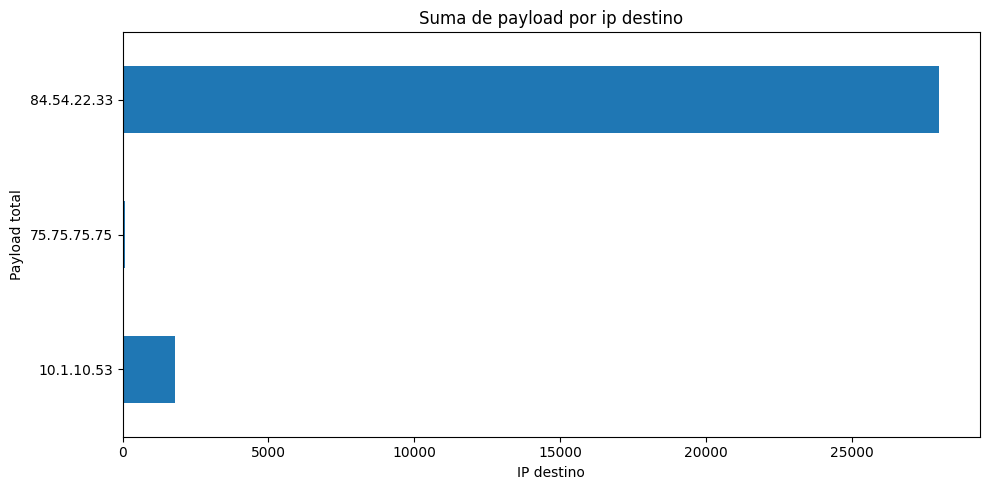
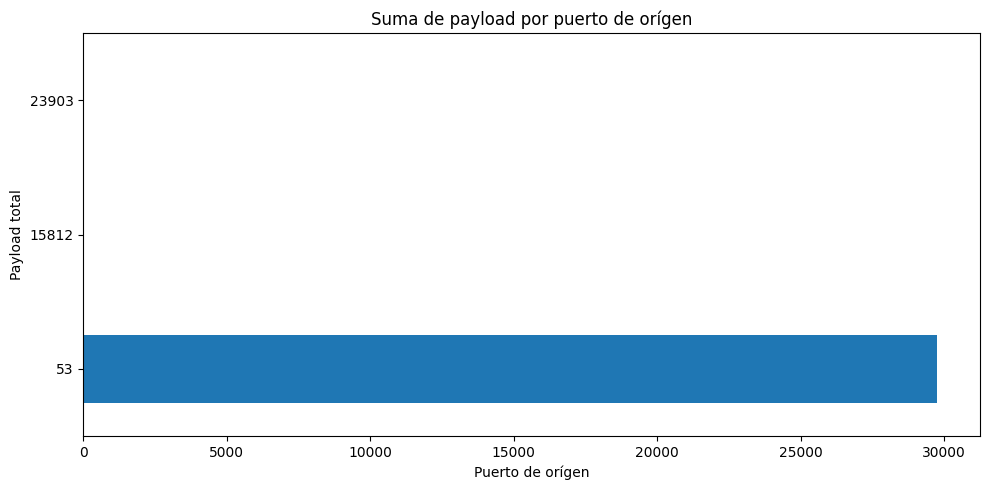
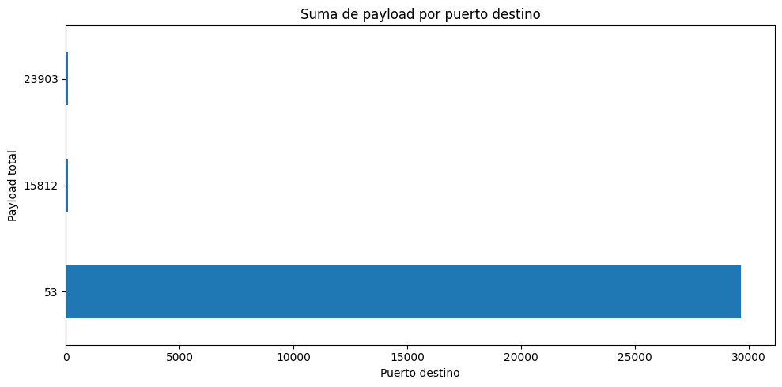

---
jupyter:
  kernelspec:
    display_name: Python 3
    language: python
    name: python3
  language_info:
    codemirror_mode:
      name: ipython
      version: 3
    file_extension: .py
    mimetype: text/x-python
    name: python
    nbconvert_exporter: python
    pygments_lexer: ipython3
    version: 3.12.2
  nbformat: 4
  nbformat_minor: 5
---

::: {#8d399046 .cell .markdown}
# Laboratorio 5

-   Pedro Pablo Guzmán Mayen
:::

::: {#bdaa5972 .cell .code execution_count="50"}
``` python
import pandas as pd
from scapy.all import *
import numpy as np
import matplotlib.pyplot as plt
import binascii
import matplotlib.dates as mdates
from sklearn.ensemble import IsolationForest
from sklearn.preprocessing import StandardScaler
from sklearn.metrics import f1_score
```
:::

::: {#42e3273e .cell .markdown}
## Parte 1
:::

::: {#88cf60ea .cell .markdown}
### Testeo de scapy

Primero, vamos a indicar que queremos capturar 10 paquetes
:::

::: {#3bca9128 .cell .code execution_count="2"}
``` python
p = sniff(filter='ip', count=10)
```
:::

::: {#4f59f344 .cell .code execution_count="3"}
``` python
for pkt in p:

    if IP in pkt:
        
        src_ip = pkt[IP].src
        dst_ip = pkt[IP].dst

        src_port = None
        dst_port = None

        if TCP in pkt:
            src_port = pkt[TCP].sport
            dst_port = pkt[TCP].dport
        elif UDP in pkt:
            src_port = pkt[UDP].sport
            dst_port = pkt[UDP].dport

        print(f'{src_ip} -> {dst_ip} | {src_port} -> {dst_port}')
```

::: {.output .stream .stdout}
    192.168.0.4 -> 192.168.0.13 | 8009 -> 61572
    192.168.0.4 -> 192.168.0.13 | 8009 -> 61572
    192.168.0.13 -> 192.168.0.4 | 61572 -> 8009
    192.168.0.13 -> 192.168.0.4 | 61572 -> 8009
    192.168.0.13 -> 192.168.0.4 | 55973 -> 8009
    192.168.0.4 -> 192.168.0.13 | 8009 -> 61572
    192.168.0.4 -> 192.168.0.13 | 8009 -> 55973
    192.168.0.13 -> 192.168.0.4 | 55973 -> 8009
    192.168.0.13 -> 192.168.0.4 | 55973 -> 8009
    192.168.0.4 -> 192.168.0.13 | 8009 -> 55973
:::
:::

::: {#bc3cd51d .cell .markdown}
### Detección de z-score
:::

::: {#a1b08e74 .cell .markdown}
Ahora, vamos a cargar un archivo de tráfico de red más complejo y vamos
a analizar mediante el z-score si hay anomalías. Primero convertimos en
un df con la información relevante
:::

::: {#e8d2f48c .cell .code execution_count="4"}
``` python
packets = rdpcap('../resources/analisis_paquetes.pcap')
# Collect field names from IP/TCP/UDP (These will be columns in DF)
ip_fields = [field.name for field in IP().fields_desc]
tcp_fields = [field.name for field in TCP().fields_desc]
udp_fields = [field.name for field in UDP().fields_desc]

dataframe_fields = ip_fields + ['time'] + tcp_fields + ['payload','payload_raw','payload_hex']

# Create blank DataFrame
df = pd.DataFrame(columns=dataframe_fields)
for packet in packets[IP]:
    # Field array for each row of DataFrame
    field_values = []
    # Add all IP fields to dataframe
    for field in ip_fields:
        if field == 'options':
            # Retrieving number of options defined in IP Header
            field_values.append(len(packet[IP].fields[field]))
        else:
            field_values.append(packet[IP].fields[field])
    
    field_values.append(packet.time)
    
    layer_type = type(packet[IP].payload)
    for field in tcp_fields:
        try:
            if field == 'options':
                field_values.append(len(packet[layer_type].fields[field]))
            else:
                field_values.append(packet[layer_type].fields[field])
        except:
            field_values.append(None)
    
    # Append payload
    field_values.append(len(packet[layer_type].payload))
    field_values.append(packet[layer_type].payload.original)
    field_values.append(binascii.hexlify(packet[layer_type].payload.original))
    # Add row to DF
    df_append = pd.DataFrame([field_values], columns=dataframe_fields)
    df = pd.concat([df, df_append], axis=0)

# Reset Index
df = df.reset_index()
# Drop old index column
df = df.drop(columns="index")
```
:::

::: {#cc3ef3e3 .cell .markdown}
Ahora que ya es un dataframe, vamos a analizar información relevante
:::

::: {#0fff659d .cell .code execution_count="47"}
``` python
df.shape
```

::: {.output .execute_result execution_count="47"}
    (62, 30)
:::
:::

::: {#a27f0b3d .cell .code execution_count="5"}
``` python
df.head()
```

::: {.output .execute_result execution_count="5"}
```{=html}
<div>
<style scoped>
    .dataframe tbody tr th:only-of-type {
        vertical-align: middle;
    }

    .dataframe tbody tr th {
        vertical-align: top;
    }

    .dataframe thead th {
        text-align: right;
    }
</style>
<table border="1" class="dataframe">
  <thead>
    <tr style="text-align: right;">
      <th></th>
      <th>version</th>
      <th>ihl</th>
      <th>tos</th>
      <th>len</th>
      <th>id</th>
      <th>flags</th>
      <th>frag</th>
      <th>ttl</th>
      <th>proto</th>
      <th>chksum</th>
      <th>...</th>
      <th>dataofs</th>
      <th>reserved</th>
      <th>flags</th>
      <th>window</th>
      <th>chksum</th>
      <th>urgptr</th>
      <th>options</th>
      <th>payload</th>
      <th>payload_raw</th>
      <th>payload_hex</th>
    </tr>
  </thead>
  <tbody>
    <tr>
      <th>0</th>
      <td>4</td>
      <td>5</td>
      <td>0</td>
      <td>961</td>
      <td>1</td>
      <td></td>
      <td>0</td>
      <td>64</td>
      <td>17</td>
      <td>21222</td>
      <td>...</td>
      <td>None</td>
      <td>None</td>
      <td>None</td>
      <td>None</td>
      <td>62990</td>
      <td>None</td>
      <td>None</td>
      <td>933</td>
      <td>b'\x00\x0c\x01\x00\x00\x01\x00\x00\x00\x00\x00...</td>
      <td>b'000c0100000100000000000006676f6f676c6503636f...</td>
    </tr>
    <tr>
      <th>1</th>
      <td>4</td>
      <td>5</td>
      <td>32</td>
      <td>84</td>
      <td>58919</td>
      <td></td>
      <td>0</td>
      <td>122</td>
      <td>17</td>
      <td>13836</td>
      <td>...</td>
      <td>None</td>
      <td>None</td>
      <td>None</td>
      <td>None</td>
      <td>65061</td>
      <td>None</td>
      <td>None</td>
      <td>56</td>
      <td>b'\x00\x0c\x81\x80\x00\x01\x00\x01\x00\x00\x00...</td>
      <td>b'000c8180000100010000000006676f6f676c6503636f...</td>
    </tr>
    <tr>
      <th>2</th>
      <td>4</td>
      <td>5</td>
      <td>0</td>
      <td>975</td>
      <td>1</td>
      <td></td>
      <td>0</td>
      <td>64</td>
      <td>17</td>
      <td>21208</td>
      <td>...</td>
      <td>None</td>
      <td>None</td>
      <td>None</td>
      <td>None</td>
      <td>36378</td>
      <td>None</td>
      <td>None</td>
      <td>947</td>
      <td>b'\x00\x0c\x01\x00\x00\x01\x00\x00\x00\x00\x00...</td>
      <td>b'000c0100000100000000000006676f6f676c6503636f...</td>
    </tr>
    <tr>
      <th>3</th>
      <td>4</td>
      <td>5</td>
      <td>32</td>
      <td>84</td>
      <td>59493</td>
      <td></td>
      <td>0</td>
      <td>122</td>
      <td>17</td>
      <td>13262</td>
      <td>...</td>
      <td>None</td>
      <td>None</td>
      <td>None</td>
      <td>None</td>
      <td>65063</td>
      <td>None</td>
      <td>None</td>
      <td>56</td>
      <td>b'\x00\x0c\x81\x80\x00\x01\x00\x01\x00\x00\x00...</td>
      <td>b'000c8180000100010000000006676f6f676c6503636f...</td>
    </tr>
    <tr>
      <th>4</th>
      <td>4</td>
      <td>5</td>
      <td>0</td>
      <td>1012</td>
      <td>1</td>
      <td></td>
      <td>0</td>
      <td>64</td>
      <td>17</td>
      <td>21171</td>
      <td>...</td>
      <td>None</td>
      <td>None</td>
      <td>None</td>
      <td>None</td>
      <td>63846</td>
      <td>None</td>
      <td>None</td>
      <td>984</td>
      <td>b'\x00\x0c\x01\x00\x00\x01\x00\x00\x00\x00\x00...</td>
      <td>b'000c0100000100000000000006676f6f676c6503636f...</td>
    </tr>
  </tbody>
</table>
<p>5 rows × 28 columns</p>
</div>
```
:::
:::

::: {#40ae7256 .cell .code execution_count="6"}
``` python
df.columns
```

::: {.output .execute_result execution_count="6"}
    Index(['version', 'ihl', 'tos', 'len', 'id', 'flags', 'frag', 'ttl', 'proto',
           'chksum', 'src', 'dst', 'options', 'time', 'sport', 'dport', 'seq',
           'ack', 'dataofs', 'reserved', 'flags', 'window', 'chksum', 'urgptr',
           'options', 'payload', 'payload_raw', 'payload_hex'],
          dtype='str')
:::
:::

::: {#ed8965b0 .cell .markdown}
1.  Muestre cuál es la IP origen más frecuente
:::

::: {#bb45c0c1 .cell .code execution_count="7"}
``` python
df['src'].value_counts()
```

::: {.output .execute_result execution_count="7"}
    src
    10.1.10.53     31
    84.54.22.33    29
    75.75.75.75     2
    Name: count, dtype: int64
:::
:::

::: {#de294424 .cell .markdown}
La ip de origen más frecuente es la 10.1.10.53
:::

::: {#7588dd11 .cell .markdown}
1.  Muestre cuál es la IP destino más frecuente
:::

::: {#4490ff33 .cell .code execution_count="8"}
``` python
df['dst'].value_counts()
```

::: {.output .execute_result execution_count="8"}
    dst
    10.1.10.53     31
    84.54.22.33    29
    75.75.75.75     2
    Name: count, dtype: int64
:::
:::

::: {#b0b6361d .cell .markdown}
La ip de destino más frecuente es 10.1.10.53, la misma que el inciso
anterior
:::

::: {#445830d9 .cell .markdown}
1.  ¿A qué IPs se comunica la IP del inciso a?
:::

::: {#bfada6f4 .cell .code execution_count="9"}
``` python
df_frequent_src_ip = df[df['src'] == '10.1.10.53']

df_frequent_src_ip['dst'].value_counts()
```

::: {.output .execute_result execution_count="9"}
    dst
    84.54.22.33    29
    75.75.75.75     2
    Name: count, dtype: int64
:::
:::

::: {#89224020 .cell .markdown}
La ip se comunica a la 84.54.22.33 de forma más frecuente pero también
se comunica con la 75.75.75.75
:::

::: {#de06bcc6 .cell .markdown}
1.  ¿A qué puertos destino se comunica la IP del inciso a?
:::

::: {#bb664208 .cell .code execution_count="10"}
``` python
df_frequent_src_ip['dport'].value_counts()
```

::: {.output .execute_result execution_count="10"}
    dport
    53    31
    Name: count, dtype: int64
:::
:::

::: {#42b15eca .cell .markdown}
Se comunica con más frecuencia el puerto 53
:::

::: {#d432a9bd .cell .markdown}
1.  ¿A qué puertos origen se comunica la IP del inciso b?
:::

::: {#458f34c3 .cell .code execution_count="11"}
``` python
df_frequent_src_ip['sport'].value_counts()
```

::: {.output .execute_result execution_count="11"}
    sport
    53       29
    15812     1
    23903     1
    Name: count, dtype: int64
:::
:::

::: {#89247a6d .cell .markdown}
Casi tiene el puerto 53 como origen pero a veces usa otros como el 15812
o 23903
:::

::: {#c65ba28d .cell .markdown}
1.  Indique el propósito de los puertos que más aparecen en los incisos
    d y e
:::

::: {#f32c49b1 .cell .markdown}
El puerto 53 es el que usa DNS, los otros puertos no se usan de forma
frecuente y son raros de utilizar.
:::

::: {#6ad81394 .cell .markdown}
Ahora vamos a analizar el z-score de los paquetes capturados
:::

::: {#64fa40b9 .cell .code execution_count="12"}
``` python
mean = df["payload"].mean()
std = df["payload"].std()

df["z_score"] = (df["payload"] - mean) / std
```
:::

::: {#0562b3d0 .cell .code execution_count="13"}
``` python
df.head()
```

::: {.output .execute_result execution_count="13"}
```{=html}
<div>
<style scoped>
    .dataframe tbody tr th:only-of-type {
        vertical-align: middle;
    }

    .dataframe tbody tr th {
        vertical-align: top;
    }

    .dataframe thead th {
        text-align: right;
    }
</style>
<table border="1" class="dataframe">
  <thead>
    <tr style="text-align: right;">
      <th></th>
      <th>version</th>
      <th>ihl</th>
      <th>tos</th>
      <th>len</th>
      <th>id</th>
      <th>flags</th>
      <th>frag</th>
      <th>ttl</th>
      <th>proto</th>
      <th>chksum</th>
      <th>...</th>
      <th>reserved</th>
      <th>flags</th>
      <th>window</th>
      <th>chksum</th>
      <th>urgptr</th>
      <th>options</th>
      <th>payload</th>
      <th>payload_raw</th>
      <th>payload_hex</th>
      <th>z_score</th>
    </tr>
  </thead>
  <tbody>
    <tr>
      <th>0</th>
      <td>4</td>
      <td>5</td>
      <td>0</td>
      <td>961</td>
      <td>1</td>
      <td></td>
      <td>0</td>
      <td>64</td>
      <td>17</td>
      <td>21222</td>
      <td>...</td>
      <td>None</td>
      <td>None</td>
      <td>None</td>
      <td>62990</td>
      <td>None</td>
      <td>None</td>
      <td>933</td>
      <td>b'\x00\x0c\x01\x00\x00\x01\x00\x00\x00\x00\x00...</td>
      <td>b'000c0100000100000000000006676f6f676c6503636f...</td>
      <td>0.981296</td>
    </tr>
    <tr>
      <th>1</th>
      <td>4</td>
      <td>5</td>
      <td>32</td>
      <td>84</td>
      <td>58919</td>
      <td></td>
      <td>0</td>
      <td>122</td>
      <td>17</td>
      <td>13836</td>
      <td>...</td>
      <td>None</td>
      <td>None</td>
      <td>None</td>
      <td>65061</td>
      <td>None</td>
      <td>None</td>
      <td>56</td>
      <td>b'\x00\x0c\x81\x80\x00\x01\x00\x01\x00\x00\x00...</td>
      <td>b'000c8180000100010000000006676f6f676c6503636f...</td>
      <td>-0.924107</td>
    </tr>
    <tr>
      <th>2</th>
      <td>4</td>
      <td>5</td>
      <td>0</td>
      <td>975</td>
      <td>1</td>
      <td></td>
      <td>0</td>
      <td>64</td>
      <td>17</td>
      <td>21208</td>
      <td>...</td>
      <td>None</td>
      <td>None</td>
      <td>None</td>
      <td>36378</td>
      <td>None</td>
      <td>None</td>
      <td>947</td>
      <td>b'\x00\x0c\x01\x00\x00\x01\x00\x00\x00\x00\x00...</td>
      <td>b'000c0100000100000000000006676f6f676c6503636f...</td>
      <td>1.011713</td>
    </tr>
    <tr>
      <th>3</th>
      <td>4</td>
      <td>5</td>
      <td>32</td>
      <td>84</td>
      <td>59493</td>
      <td></td>
      <td>0</td>
      <td>122</td>
      <td>17</td>
      <td>13262</td>
      <td>...</td>
      <td>None</td>
      <td>None</td>
      <td>None</td>
      <td>65063</td>
      <td>None</td>
      <td>None</td>
      <td>56</td>
      <td>b'\x00\x0c\x81\x80\x00\x01\x00\x01\x00\x00\x00...</td>
      <td>b'000c8180000100010000000006676f6f676c6503636f...</td>
      <td>-0.924107</td>
    </tr>
    <tr>
      <th>4</th>
      <td>4</td>
      <td>5</td>
      <td>0</td>
      <td>1012</td>
      <td>1</td>
      <td></td>
      <td>0</td>
      <td>64</td>
      <td>17</td>
      <td>21171</td>
      <td>...</td>
      <td>None</td>
      <td>None</td>
      <td>None</td>
      <td>63846</td>
      <td>None</td>
      <td>None</td>
      <td>984</td>
      <td>b'\x00\x0c\x01\x00\x00\x01\x00\x00\x00\x00\x00...</td>
      <td>b'000c0100000100000000000006676f6f676c6503636f...</td>
      <td>1.092101</td>
    </tr>
  </tbody>
</table>
<p>5 rows × 29 columns</p>
</div>
```
:::
:::

::: {#b2435394 .cell .markdown}
Ya con el z-score, vamos a ver si hay paquetes anómalos, que tengan un
z-score mayor a 2, eso incluye a los que tienen el z-score mayor a 3
:::

::: {#5b6baa35 .cell .code execution_count="14"}
``` python
df_anomalies_2 = df[df['z_score'] > 2.0]
df_anomalies_2.shape
```

::: {.output .execute_result execution_count="14"}
    (0, 29)
:::
:::

::: {#f8ba0312 .cell .markdown}
No encontramos paquetes anómalos, vamos a ver la distribución del
payload.
:::

::: {#67c2f6b6 .cell .code execution_count="24"}
``` python
plt.figure(figsize=(8,5))

count, bins, _ = plt.hist(df["payload"], bins=30, density=True)

mean = df["payload"].mean()
std = df["payload"].std()

x = np.linspace(min(bins), max(bins), 100)
y = (1/(std * np.sqrt(2*np.pi))) * np.exp(-0.5*((x-mean)/std)**2)

plt.plot(x, y)

plt.title("Distribución de payload con curva normal")
plt.xlabel("Payload length")
plt.ylabel("Densidad")

plt.show()
```

::: {.output .display_data}

:::
:::

::: {#03cd6d09 .cell .markdown}
Vemos que los valores no están centralizados, hay muchos datos que
superan los 1000 bytes de tamaño mientras que otros rondan los 50 o 10.
Por esa razón vamos a usar conocimiento experto. Una consulta DNS, en
promedio, tiene 50 bytes de tamaño y 15 bytes de desviación estándar
:::

::: {#054f5d32 .cell .code execution_count="25"}
``` python
df["z_score_expert"] = (df["payload"] - 50) / 15
```
:::

::: {#8d29a2cc .cell .code}
``` python
df_new_anomalies = df[df['z_score_expert'] > 2]
```
:::

::: {#08533828 .cell .code execution_count="27"}
``` python
print(df_new_anomalies.shape)
```

::: {.output .stream .stdout}
    (30, 30)
:::
:::

::: {#f0512c92 .cell .code execution_count="31"}
``` python
df_new_anomalies['payload'].astype(int).describe()
```

::: {.output .execute_result execution_count="31"}
    count      30.000000
    mean      935.600000
    std       178.819616
    min        89.000000
    25%       959.500000
    50%       978.000000
    75%       990.500000
    max      1023.000000
    Name: payload, dtype: float64
:::
:::

::: {#2e3f496a .cell .code execution_count="69"}
``` python
df_new_anomalies['src'].value_counts()
```

::: {.output .execute_result execution_count="69"}
    src
    10.1.10.53     29
    75.75.75.75     1
    Name: count, dtype: int64
:::
:::

::: {#1ebc2931 .cell .code execution_count="70"}
``` python
df_new_anomalies['dst'].value_counts()
```

::: {.output .execute_result execution_count="70"}
    dst
    84.54.22.33    29
    10.1.10.53      1
    Name: count, dtype: int64
:::
:::

::: {#5890318f .cell .code execution_count="71"}
``` python
df_new_anomalies['sport'].value_counts()
```

::: {.output .execute_result execution_count="71"}
    sport
    53    30
    Name: count, dtype: int64
:::
:::

::: {#1758feee .cell .code execution_count="72"}
``` python
df_new_anomalies['dport'].value_counts()
```

::: {.output .execute_result execution_count="72"}
    dport
    53       29
    23903     1
    Name: count, dtype: int64
:::
:::

::: {#34f1ae0e .cell .markdown}
Las comunicaciones detectadas como anómalas con el z-score tienen estas
características

-   La IP de orígen es casi siempre la 10.1.10.53 y la de destino la
    84.54.22.33
-   Salen del puerto 53 desde la máquina de orígen y casi siempre se
    comunican con el puerto 53 de la máquina de destino, casi siempre
    usan el puerto de DNS
-   El tamaño del payload de cada comunicación es mayor a 89 bytes
:::

::: {#d9fb41f9 .cell .markdown}
Es importante conocer los protocolos ya que así, sabemos cuáles son los
valores típicos o esperados en cierto tipo de conexión y de esa forma
podemos ajustar de mejor manera los valores que vamos a usar para
detectar anomalías. Un buen ejemplo de esto es el caso anterior, pues
los datos originalmente no tenían una distribución normal y había
conexiones con valores demasiado altos y otras con valores muy bajos,
esto afectaba el valor de la media y la desviación estándar y no nos
permitió identificar anomalías de forma correcta, sin embargo, gracias a
que se sabe que la mayoría de conexiones del conjunto de datos es DNS y
se tiene conocimiento del tamaño típico de este tipo de conexiones,
realizamos un ajuste en los datos el cuál nos permitió detectar las
anomalías de forma correcta.
:::

::: {#36befa90 .cell .markdown}
## Parte 2
:::

::: {#199724ac .cell .code execution_count="40"}
``` python
def graph(group_col: str, interest_col: str, title: str, x_label: str, y_label: str):
    df.groupby(group_col)[interest_col].sum().plot(kind='barh', figsize=(10, 5))
    plt.title(title)
    plt.xlabel(x_label)
    plt.ylabel(y_label)
    plt.tight_layout()
    plt.show()
```
:::

::: {#3397dd81 .cell .markdown}
1.  Muestre una gráfica 2D, en el eje Y las IPs origen, y en el eje X la
    suma de los payloads enviados de dichas direcciones
:::

::: {#fa358464 .cell .code execution_count="42"}
``` python
graph('src', 'payload', 'Suma de payload por ip de origen', 'IP de origen', 'Payload total')
```

::: {.output .display_data}

:::
:::

::: {#1b88b6f4 .cell .markdown}
1.  Muestre una gráfica 2D, en el eje Y las IPs destino, y en el eje X
    la suma de los payloads recibidos en dichas direcciones.
:::

::: {#4774f416 .cell .code execution_count="43"}
``` python
graph('dst', 'payload', 'Suma de payload por ip destino', 'IP destino', 'Payload total')
```

::: {.output .display_data}

:::
:::

::: {#c38d43ed .cell .markdown}
1.  Muestre una gráfica 2D, en el eje Y los puertos origen, y en el eje
    X la suma de los payloads enviados de dichos puertos
:::

::: {#14bea38f .cell .code execution_count="44"}
``` python
graph('sport', 'payload', 'Suma de payload por puerto de orígen', 'Puerto de orígen', 'Payload total')
```

::: {.output .display_data}

:::
:::

::: {#8166c356 .cell .markdown}
1.  Muestre una gráfica 2D, en el eje Y los puertos destino, y en el eje
    X la suma de los payloads recibidos en dichos puertos.
:::

::: {#3d055560 .cell .code execution_count="46"}
``` python
graph('dport', 'payload', 'Suma de payload por puerto destino', 'Puerto destino', 'Payload total')
```

::: {.output .display_data}

:::
:::

::: {#3dcc7d12 .cell .markdown}
## Parte 3
:::

::: {#35019b3f .cell .markdown}
1.  Utilice las columnas numéricas del DataFrame (payload_len y pkt_len)
    para entrenar un modelo de Isolation Forest con un valor igual al
    número de paquetes detectados en el inciso 4c dividido por el número
    de paquetes totales para definir su valor para el parámetro
    contamination. ¿Qué paquetes son marcados como anomalías?
:::

::: {#70ea16dc .cell .markdown}
Como detectamos 30 anomalías con el z-score y tenemos 62 observaciones,
nuestro valor de contaminación será 0.5
:::

::: {#c8b47de2 .cell .code execution_count="48"}
``` python
features = df[['payload', 'len']]
```
:::

::: {#791d44f9 .cell .code execution_count="51"}
``` python
iso_forest = IsolationForest(
    n_estimators=200,          
    contamination=30/62,      
    random_state=42,
    n_jobs=-1                  
)

iso_forest.fit(features)
```

::: {.output .execute_result execution_count="51"}
```{=html}
<style>#sk-container-id-1 {
  /* Definition of color scheme common for light and dark mode */
  --sklearn-color-text: #000;
  --sklearn-color-text-muted: #666;
  --sklearn-color-line: gray;
  /* Definition of color scheme for unfitted estimators */
  --sklearn-color-unfitted-level-0: #fff5e6;
  --sklearn-color-unfitted-level-1: #f6e4d2;
  --sklearn-color-unfitted-level-2: #ffe0b3;
  --sklearn-color-unfitted-level-3: chocolate;
  /* Definition of color scheme for fitted estimators */
  --sklearn-color-fitted-level-0: #f0f8ff;
  --sklearn-color-fitted-level-1: #d4ebff;
  --sklearn-color-fitted-level-2: #b3dbfd;
  --sklearn-color-fitted-level-3: cornflowerblue;
}

#sk-container-id-1.light {
  /* Specific color for light theme */
  --sklearn-color-text-on-default-background: black;
  --sklearn-color-background: white;
  --sklearn-color-border-box: black;
  --sklearn-color-icon: #696969;
}

#sk-container-id-1.dark {
  --sklearn-color-text-on-default-background: white;
  --sklearn-color-background: #111;
  --sklearn-color-border-box: white;
  --sklearn-color-icon: #878787;
}

#sk-container-id-1 {
  color: var(--sklearn-color-text);
}

#sk-container-id-1 pre {
  padding: 0;
}

#sk-container-id-1 input.sk-hidden--visually {
  border: 0;
  clip: rect(1px 1px 1px 1px);
  clip: rect(1px, 1px, 1px, 1px);
  height: 1px;
  margin: -1px;
  overflow: hidden;
  padding: 0;
  position: absolute;
  width: 1px;
}

#sk-container-id-1 div.sk-dashed-wrapped {
  border: 1px dashed var(--sklearn-color-line);
  margin: 0 0.4em 0.5em 0.4em;
  box-sizing: border-box;
  padding-bottom: 0.4em;
  background-color: var(--sklearn-color-background);
}

#sk-container-id-1 div.sk-container {
  /* jupyter's `normalize.less` sets `[hidden] { display: none; }`
     but bootstrap.min.css set `[hidden] { display: none !important; }`
     so we also need the `!important` here to be able to override the
     default hidden behavior on the sphinx rendered scikit-learn.org.
     See: https://github.com/scikit-learn/scikit-learn/issues/21755 */
  display: inline-block !important;
  position: relative;
}

#sk-container-id-1 div.sk-text-repr-fallback {
  display: none;
}

div.sk-parallel-item,
div.sk-serial,
div.sk-item {
  /* draw centered vertical line to link estimators */
  background-image: linear-gradient(var(--sklearn-color-text-on-default-background), var(--sklearn-color-text-on-default-background));
  background-size: 2px 100%;
  background-repeat: no-repeat;
  background-position: center center;
}

/* Parallel-specific style estimator block */

#sk-container-id-1 div.sk-parallel-item::after {
  content: "";
  width: 100%;
  border-bottom: 2px solid var(--sklearn-color-text-on-default-background);
  flex-grow: 1;
}

#sk-container-id-1 div.sk-parallel {
  display: flex;
  align-items: stretch;
  justify-content: center;
  background-color: var(--sklearn-color-background);
  position: relative;
}

#sk-container-id-1 div.sk-parallel-item {
  display: flex;
  flex-direction: column;
}

#sk-container-id-1 div.sk-parallel-item:first-child::after {
  align-self: flex-end;
  width: 50%;
}

#sk-container-id-1 div.sk-parallel-item:last-child::after {
  align-self: flex-start;
  width: 50%;
}

#sk-container-id-1 div.sk-parallel-item:only-child::after {
  width: 0;
}

/* Serial-specific style estimator block */

#sk-container-id-1 div.sk-serial {
  display: flex;
  flex-direction: column;
  align-items: center;
  background-color: var(--sklearn-color-background);
  padding-right: 1em;
  padding-left: 1em;
}


/* Toggleable style: style used for estimator/Pipeline/ColumnTransformer box that is
clickable and can be expanded/collapsed.
- Pipeline and ColumnTransformer use this feature and define the default style
- Estimators will overwrite some part of the style using the `sk-estimator` class
*/

/* Pipeline and ColumnTransformer style (default) */

#sk-container-id-1 div.sk-toggleable {
  /* Default theme specific background. It is overwritten whether we have a
  specific estimator or a Pipeline/ColumnTransformer */
  background-color: var(--sklearn-color-background);
}

/* Toggleable label */
#sk-container-id-1 label.sk-toggleable__label {
  cursor: pointer;
  display: flex;
  width: 100%;
  margin-bottom: 0;
  padding: 0.5em;
  box-sizing: border-box;
  text-align: center;
  align-items: center;
  justify-content: center;
  gap: 0.5em;
}

#sk-container-id-1 label.sk-toggleable__label .caption {
  font-size: 0.6rem;
  font-weight: lighter;
  color: var(--sklearn-color-text-muted);
}

#sk-container-id-1 label.sk-toggleable__label-arrow:before {
  /* Arrow on the left of the label */
  content: "▸";
  float: left;
  margin-right: 0.25em;
  color: var(--sklearn-color-icon);
}

#sk-container-id-1 label.sk-toggleable__label-arrow:hover:before {
  color: var(--sklearn-color-text);
}

/* Toggleable content - dropdown */

#sk-container-id-1 div.sk-toggleable__content {
  display: none;
  text-align: left;
  /* unfitted */
  background-color: var(--sklearn-color-unfitted-level-0);
}

#sk-container-id-1 div.sk-toggleable__content.fitted {
  /* fitted */
  background-color: var(--sklearn-color-fitted-level-0);
}

#sk-container-id-1 div.sk-toggleable__content pre {
  margin: 0.2em;
  border-radius: 0.25em;
  color: var(--sklearn-color-text);
  /* unfitted */
  background-color: var(--sklearn-color-unfitted-level-0);
}

#sk-container-id-1 div.sk-toggleable__content.fitted pre {
  /* unfitted */
  background-color: var(--sklearn-color-fitted-level-0);
}

#sk-container-id-1 input.sk-toggleable__control:checked~div.sk-toggleable__content {
  /* Expand drop-down */
  display: block;
  width: 100%;
  overflow: visible;
}

#sk-container-id-1 input.sk-toggleable__control:checked~label.sk-toggleable__label-arrow:before {
  content: "▾";
}

/* Pipeline/ColumnTransformer-specific style */

#sk-container-id-1 div.sk-label input.sk-toggleable__control:checked~label.sk-toggleable__label {
  color: var(--sklearn-color-text);
  background-color: var(--sklearn-color-unfitted-level-2);
}

#sk-container-id-1 div.sk-label.fitted input.sk-toggleable__control:checked~label.sk-toggleable__label {
  background-color: var(--sklearn-color-fitted-level-2);
}

/* Estimator-specific style */

/* Colorize estimator box */
#sk-container-id-1 div.sk-estimator input.sk-toggleable__control:checked~label.sk-toggleable__label {
  /* unfitted */
  background-color: var(--sklearn-color-unfitted-level-2);
}

#sk-container-id-1 div.sk-estimator.fitted input.sk-toggleable__control:checked~label.sk-toggleable__label {
  /* fitted */
  background-color: var(--sklearn-color-fitted-level-2);
}

#sk-container-id-1 div.sk-label label.sk-toggleable__label,
#sk-container-id-1 div.sk-label label {
  /* The background is the default theme color */
  color: var(--sklearn-color-text-on-default-background);
}

/* On hover, darken the color of the background */
#sk-container-id-1 div.sk-label:hover label.sk-toggleable__label {
  color: var(--sklearn-color-text);
  background-color: var(--sklearn-color-unfitted-level-2);
}

/* Label box, darken color on hover, fitted */
#sk-container-id-1 div.sk-label.fitted:hover label.sk-toggleable__label.fitted {
  color: var(--sklearn-color-text);
  background-color: var(--sklearn-color-fitted-level-2);
}

/* Estimator label */

#sk-container-id-1 div.sk-label label {
  font-family: monospace;
  font-weight: bold;
  line-height: 1.2em;
}

#sk-container-id-1 div.sk-label-container {
  text-align: center;
}

/* Estimator-specific */
#sk-container-id-1 div.sk-estimator {
  font-family: monospace;
  border: 1px dotted var(--sklearn-color-border-box);
  border-radius: 0.25em;
  box-sizing: border-box;
  margin-bottom: 0.5em;
  /* unfitted */
  background-color: var(--sklearn-color-unfitted-level-0);
}

#sk-container-id-1 div.sk-estimator.fitted {
  /* fitted */
  background-color: var(--sklearn-color-fitted-level-0);
}

/* on hover */
#sk-container-id-1 div.sk-estimator:hover {
  /* unfitted */
  background-color: var(--sklearn-color-unfitted-level-2);
}

#sk-container-id-1 div.sk-estimator.fitted:hover {
  /* fitted */
  background-color: var(--sklearn-color-fitted-level-2);
}

/* Specification for estimator info (e.g. "i" and "?") */

/* Common style for "i" and "?" */

.sk-estimator-doc-link,
a:link.sk-estimator-doc-link,
a:visited.sk-estimator-doc-link {
  float: right;
  font-size: smaller;
  line-height: 1em;
  font-family: monospace;
  background-color: var(--sklearn-color-unfitted-level-0);
  border-radius: 1em;
  height: 1em;
  width: 1em;
  text-decoration: none !important;
  margin-left: 0.5em;
  text-align: center;
  /* unfitted */
  border: var(--sklearn-color-unfitted-level-3) 1pt solid;
  color: var(--sklearn-color-unfitted-level-3);
}

.sk-estimator-doc-link.fitted,
a:link.sk-estimator-doc-link.fitted,
a:visited.sk-estimator-doc-link.fitted {
  /* fitted */
  background-color: var(--sklearn-color-fitted-level-0);
  border: var(--sklearn-color-fitted-level-3) 1pt solid;
  color: var(--sklearn-color-fitted-level-3);
}

/* On hover */
div.sk-estimator:hover .sk-estimator-doc-link:hover,
.sk-estimator-doc-link:hover,
div.sk-label-container:hover .sk-estimator-doc-link:hover,
.sk-estimator-doc-link:hover {
  /* unfitted */
  background-color: var(--sklearn-color-unfitted-level-3);
  border: var(--sklearn-color-fitted-level-0) 1pt solid;
  color: var(--sklearn-color-unfitted-level-0);
  text-decoration: none;
}

div.sk-estimator.fitted:hover .sk-estimator-doc-link.fitted:hover,
.sk-estimator-doc-link.fitted:hover,
div.sk-label-container:hover .sk-estimator-doc-link.fitted:hover,
.sk-estimator-doc-link.fitted:hover {
  /* fitted */
  background-color: var(--sklearn-color-fitted-level-3);
  border: var(--sklearn-color-fitted-level-0) 1pt solid;
  color: var(--sklearn-color-fitted-level-0);
  text-decoration: none;
}

/* Span, style for the box shown on hovering the info icon */
.sk-estimator-doc-link span {
  display: none;
  z-index: 9999;
  position: relative;
  font-weight: normal;
  right: .2ex;
  padding: .5ex;
  margin: .5ex;
  width: min-content;
  min-width: 20ex;
  max-width: 50ex;
  color: var(--sklearn-color-text);
  box-shadow: 2pt 2pt 4pt #999;
  /* unfitted */
  background: var(--sklearn-color-unfitted-level-0);
  border: .5pt solid var(--sklearn-color-unfitted-level-3);
}

.sk-estimator-doc-link.fitted span {
  /* fitted */
  background: var(--sklearn-color-fitted-level-0);
  border: var(--sklearn-color-fitted-level-3);
}

.sk-estimator-doc-link:hover span {
  display: block;
}

/* "?"-specific style due to the `<a>` HTML tag */

#sk-container-id-1 a.estimator_doc_link {
  float: right;
  font-size: 1rem;
  line-height: 1em;
  font-family: monospace;
  background-color: var(--sklearn-color-unfitted-level-0);
  border-radius: 1rem;
  height: 1rem;
  width: 1rem;
  text-decoration: none;
  /* unfitted */
  color: var(--sklearn-color-unfitted-level-1);
  border: var(--sklearn-color-unfitted-level-1) 1pt solid;
}

#sk-container-id-1 a.estimator_doc_link.fitted {
  /* fitted */
  background-color: var(--sklearn-color-fitted-level-0);
  border: var(--sklearn-color-fitted-level-1) 1pt solid;
  color: var(--sklearn-color-fitted-level-1);
}

/* On hover */
#sk-container-id-1 a.estimator_doc_link:hover {
  /* unfitted */
  background-color: var(--sklearn-color-unfitted-level-3);
  color: var(--sklearn-color-background);
  text-decoration: none;
}

#sk-container-id-1 a.estimator_doc_link.fitted:hover {
  /* fitted */
  background-color: var(--sklearn-color-fitted-level-3);
}

.estimator-table {
    font-family: monospace;
}

.estimator-table summary {
    padding: .5rem;
    cursor: pointer;
}

.estimator-table summary::marker {
    font-size: 0.7rem;
}

.estimator-table details[open] {
    padding-left: 0.1rem;
    padding-right: 0.1rem;
    padding-bottom: 0.3rem;
}

.estimator-table .parameters-table {
    margin-left: auto !important;
    margin-right: auto !important;
    margin-top: 0;
}

.estimator-table .parameters-table tr:nth-child(odd) {
    background-color: #fff;
}

.estimator-table .parameters-table tr:nth-child(even) {
    background-color: #f6f6f6;
}

.estimator-table .parameters-table tr:hover {
    background-color: #e0e0e0;
}

.estimator-table table td {
    border: 1px solid rgba(106, 105, 104, 0.232);
}

/*
    `table td`is set in notebook with right text-align.
    We need to overwrite it.
*/
.estimator-table table td.param {
    text-align: left;
    position: relative;
    padding: 0;
}

.user-set td {
    color:rgb(255, 94, 0);
    text-align: left !important;
}

.user-set td.value {
    color:rgb(255, 94, 0);
    background-color: transparent;
}

.default td {
    color: black;
    text-align: left !important;
}

.user-set td i,
.default td i {
    color: black;
}

/*
    Styles for parameter documentation links
    We need styling for visited so jupyter doesn't overwrite it
*/
a.param-doc-link,
a.param-doc-link:link,
a.param-doc-link:visited {
    text-decoration: underline dashed;
    text-underline-offset: .3em;
    color: inherit;
    display: block;
    padding: .5em;
}

/* "hack" to make the entire area of the cell containing the link clickable */
a.param-doc-link::before {
    position: absolute;
    content: "";
    inset: 0;
}

.param-doc-description {
    display: none;
    position: absolute;
    z-index: 9999;
    left: 0;
    padding: .5ex;
    margin-left: 1.5em;
    color: var(--sklearn-color-text);
    box-shadow: .3em .3em .4em #999;
    width: max-content;
    text-align: left;
    max-height: 10em;
    overflow-y: auto;

    /* unfitted */
    background: var(--sklearn-color-unfitted-level-0);
    border: thin solid var(--sklearn-color-unfitted-level-3);
}

/* Fitted state for parameter tooltips */
.fitted .param-doc-description {
    /* fitted */
    background: var(--sklearn-color-fitted-level-0);
    border: thin solid var(--sklearn-color-fitted-level-3);
}

.param-doc-link:hover .param-doc-description {
    display: block;
}

.copy-paste-icon {
    background-image: url(data:image/svg+xml;base64,PHN2ZyB4bWxucz0iaHR0cDovL3d3dy53My5vcmcvMjAwMC9zdmciIHZpZXdCb3g9IjAgMCA0NDggNTEyIj48IS0tIUZvbnQgQXdlc29tZSBGcmVlIDYuNy4yIGJ5IEBmb250YXdlc29tZSAtIGh0dHBzOi8vZm9udGF3ZXNvbWUuY29tIExpY2Vuc2UgLSBodHRwczovL2ZvbnRhd2Vzb21lLmNvbS9saWNlbnNlL2ZyZWUgQ29weXJpZ2h0IDIwMjUgRm9udGljb25zLCBJbmMuLS0+PHBhdGggZD0iTTIwOCAwTDMzMi4xIDBjMTIuNyAwIDI0LjkgNS4xIDMzLjkgMTQuMWw2Ny45IDY3LjljOSA5IDE0LjEgMjEuMiAxNC4xIDMzLjlMNDQ4IDMzNmMwIDI2LjUtMjEuNSA0OC00OCA0OGwtMTkyIDBjLTI2LjUgMC00OC0yMS41LTQ4LTQ4bDAtMjg4YzAtMjYuNSAyMS41LTQ4IDQ4LTQ4ek00OCAxMjhsODAgMCAwIDY0LTY0IDAgMCAyNTYgMTkyIDAgMC0zMiA2NCAwIDAgNDhjMCAyNi41LTIxLjUgNDgtNDggNDhMNDggNTEyYy0yNi41IDAtNDgtMjEuNS00OC00OEwwIDE3NmMwLTI2LjUgMjEuNS00OCA0OC00OHoiLz48L3N2Zz4=);
    background-repeat: no-repeat;
    background-size: 14px 14px;
    background-position: 0;
    display: inline-block;
    width: 14px;
    height: 14px;
    cursor: pointer;
}
</style><body><div id="sk-container-id-1" class="sk-top-container"><div class="sk-text-repr-fallback"><pre>IsolationForest(contamination=0.4838709677419355, n_estimators=200, n_jobs=-1,
                random_state=42)</pre><b>In a Jupyter environment, please rerun this cell to show the HTML representation or trust the notebook. <br />On GitHub, the HTML representation is unable to render, please try loading this page with nbviewer.org.</b></div><div class="sk-container" hidden><div class="sk-item"><div class="sk-estimator fitted sk-toggleable"><input class="sk-toggleable__control sk-hidden--visually" id="sk-estimator-id-1" type="checkbox" checked><label for="sk-estimator-id-1" class="sk-toggleable__label fitted sk-toggleable__label-arrow"><div><div>IsolationForest</div></div><div><a class="sk-estimator-doc-link fitted" rel="noreferrer" target="_blank" href="https://scikit-learn.org/1.8/modules/generated/sklearn.ensemble.IsolationForest.html">?<span>Documentation for IsolationForest</span></a><span class="sk-estimator-doc-link fitted">i<span>Fitted</span></span></div></label><div class="sk-toggleable__content fitted" data-param-prefix="">
        <div class="estimator-table">
            <details>
                <summary>Parameters</summary>
                <table class="parameters-table">
                  <tbody>
                    
        <tr class="user-set">
            <td><i class="copy-paste-icon"
                 onclick="copyToClipboard('n_estimators',
                          this.parentElement.nextElementSibling)"
            ></i></td>
            <td class="param">
        <a class="param-doc-link"
            rel="noreferrer" target="_blank" href="https://scikit-learn.org/1.8/modules/generated/sklearn.ensemble.IsolationForest.html#:~:text=n_estimators,-int%2C%20default%3D100">
            n_estimators
            <span class="param-doc-description">n_estimators: int, default=100<br><br>The number of base estimators in the ensemble.</span>
        </a>
    </td>
            <td class="value">200</td>
        </tr>
    

        <tr class="default">
            <td><i class="copy-paste-icon"
                 onclick="copyToClipboard('max_samples',
                          this.parentElement.nextElementSibling)"
            ></i></td>
            <td class="param">
        <a class="param-doc-link"
            rel="noreferrer" target="_blank" href="https://scikit-learn.org/1.8/modules/generated/sklearn.ensemble.IsolationForest.html#:~:text=max_samples,-%22auto%22%2C%20int%20or%20float%2C%20default%3D%22auto%22">
            max_samples
            <span class="param-doc-description">max_samples: "auto", int or float, default="auto"<br><br>The number of samples to draw from X to train each base estimator.<br><br>- If int, then draw `max_samples` samples.<br>- If float, then draw `max_samples * X.shape[0]` samples.<br>- If "auto", then `max_samples=min(256, n_samples)`.<br><br>If max_samples is larger than the number of samples provided,<br>all samples will be used for all trees (no sampling).</span>
        </a>
    </td>
            <td class="value">&#x27;auto&#x27;</td>
        </tr>
    

        <tr class="user-set">
            <td><i class="copy-paste-icon"
                 onclick="copyToClipboard('contamination',
                          this.parentElement.nextElementSibling)"
            ></i></td>
            <td class="param">
        <a class="param-doc-link"
            rel="noreferrer" target="_blank" href="https://scikit-learn.org/1.8/modules/generated/sklearn.ensemble.IsolationForest.html#:~:text=contamination,-%27auto%27%20or%20float%2C%20default%3D%27auto%27">
            contamination
            <span class="param-doc-description">contamination: 'auto' or float, default='auto'<br><br>The amount of contamination of the data set, i.e. the proportion<br>of outliers in the data set. Used when fitting to define the threshold<br>on the scores of the samples.<br><br>- If 'auto', the threshold is determined as in the<br>  original paper.<br>- If float, the contamination should be in the range (0, 0.5].<br><br>.. versionchanged:: 0.22<br>   The default value of ``contamination`` changed from 0.1<br>   to ``'auto'``.</span>
        </a>
    </td>
            <td class="value">0.4838709677419355</td>
        </tr>
    

        <tr class="default">
            <td><i class="copy-paste-icon"
                 onclick="copyToClipboard('max_features',
                          this.parentElement.nextElementSibling)"
            ></i></td>
            <td class="param">
        <a class="param-doc-link"
            rel="noreferrer" target="_blank" href="https://scikit-learn.org/1.8/modules/generated/sklearn.ensemble.IsolationForest.html#:~:text=max_features,-int%20or%20float%2C%20default%3D1.0">
            max_features
            <span class="param-doc-description">max_features: int or float, default=1.0<br><br>The number of features to draw from X to train each base estimator.<br><br>- If int, then draw `max_features` features.<br>- If float, then draw `max(1, int(max_features * n_features_in_))` features.<br><br>Note: using a float number less than 1.0 or integer less than number of<br>features will enable feature subsampling and leads to a longer runtime.</span>
        </a>
    </td>
            <td class="value">1.0</td>
        </tr>
    

        <tr class="default">
            <td><i class="copy-paste-icon"
                 onclick="copyToClipboard('bootstrap',
                          this.parentElement.nextElementSibling)"
            ></i></td>
            <td class="param">
        <a class="param-doc-link"
            rel="noreferrer" target="_blank" href="https://scikit-learn.org/1.8/modules/generated/sklearn.ensemble.IsolationForest.html#:~:text=bootstrap,-bool%2C%20default%3DFalse">
            bootstrap
            <span class="param-doc-description">bootstrap: bool, default=False<br><br>If True, individual trees are fit on random subsets of the training<br>data sampled with replacement. If False, sampling without replacement<br>is performed.</span>
        </a>
    </td>
            <td class="value">False</td>
        </tr>
    

        <tr class="user-set">
            <td><i class="copy-paste-icon"
                 onclick="copyToClipboard('n_jobs',
                          this.parentElement.nextElementSibling)"
            ></i></td>
            <td class="param">
        <a class="param-doc-link"
            rel="noreferrer" target="_blank" href="https://scikit-learn.org/1.8/modules/generated/sklearn.ensemble.IsolationForest.html#:~:text=n_jobs,-int%2C%20default%3DNone">
            n_jobs
            <span class="param-doc-description">n_jobs: int, default=None<br><br>The number of jobs to run in parallel for :meth:`fit`. ``None`` means 1<br>unless in a :obj:`joblib.parallel_backend` context. ``-1`` means using<br>all processors. See :term:`Glossary <n_jobs>` for more details.</span>
        </a>
    </td>
            <td class="value">-1</td>
        </tr>
    

        <tr class="user-set">
            <td><i class="copy-paste-icon"
                 onclick="copyToClipboard('random_state',
                          this.parentElement.nextElementSibling)"
            ></i></td>
            <td class="param">
        <a class="param-doc-link"
            rel="noreferrer" target="_blank" href="https://scikit-learn.org/1.8/modules/generated/sklearn.ensemble.IsolationForest.html#:~:text=random_state,-int%2C%20RandomState%20instance%20or%20None%2C%20default%3DNone">
            random_state
            <span class="param-doc-description">random_state: int, RandomState instance or None, default=None<br><br>Controls the pseudo-randomness of the selection of the feature<br>and split values for each branching step and each tree in the forest.<br><br>Pass an int for reproducible results across multiple function calls.<br>See :term:`Glossary <random_state>`.</span>
        </a>
    </td>
            <td class="value">42</td>
        </tr>
    

        <tr class="default">
            <td><i class="copy-paste-icon"
                 onclick="copyToClipboard('verbose',
                          this.parentElement.nextElementSibling)"
            ></i></td>
            <td class="param">
        <a class="param-doc-link"
            rel="noreferrer" target="_blank" href="https://scikit-learn.org/1.8/modules/generated/sklearn.ensemble.IsolationForest.html#:~:text=verbose,-int%2C%20default%3D0">
            verbose
            <span class="param-doc-description">verbose: int, default=0<br><br>Controls the verbosity of the tree building process.</span>
        </a>
    </td>
            <td class="value">0</td>
        </tr>
    

        <tr class="default">
            <td><i class="copy-paste-icon"
                 onclick="copyToClipboard('warm_start',
                          this.parentElement.nextElementSibling)"
            ></i></td>
            <td class="param">
        <a class="param-doc-link"
            rel="noreferrer" target="_blank" href="https://scikit-learn.org/1.8/modules/generated/sklearn.ensemble.IsolationForest.html#:~:text=warm_start,-bool%2C%20default%3DFalse">
            warm_start
            <span class="param-doc-description">warm_start: bool, default=False<br><br>When set to ``True``, reuse the solution of the previous call to fit<br>and add more estimators to the ensemble, otherwise, just fit a whole<br>new forest. See :term:`the Glossary <warm_start>`.<br><br>.. versionadded:: 0.21</span>
        </a>
    </td>
            <td class="value">False</td>
        </tr>
    
                  </tbody>
                </table>
            </details>
        </div>
    </div></div></div></div></div><script>function copyToClipboard(text, element) {
    // Get the parameter prefix from the closest toggleable content
    const toggleableContent = element.closest('.sk-toggleable__content');
    const paramPrefix = toggleableContent ? toggleableContent.dataset.paramPrefix : '';
    const fullParamName = paramPrefix ? `${paramPrefix}${text}` : text;

    const originalStyle = element.style;
    const computedStyle = window.getComputedStyle(element);
    const originalWidth = computedStyle.width;
    const originalHTML = element.innerHTML.replace('Copied!', '');

    navigator.clipboard.writeText(fullParamName)
        .then(() => {
            element.style.width = originalWidth;
            element.style.color = 'green';
            element.innerHTML = "Copied!";

            setTimeout(() => {
                element.innerHTML = originalHTML;
                element.style = originalStyle;
            }, 2000);
        })
        .catch(err => {
            console.error('Failed to copy:', err);
            element.style.color = 'red';
            element.innerHTML = "Failed!";
            setTimeout(() => {
                element.innerHTML = originalHTML;
                element.style = originalStyle;
            }, 2000);
        });
    return false;
}

document.querySelectorAll('.copy-paste-icon').forEach(function(element) {
    const toggleableContent = element.closest('.sk-toggleable__content');
    const paramPrefix = toggleableContent ? toggleableContent.dataset.paramPrefix : '';
    const paramName = element.parentElement.nextElementSibling
        .textContent.trim().split(' ')[0];
    const fullParamName = paramPrefix ? `${paramPrefix}${paramName}` : paramName;

    element.setAttribute('title', fullParamName);
});


/**
 * Adapted from Skrub
 * https://github.com/skrub-data/skrub/blob/403466d1d5d4dc76a7ef569b3f8228db59a31dc3/skrub/_reporting/_data/templates/report.js#L789
 * @returns "light" or "dark"
 */
function detectTheme(element) {
    const body = document.querySelector('body');

    // Check VSCode theme
    const themeKindAttr = body.getAttribute('data-vscode-theme-kind');
    const themeNameAttr = body.getAttribute('data-vscode-theme-name');

    if (themeKindAttr && themeNameAttr) {
        const themeKind = themeKindAttr.toLowerCase();
        const themeName = themeNameAttr.toLowerCase();

        if (themeKind.includes("dark") || themeName.includes("dark")) {
            return "dark";
        }
        if (themeKind.includes("light") || themeName.includes("light")) {
            return "light";
        }
    }

    // Check Jupyter theme
    if (body.getAttribute('data-jp-theme-light') === 'false') {
        return 'dark';
    } else if (body.getAttribute('data-jp-theme-light') === 'true') {
        return 'light';
    }

    // Guess based on a parent element's color
    const color = window.getComputedStyle(element.parentNode, null).getPropertyValue('color');
    const match = color.match(/^rgb\s*\(\s*(\d+)\s*,\s*(\d+)\s*,\s*(\d+)\s*\)\s*$/i);
    if (match) {
        const [r, g, b] = [
            parseFloat(match[1]),
            parseFloat(match[2]),
            parseFloat(match[3])
        ];

        // https://en.wikipedia.org/wiki/HSL_and_HSV#Lightness
        const luma = 0.299 * r + 0.587 * g + 0.114 * b;

        if (luma > 180) {
            // If the text is very bright we have a dark theme
            return 'dark';
        }
        if (luma < 75) {
            // If the text is very dark we have a light theme
            return 'light';
        }
        // Otherwise fall back to the next heuristic.
    }

    // Fallback to system preference
    return window.matchMedia('(prefers-color-scheme: dark)').matches ? 'dark' : 'light';
}


function forceTheme(elementId) {
    const estimatorElement = document.querySelector(`#${elementId}`);
    if (estimatorElement === null) {
        console.error(`Element with id ${elementId} not found.`);
    } else {
        const theme = detectTheme(estimatorElement);
        estimatorElement.classList.add(theme);
    }
}

forceTheme('sk-container-id-1');</script></body>
```
:::
:::

::: {#3cdbbd84 .cell .code execution_count="53"}
``` python
# Get predictions: 1 = normal, -1 = anomaly
df['iso_pred'] = iso_forest.predict(features)

# Get anomaly scores (more negative = more anomalous)
df['iso_score'] = iso_forest.decision_function(features)

# Convert to a more intuitive scale: higher = more anomalous
df['iso_anomaly_score'] = -df['iso_score']
```
:::

::: {#264d40ed .cell .code execution_count="54"}
``` python
print('Isolation Forest trained (unsupervised — no labels used).\n')
print(f'Predictions:  {(df["iso_pred"]==-1).sum()} flagged as anomaly, '
      f'{(df["iso_pred"]==1).sum()} flagged as normal')
print(f'\nAnomaly score range: [{df["iso_anomaly_score"].min():.3f}, '
      f'{df["iso_anomaly_score"].max():.3f}]')
```

::: {.output .stream .stdout}
    Isolation Forest trained (unsupervised — no labels used).

    Predictions:  30 flagged as anomaly, 32 flagged as normal

    Anomaly score range: [-0.013, 0.386]
:::
:::

::: {#c3284fb0 .cell .markdown}
Los datos entre -0.013 y 0 son normalesm mientras que los que están
entre 0 y 0.386 son anómalos. Tenemos 32 datos normales y 30 anómalos,
tal y como en el z-score. Vamos a verificar si se trata de los mismos
puntos.
:::

::: {#6c8e2a4e .cell .code execution_count="56"}
``` python
df_new_anomalies.head()
```

::: {.output .execute_result execution_count="56"}
```{=html}
<div>
<style scoped>
    .dataframe tbody tr th:only-of-type {
        vertical-align: middle;
    }

    .dataframe tbody tr th {
        vertical-align: top;
    }

    .dataframe thead th {
        text-align: right;
    }
</style>
<table border="1" class="dataframe">
  <thead>
    <tr style="text-align: right;">
      <th></th>
      <th>version</th>
      <th>ihl</th>
      <th>tos</th>
      <th>len</th>
      <th>id</th>
      <th>flags</th>
      <th>frag</th>
      <th>ttl</th>
      <th>proto</th>
      <th>chksum</th>
      <th>...</th>
      <th>flags</th>
      <th>window</th>
      <th>chksum</th>
      <th>urgptr</th>
      <th>options</th>
      <th>payload</th>
      <th>payload_raw</th>
      <th>payload_hex</th>
      <th>z_score</th>
      <th>z_score_expert</th>
    </tr>
  </thead>
  <tbody>
    <tr>
      <th>0</th>
      <td>4</td>
      <td>5</td>
      <td>0</td>
      <td>961</td>
      <td>1</td>
      <td></td>
      <td>0</td>
      <td>64</td>
      <td>17</td>
      <td>21222</td>
      <td>...</td>
      <td>None</td>
      <td>None</td>
      <td>62990</td>
      <td>None</td>
      <td>None</td>
      <td>933</td>
      <td>b'\x00\x0c\x01\x00\x00\x01\x00\x00\x00\x00\x00...</td>
      <td>b'000c0100000100000000000006676f6f676c6503636f...</td>
      <td>0.981296</td>
      <td>58.866667</td>
    </tr>
    <tr>
      <th>2</th>
      <td>4</td>
      <td>5</td>
      <td>0</td>
      <td>975</td>
      <td>1</td>
      <td></td>
      <td>0</td>
      <td>64</td>
      <td>17</td>
      <td>21208</td>
      <td>...</td>
      <td>None</td>
      <td>None</td>
      <td>36378</td>
      <td>None</td>
      <td>None</td>
      <td>947</td>
      <td>b'\x00\x0c\x01\x00\x00\x01\x00\x00\x00\x00\x00...</td>
      <td>b'000c0100000100000000000006676f6f676c6503636f...</td>
      <td>1.011713</td>
      <td>59.8</td>
    </tr>
    <tr>
      <th>4</th>
      <td>4</td>
      <td>5</td>
      <td>0</td>
      <td>1012</td>
      <td>1</td>
      <td></td>
      <td>0</td>
      <td>64</td>
      <td>17</td>
      <td>21171</td>
      <td>...</td>
      <td>None</td>
      <td>None</td>
      <td>63846</td>
      <td>None</td>
      <td>None</td>
      <td>984</td>
      <td>b'\x00\x0c\x01\x00\x00\x01\x00\x00\x00\x00\x00...</td>
      <td>b'000c0100000100000000000006676f6f676c6503636f...</td>
      <td>1.092101</td>
      <td>62.266667</td>
    </tr>
    <tr>
      <th>6</th>
      <td>4</td>
      <td>5</td>
      <td>0</td>
      <td>998</td>
      <td>1</td>
      <td></td>
      <td>0</td>
      <td>64</td>
      <td>17</td>
      <td>21185</td>
      <td>...</td>
      <td>None</td>
      <td>None</td>
      <td>65315</td>
      <td>None</td>
      <td>None</td>
      <td>970</td>
      <td>b'\x00\x0c\x01\x00\x00\x01\x00\x00\x00\x00\x00...</td>
      <td>b'000c0100000100000000000006676f6f676c6503636f...</td>
      <td>1.061684</td>
      <td>61.333333</td>
    </tr>
    <tr>
      <th>8</th>
      <td>4</td>
      <td>5</td>
      <td>0</td>
      <td>1003</td>
      <td>1</td>
      <td></td>
      <td>0</td>
      <td>64</td>
      <td>17</td>
      <td>21180</td>
      <td>...</td>
      <td>None</td>
      <td>None</td>
      <td>38088</td>
      <td>None</td>
      <td>None</td>
      <td>975</td>
      <td>b'\x00\x0c\x01\x00\x00\x01\x00\x00\x00\x00\x00...</td>
      <td>b'000c0100000100000000000006676f6f676c6503636f...</td>
      <td>1.072547</td>
      <td>61.666667</td>
    </tr>
  </tbody>
</table>
<p>5 rows × 30 columns</p>
</div>
```
:::
:::

::: {#6550db6d .cell .code execution_count="73"}
``` python
df_iso_anomalies = df[df['iso_anomaly_score'] > 0]
```
:::

::: {#111f8ae3 .cell .code execution_count="74"}
``` python
df_iso_anomalies['payload'].astype(int).describe()
```

::: {.output .execute_result execution_count="74"}
    count      30.000000
    mean      842.833333
    std       322.485614
    min        37.000000
    25%       942.500000
    50%       976.000000
    75%       990.500000
    max      1023.000000
    Name: payload, dtype: float64
:::
:::

::: {#ad925bb3 .cell .code execution_count="75"}
``` python
df_iso_anomalies['src'].value_counts()
```

::: {.output .execute_result execution_count="75"}
    src
    10.1.10.53     28
    75.75.75.75     2
    Name: count, dtype: int64
:::
:::

::: {#d30c42fb .cell .code execution_count="76"}
``` python
df_iso_anomalies['dst'].value_counts()
```

::: {.output .execute_result execution_count="76"}
    dst
    84.54.22.33    26
    75.75.75.75     2
    10.1.10.53      2
    Name: count, dtype: int64
:::
:::

::: {#e7d43fd3 .cell .code execution_count="77"}
``` python
df_iso_anomalies['sport'].value_counts()
```

::: {.output .execute_result execution_count="77"}
    sport
    53       28
    15812     1
    23903     1
    Name: count, dtype: int64
:::
:::

::: {#9a2f18a2 .cell .code execution_count="78"}
``` python
df_iso_anomalies['dport'].value_counts()
```

::: {.output .execute_result execution_count="78"}
    dport
    53       28
    15812     1
    23903     1
    Name: count, dtype: int64
:::
:::

::: {#93eea02f .cell .markdown}
El isolation forest detectó como anomalías algunas conexiones con un
tamaño menor a 50, lo común en DNS a pesar de tener la misma cantidad de
anomalías detectadas que el z-score. Vamos a ver que tantas conexiones
tienen en común, para eso vamos a usar el tiempo como identificador
único.
:::

::: {#b14e6d69 .cell .code execution_count="68"}
``` python
iso_anom = set(df_iso_anomalies['time'].astype(float).unique())
z_anom = set(df_new_anomalies['time'].astype(float).unique())

common = iso_anom.intersection(z_anom)

print(len(common))
```

::: {.output .stream .stdout}
    27
:::
:::

::: {#5d2222fa .cell .markdown}
En total, la evaluación de anomalías con z-score y isolation forest
tienen 27 observaciones de 30 en total en común. La IP de destino más
frecuente en ambos enfoques es la 10.1.10.53 y la de destino es
84.54.22.33, casi siempre usan el puerto asignado para DNS, en cuánto al
tamaño del payload, el z-score consideró como anómalas sola aquellas
conexiones que superaban los 89 bytes de tamaño, mientras que el
isolation forest consideró como anomalías las que estaban por encima de
los 37 bytes, esto discrepa un poco con el valor promedio de una
conexión DNS, el cuál es de 50 bytes. En general, las anomalías
obtenidas usando cada uno de los enfoques coincide bastante.
:::

::: {#7c35d016 .cell .markdown}
## Parte 4
:::

::: {#4190753c .cell .markdown}
1.  Cree un nuevo DataFrame que incluya únicamente las conexiones con la
    dirección IP orígen más frecuente.
:::

::: {#edf4e900 .cell .code execution_count="79"}
``` python
df_frequent_src_ip = df[df['src'] == '10.1.10.53']
```
:::

::: {#9dc09896 .cell .markdown}
1.  Obtenga un nuevo DataFrame con las columnas Src Address, Dst Address
    y agrúpelas por payload.
:::

::: {#33af58cb .cell .code execution_count="85"}
``` python

df_grouped = df_frequent_src_ip[['src', 'dst', 'payload']].groupby(['src', 'dst'])['payload'].sum()
```
:::

::: {#b785ccdb .cell .markdown}
1.  Obtenga la IP que más ha intercambiado bytes con la IP más
    frecuente. Confirme que esta es la misma IP sospechosa identificada
    por las técnicas automáticas.
:::

::: {#d27fdfb3 .cell .code execution_count="86"}
``` python
print(df_grouped)
```

::: {.output .stream .stdout}
    src         dst        
    10.1.10.53  75.75.75.75       74
                84.54.22.33    27979
    Name: payload, dtype: object
:::
:::

::: {#5138c96c .cell .markdown}
La IP con la que más intercambia bytes la ip de orígen más frecuentes es
la 84.54.22.33, esto coincide con la mayoría de observaciones que han
sido catalogadas como anómalas por el z-score y el isolation forest.
:::

::: {#4dde2d03 .cell .markdown}
1.  Cree un nuevo DataFrame con la conversación entre la IP más
    frecuente y la IP sospechosa.
:::

::: {#2316747c .cell .code execution_count="92"}
``` python
df_conversation = df[
    ((df['src'] == '10.1.10.53') & (df['dst'] == '84.54.22.33')) |
    ((df['src'] == '84.54.22.33') & (df['dst'] == '10.1.10.53'))
]
```
:::

::: {#5b72d439 .cell .code execution_count="93"}
``` python
payloads = df_conversation['payload_raw'].tolist()
```
:::

::: {#a18393f9 .cell .code execution_count="94"}
``` python
print(payloads)
```

::: {.output .stream .stdout}
    [b'\x00\x0c\x01\x00\x00\x01\x00\x00\x00\x00\x00\x00\x06google\x03com\x00\x00\x1c\x00\x01\xef\xbf\xbdPNG\r\n\x1a\n\x00\x00\x00\rIHDR\x00\x00\x01b\x00\x00\x00\xef\xbf\xbd\x08\x06\x00\x00\x00(\xef\xbf\xbdTR\x00\x00:\xef\xbf\xbdIDATx\xef\xbf\xbd\xef\xbf\xbd\t|T\xef\xbf\xbd\xef\xbf\xbd\xef\xbf\xbd\xef\xbf\xbd\xef\xbf\xbd;K\x12\x08;\x08\xef\xbf\xbd\nE\xef\xbf\xbd\xef\xbf\xbd$\x19\xef\xbf\xbd\xef\xbf\xbdZi\xdf\xaa-\xef\xbf\xbd;N2\xef\xbf\xbd\xef\xbf\xbdV\xef\xbf\xbdV\xef\xbf\xbda\xef\xbf\xbdZ\x11!\xef\xbf\xbd\xef\xbf\xbd\x01\xdc\xbbik[\xef\xbf\xbd.ok\xef\xbf\xbde\xef\xbf\xbd\x01\\\xef\xbf\xbd\xef\xbf\xbd]\xef\xbf\xbd-\xef\xbf\xbd\xef\xbf\xbd\xef\xbf\xbdd\xef\xbf\xbd\x08\xef\xbf\xbd\x08\xef\xbf\xbd\xef\xbf\xbdg\xef\xbf\xbd\xef\xbf\xbd\xef\xbf\xbd<\xef\xbf\xbd\xef\xbf\xbdL\x12\xef\xbf\xbd$3wf\xef\xbf\xbd\xef\xbf\xbd\x02<_\r\xef\xbf\xbdY\xef\xbf\xbdr\xef\xbf\xbd\xef\xbf\xbdy\xef\xbf\xbd\xef\xbf\xbd\xef\xbf\xbd\x1c\r\x18\xef\xbf\xbd8c\xef\xbf\xbdew\r\x1e\xef\xbf\xbd\xef\xbf\xbd\xef\xbf\xbd\xef\xbf\xbd\x13\xef\xbf\xbdiaK\xef\xbf\xbd\xef\xbf\xbd\xef\xbf\xbd\xef\xbf\xbdu}\xc5\xb2w\xef\xbf\xbdd\xef\xbf\xbd\xef\xbf\xbd\x15\xef\xbf\xbd"`\x06:\x13\xef\xbf\xbd\x0b\xef\xbf\xbd\x0c\x16\xef\xbf\xbd\x12\xef\xbf\xbd&\xef\xbf\xbd9\xc6\x90\xef\xbf\xbd\x00\xef\xbf\xbd\xef\xbf\xbd\xef\xbf\xbd\x08\x111\xd2\x8cQHP*\xef\xbf\xbd@\x04O4\xef\xbf\xbd\xef\xbf\xbd\xef\xbf\xbd7<y\xef\xbf\xbd\x0e.9\xef\xbf\xbd\xef\xbf\xbd\xef\xbf\xbda2@a\xef\xbf\xbd\xef\xbf\xbd&"\xef\xbf\xbd\x13\x11\xef\xbf\xbdc\xef\xbf\xbdkO\xef\xbf\xbds@\xef\xbf\xbd9\xef\xbf\xbdi\xef\xbf\xbd4X\xef\xbf\xbdx\xef\xbf\xbdK\xef\xbf\xbda!f\xef\xbf\xbd\xef\xbf\xbd0w\xef\xbf\xbd\xef\xbf\xbd3dx\x1d"\xef\xbf\xbd\xef\xbf\xbd\xef\xbf\xbdC(\xef\xbf\xbd}\xef\xbf\xbd0|q\xef\xbf\xbd*\xef\xbf\xbd\xef\xbf\xbd\x0b\xef\xbf\xbda!f\xef\xbf\xbd4\xef\xbf\xbd\xef\xbf\xbd.\xef\xbf\xbdsKg\x10\x11]=9N\xd4\x82\x06\xef\xbf\xbd\xef\xbf\xbdu\xef\xbf\xbd\xef\xbf\xbd\xef\xbf\xbdK_\xef\xbf\xbde\x06*\xef\xbf\xbd\xef\xbf\xbd\xef\xbf\xbd\x19Px\xef\xbf\xbd\xef\xbf\xbd%\xef\xbf\xbd\xef\xbf\xbd\x03\xef\xbf\xbd3\xef\xbf\xbd\xef\xbf\xbd\x1e"E?\x0f\xef\xbf\xbd\xef\xbf\xbd\xef\xbf\xbd+H\xef\xbf\xbd]Q\xef\xbf\xbdk\xef\xbf\xbd\xef\xbf\xbd\xef\xbf\xbd\xef\xbf\xbd8\xef\xbf\xbd"\xef\xbf\xbd\x1d\x114v\xef\xbf\xbd2\x10\xef\xbf\xbd\xef\xbf\xbd\xef\xbf\xbd\xe5\x92\xaf\xcc\xb8|\xef\xbf\xbdx.\\\xef\xbf\xbd-b\xef\xbf\xbdI\xef\xbf\xbdB\xef\xbf\xbd\xef\xbf\xbd\xef\xbf\xbd@\xef\xbf\xbdL\xef\xbf\xbd\xef\xbf\xbdCJ]XWQ\xef\xbf\xbd\xef\xbf\xbd\xef\xbf\xbd\xef\xbf\xbduQ\xef\xbf\xbdkQ\x13\x7f\xef\xbf\xbdN\xef\xbf\xbd1\x00\xef\xbf\xbd\xef\xbf\xbd\xef\xbf\xbd2\x17\xef\xbf\xbd03\x10\xef\xbf\xbd\\\x04\xef\xbf\xbd@!\xef\xbf\xbdH\xef\xbf\xbdBJqG\'+\xef\xbf\xbdR\xef\xbf\xbdU\\[\xef\xbf\xbd\xef\xbf\xbd\xef\xbf\xbd\xef\xbf\xbdGXC;\xef\xbf\xbd\xef\xbf\xbd\xd4\x8e\xef\xbf\xbdq\xef\xbf\xbd!\x04\xef\xbf\xbdr\xef\xbf\xbds=\xef\xbf\xbd\x02r\xd4\xb4\x0b\xef\xbf\xbd\xef\xbf\xbd\xef\xbf\xbd_S\xef\xbf\xbd%\xef\xbf\xbdph\xef\xbf\xbda\x12Y\x05\x02\xef\xbf\xbd\xef\xbf\xbd\xef\xbf\xbd\xef\xbf\xbdc\xef\xbf\xbd\xef\xbf\xbd\xef\xbf\xbdP\xef\xbf\xbd9\xef\xbf\xbd', b'\x00\x0c\x81\x80\x00\x01\x00\x01\x00\x00\x00\x00\x06google\x03com\x00\x00\x1c\x00\x01\xc0\x0c\x00\x1c\x00\x01\x00\x00\x01+\x00\x10&\x07\xf8\xb0@\x05\x08\x07\x00\x00\x00\x00\x00\x00 \x0e', b'\x00\x0c\x01\x00\x00\x01\x00\x00\x00\x00\x00\x00\x06google\x03com\x00\x00\x1c\x00\x01:\xef\xbf\xbdle:\xc7\xa9\xef\xbf\xbd\xef\xbf\xbd\xef\xbf\xbd\x0c\xef\xbf\xbd\xef\xbf\xbd\xef\xbf\xbd:|\x11\xef\xbf\xbdX\xef\xbf\xbd\xef\xbf\xbdq.e\xef\xbf\xbd\xef\xbf\xbd\xef\xbf\xbda\x120\xef\xbf\xbdJ}4\n9$vz\xef\xbf\xbdR\xef\xbf\xbduO/\xef\xbf\xbd\xef\xbf\xbd;\xc7\xab]\xef\xbf\xbd\xef\xbf\xbdM"\xef\xbf\xbdrT\xd3\xa3H1i\xef\xbf\xbd\xef\xbf\xbd\xcb\xa5\xcd\xb0\x103L<k\xef\xbf\xbd\x01_\x07R\x1d,\xef\xbf\xbd\xef\xbf\xbdF\xef\xbf\xbd\xef\xbf\xbd\xe4\x98\xa10]\x1e\xef\xbf\xbd\xef\xbf\xbd\xef\xbf\xbd\x1eSY\xef\xbf\xbd\xef\xbf\xbd\x0b\x0fqi3,\xef\xbf\xbd\x0c\x13\x07D\xef\xbf\xbd\xef\xbf\xbd\xef\xbf\xbd\x0b\xef\xbf\xbd\xef\xbf\xbd\x19c{O\xef\xbf\xbd\xef\xbf\xbdn\xef\xbf\xbdQK\xef\xbf\xbd\n\xef\xbf\xbdZ\xef\xbf\xbd\x00p)\xef\xbf\xbd63\xef\xbf\xbd\xef\xbf\xbd\\\x13\'-\xef\xbf\xbd\xef\xbf\xbdU\x0cy\x12\xef\xbf\xbdc\x115\xef\xbf\xbdV\xef\xbf\xbd\x00\xef\xbf\xbd\xea\xaf\xab!\xef\xbf\xbd)\x1d\xef\xbf\xbd\xef\xbf\xbd\x10}\xef\xbf\xbd\xef\xbf\xbd\xef\xbf\xbd*\x05\x15R\xef\xbf\xbd\xef\xbf\xbdG\xef\xbf\xbdX\xef\xbf\xbd\xef\xbf\xbd\xef\xbf\xbdY\xef\xbf\xbdS.\xef\xbf\xbdkpv\xef\xbf\xbd\xef\xbf\xbd\x08H\x1e8\xef\xbf\xbd\x10z\xef\xbf\xbd\xef\xbf\xbd\x7f\xef\xbf\xbdm\xef\xbf\xbda!>\t\xef\xbf\xbd/\xef\xbf\xbd/\xef\xbf\xbd\x02\xef\xbf\xbdF\x14\x02\xef\xbf\xbd@\x00B\xef\xbf\xbd\xef\xbf\xbd^\xef\xbf\xbd\xef\xbf\xbd\xef\xbf\xbdy\xef\xbf\xbd\xef\xbf\xbd\x10\x1d.\xef\xbf\xbd\xef\xbf\xbd\xef\xbf\xbd1\x1d\x06\xd8\x95\x11K\x1b\xef\xbf\xbd\xef\xbf\xbd\xef\xbf\xbd\xef\xbf\xbdb\xef\xbf\xbd\xef\xbf\xbd\xef\xbf\xbd;\xef\xbf\xbd\xef\xbf\xbd\x08\xef\xbf\xbd\xef\xbf\xbd=N\xef\xbf\xbd\xef\xbf\xbd 7\'\'k\x1f\x02\xef\xbf\xbd\xef\xbf\xbdu\x0c\x19\xef\xbf\xbd\x02\xef\xbf\xbdO\xef\xbf\xbd\xef\xbf\xbd\xef\xbf\xbda\xef\xbf\xbd\\\x16d\x16b\xef\xbf\xbd$a\xef\xbf\xbd\x15\xef\xbf\xbdFd\xef\xbf\xbd\xef\xbf\xbd\xef\xbf\xbd\x16\xef\xbf\xbd3Z\xef\xbf\xbd\xef\xbf\xbd\x1e\x13(!\xc4\xb9\xef\xbf\xbd\xef\xbf\xbd\xef\xbf\xbdWj\x03\xef\xbf\xbd_S=^\xef\xbf\xbdW?\xef\xbf\xbd%\xef\xbf\xbd\xef\xbf\xbd\x00\xef\xbf\xbdR\xef\xbf\xbd\xef\xbf\xbdK \x10\xef\xbf\xbd\xef\xbf\xbd{mV8\x14B<\xef\xbf\xbd\xef\xbf\xbd\xef\xbf\xbd,x=#\x16\xef\xbf\xbdi\xef\xbf\xbd%dL\xef\xbf\xbd\xef\xbf\xbd\xef\xbf\xbd\xef\xbf\xbd\x08\xef\xbf\xbd\xef\xbf\xbd=k\xef\xbf\xbd\xef\xbf\xbd]\xef\xbf\xbd\xef\xbf\xbd\xef\xbf\xbd\xc6\x96\xef\xbf\xbd\xef\xbf\xbd\rO\xef\xbf\xbd\xef\xbf\xbdI\xef\xbf\xbd\xef\xbf\xbd\xef\xbf\xbd\x1d2\xef\xbf\xbd5h\x1d\xef\xbf\xbd\xda\xae%\xea\x80\x8c\xef\xbf\xbd\x1d\xef\xbf\xbd\xef\xbf\xbd\xef\xbf\xbd)\xef\xbf\xbd_\x0fV\x18\xef\xbf\xbdr+=9\xef\xbf\xbd\x18\xef\xbf\xbdID\xef\xbf\xbd\xef\xbf\xbd\xef\xbf\xbd:\x02L\xef\xbf\xbdc\xef\xbf\xbd\xef\xbf\xbd\x0e\xef\xbf\xbd\xef\xbf\xbdR\xef\xbf\xbd7\x1dc\xef\xbf\xbd-\xef\xbf\xbd]D\xef\xbf\xbd]\x08qw\xef\xbf\xbd\xef\xbf\xbd\xef\xbf\xbdp\xef\xbf\xbdd}\xef\xbf\xbdM(##\xef\xbf\xbd\xda\xbf{\xcb\xa2L\xef\xbf\xbds\xef\xbf\xbd\'\xef\xbf\xbd2\x01\x1c\x15^K\xef\xbf\xbd;{r\xef\xbf\xbdQ2w\xef\xbf\xbd\x10p;\n\xef\xbf\xbd^\xef\xbf\xbd\xef\xbf\xbd\xef\xbf\xbd~z\xef\xbf\xbd\xef\xbf\xbdPv.\xef\xbf\xbd\xef\xbf\xbd\xef\xbf\xbd\x00\x05~\xef\xbf\xbd\xef\xbf\xbd', b'\x00\x0c\x81\x80\x00\x01\x00\x01\x00\x00\x00\x00\x06google\x03com\x00\x00\x1c\x00\x01\xc0\x0c\x00\x1c\x00\x01\x00\x00\x01)\x00\x10&\x07\xf8\xb0@\x05\x08\x07\x00\x00\x00\x00\x00\x00 \x0e', b'\x00\x0c\x01\x00\x00\x01\x00\x00\x00\x00\x00\x00\x06google\x03com\x00\x00\x1c\x00\x01\xef\xbf\xbd\xef\xbf\xbd^n\xef\xbf\xbd\'\'\xef\xbf\xbd\xef\xbf\xbd\xef\xbf\xbd$\xef\xbf\xbd\xef\xbf\xbd\xef\xbf\xbd\xef\xbf\xbd\xef\xbf\xbdR\xef\xbf\xbd\xef\xbf\xbd\xef\xbf\xbd\x17\xef\xbf\xbd>Epou\xef\xbf\xbd\xef\xbf\xbd$\xef\xbf\xbd\xef\xbf\xbdM\xef\xbf\xbd\xef\xbf\xbd\x1c\xef\xbf\xbd\xef\xbf\xbd\x0e\xef\xbf\xbdtB\r\xef\xbf\xbd\xd4\xbag\xef\xbf\xbdm\xef\xbf\xbd\xef\xbf\xbd>8w\xe8\x84\xaa\xef\xbf\xbd\xef\xbf\xbd5\xef\xbf\xbd\xef\xbf\xbd\xef\xbf\xbd<\xef\xbf\xbd>\xef\xbf\xbd\x19\xef\xbf\xbd\xef\xbf\xbdl\x0e<p\xef\xbf\xbd\xef\xbf\xbd\xc7\x98\xef\xbf\xbd\xef\xbf\xbd\xef\xbf\xbdw8\xef\xbf\xbd\xef\xbf\xbd@\xd4\xae\xef\xbf\xbd`Y\xef\xbf\xbd\xef\xbf\xbd\x15\xef\xbf\xbdoR\xef\xbf\xbdH\xef\xbf\xbd\xef\xbf\xbdhD\xef\xbf\xbd(\xef\xbf\xbd;\xef\xbf\xbd8*~o\x14`Y\xef\xbf\xbdm\xef\xbf\xbd\x15\xef\xbf\xbd?\xef\xbf\xbd\x16\xcb\xa1\t\xef\xbf\xbd\x04DJ\xef\xbf\xbd1PD\xef\xbf\xbd\x143O\xef\xbf\xbd\x16UU\x18\xef\xbf\xbdw\xef\xbf\xbdx.\x05C\xef\xbf\xbd\xef\xbf\xbdH\xef\xbf\xbdt\xef\xbf\xbd\xef\xbf\xbd\x1a7=\xef\xbf\xbd\xe8\xa1\x88\x11\xef\xbf\xbd\x1b\xef\xbf\xbd_\x1f06e\xef\xbf\xbd0\x1d\xef\xbf\xbd_P4\x13r\xef\xbf\xbd9,6\xef\xbf\xbd\x18\rc\xef\xbf\xbd\x06\xef\xbf\xbdE\xef\xbf\xbd<\xef\xbf\xbdS\xc2\xa1\xef\xbf\xbd\xef\xbf\xbd\x08\xc3\x8f\x1eNY$\x04\xef\xbf\xbd\x08\x00X\xef\xbf\xbd94\xef\xbf\xbd\xef\xbf\xbdp\xd6\xb0\xef\xbf\xbd\xef\xbf\xbd\xef\xbf\xbd\xef\xbf\xbd\x15\x17+\xc2\xa6\xef\xbf\xbd\xef\xbf\xbd\xef\xbf\xbd0\xef\xbf\xbdS\x0cU\xef\xbf\xbdj\xef\xbf\xbd{A\x7f\xef\xbf\xbd\x08"z\xef\xbf\xbdC\xef\xbf\xbd\x02P\xef\xbf\xbd{\x17\xef\xbf\xbd\xef\xbf\xbde\xef\xbf\xbd\x161s\xef\xbf\xbd\xef\xbf\xbd\x02\xef\xbf\xbd\xef\xbf\xbd\xef\xbf\xbd\xef\xbf\xbd\xef\xbf\xbd\xef\xbf\xbd`\xef\xbf\xbd\xef\xbf\xbd\xef\xbf\xbd\x07\xc2\xb5M\xef\xbf\xbdp\xef\xbf\xbd\xef\xbf\xbda\xef\xbf\xbdS\xef\xbf\xbd\xef\xbf\xbd;\xef\xbf\xbd \x04\x10\xda\xb0i\xef\xbf\xbd\x07\x03!i|S\xc8\xbc(\xef\xbf\xbd\xef\xbf\xbd\xef\xbf\xbd\xef\xbf\xbd\x1e\xef\xbf\xbd\xef\xbf\xbdh\x02\x18y>\x00Tp\xef\xbf\xbde!fN(%\xef\xbf\xbd\xef\xbf\xbd\x1d\x7f\xef\xbf\xbdtw\xef\xbf\xbd\xef\xbf\xbd\xef\xbf\xbdr\xce\x98\xef\xbf\xbd\xef\xbf\xbdG\xef\xbf\xbd\xef\xbf\xbd\xef\xbf\xbdI\xef\xbf\xbd\xef\xbf\xbd5\xef\xbf\xbd\xef\xbf\xbd%\xef\xbf\xbd\xef\xbf\xbd\xef\xbf\xbd\xef\xbf\xbdN\x008g\xef\xbf\xbd\x19`M\xd6\xb7\xef\xbf\xbd&|+\xef\xbf\xbd\xef\xbf\xbd"\xef\xbf\xbd\xef\xbf\xbd\xef\xbf\xbd\xef\xbf\xbd\xef\xbf\xbd\xef\xbf\xbd9\xef\xbf\xbdr\x03\xd1\xb1\t\'(\xef\xbf\xbd\xef\xbf\xbdq\xef\xbf\xbd\x103\'\xef\xbf\xbd\x0e\x13\xef\xbf\xbd@y,\xef\xbf\xbd\xef\xbf\xbd{R\xef\xbf\xbd\x06\xef\xbf\xbd\x00\xef\xbf\xbd\x01D\xef\xbf\xbd\xef\xbf\xbd\xef\xbf\xbd1J\t\xef\xbf\xbd\xef\xbf\xbd\x1f\xef\xbf\xbd;4|\xef\xbf\xbd\xef\xbf\xbd\xef\xbf\xbd\x0f~\xef\xbf\xbd\x03N\xd9\xba\xef\xbf\xbdh\xef\xbf\xbd\xef\xbf\xbd\xeb\x90\xae\\\xef\xbf\xbd\x16\xef\xbf\xbdp\xef\xbf\xbd\xef\xbf\xbd\xef\xbf\xbd;\xef\xbf\xbdI\xef\xbf\xbd]\xef\xbf\xbd\x00\xe8\x80\xb8S\xef\xbf\xbd\xef\xbf\xbdx\xef\xbf\xbdj;?"\x0e\x19~\n\xef\xbf\xbd\xc5\xb3\xef\xbf\xbd\x18\x16b\xe6\x84\xa7PL\xef\xbf\xbd\xef\xbf\xbd@\xef\xbf\xbd\x1a\xef\xbf\xbd\x1dA\xef\xbf\xbd\xef\xbf\xbdB\xef\xbf\xbd\xef\xbf\xbd6\xef\xbf\xbd\x12\xef\xbf\xbd\x1fph\xef\xbf\xbd\xef\xbf\xbd\x16\xef\xbf\xbd\xef\xbf\xbd\xef\xbf\xbd\xef\xbf\xbds\xef\xbf\xbdPAv\xef\xbf\xbd\xef\xbf\xbdO\xef\xbf\xbd', b'\x00\x0c\x81\x80\x00\x01\x00\x01\x00\x00\x00\x00\x06google\x03com\x00\x00\x1c\x00\x01\xc0\x0c\x00\x1c\x00\x01\x00\x00\x01(\x00\x10&\x07\xf8\xb0@\x05\x08\x07\x00\x00\x00\x00\x00\x00 \x0e', b'\x00\x0c\x01\x00\x00\x01\x00\x00\x00\x00\x00\x00\x06google\x03com\x00\x00\x1c\x00\x01\xe4\x8e\x91Bj_\xef\xbf\xbda\r\xef\xbf\xbd\xef\xbf\xbd\xef\xbf\xbd\x04\xef\xbf\xbd\xef\xbf\xbd\x10DJ\xef\xbf\xbd\xef\xbf\xbd\x14\xef\xbf\xbd\x12\xef\xbf\xbd\xef\xbf\xbdB\xef\xbf\xbd\x05\x1dB\r&\xef\xbf\xbd@\xef\xbf\xbd\xd6\x9e\t\xef\xbf\xbdD\xef\xbf\xbdo\x01\xef\xbf\xbdgc\xef\xbf\xbdr\xef\xbf\xbd\xef\xbf\xbd1\xef\xbf\xbd\x12 \xef\xbf\xbd\nA\x04\x1a\xef\xbf\xbda\xef\xbf\xbd4F\xef\xbf\xbdG\xef\xbf\xbd\xef\xbf\xbd\xef\xbf\xbd\xef\xbf\xbd\xef\xbf\xbd\x103\xef\xbf\xbd\xef\xbf\xbd\xef\xbf\xbdK\xef\xbf\xbd\xef\xbf\xbd\xef\xbf\xbd&\x1c]\xef\xbf\xbd\x10\xef\xbf\xbd\xef\xbf\xbd\x0c7\x03D]\xef\xbf\xbd.\xef\xbf\xbd\xef\xbf\xbd\x0c\xef\xbf\xbd\x01tx(\xef\xbf\xbd`\xef\xbf\xbd\xef\xbf\xbd\xef\xbf\xbd\xef\xbf\xbdY]\xef\xbf\xbd\xef\xbf\xbd\xef\xbf\xbd-k\xef\xbf\xbdq-\x02u\x10\xef\xbf\xbd`@Ow\xef\xbf\xbd\xef\xbf\xbd\x1f\x0b\xef\xbf\xbd->W:\x1d\xef\xbf\xbd\xef\xbf\xbd\xe8\xaa\x98y\xef\xbf\xbd\xef\xbf\xbd\xef\xbf\xbd\xef\xbf\xbdV\xef\xbf\xbd\xef\xbf\xbdq\xef\xbf\xbdf\t\xef\xbf\xbd\xef\xbf\xbd\xef\xbf\xbd>\xef\xbf\xbd\xef\xbf\xbd\x0e|\xef\xbf\xbd[\x03\xc3\xa1\t\xef\xbf\xbd_h>\xef\xbf\xbd\xef\xbf\xbd@\xef\xbf\xbd*\n\xef\xbf\xbdW\xef\xbf\xbduZ\xef\xbf\xbd\xef\xbf\xbd\xef\xbf\xbd\xef\xbf\xbd\xc9\xbc\xef\xbf\xbd\xef\xbf\xbd\xd5\xb8\xef\xbf\xbd?\xef\xbf\xbdz\xef\xbf\xbd\xef\xbf\xbd\xef\xbf\xbd\x08\xef\xbf\xbd!\xef\xbf\xbd5)hz\xef\xbf\xbd\xef\xbf\xbdN-\xef\xbf\xbdg\xef\xbf\xbd@\xef\xbf\xbd\xef\xbf\xbd6\xef\xbf\xbd-;j\xef\xbf\xbd50l\x113\xef\xbf\xbd\xc2\xa6\xef\xbf\xbd\x1fm\xef\xbf\xbd\xef\xbf\xbd\xef\xbf\xbd\xef\xbf\xbd\x10\xef\xbf\xbd.\xef\xbf\xbdR\xef\xbf\xbdt\xef\xbf\xbd|\xef\xbf\xbd_\xef\xbf\xbd\xef\xbf\xbd\x08v\xef\xbf\xbdX\xef\xbf\xbd\x04D\x13:\xef\xbf\xbd\x18\xef\xbf\xbdj\xef\xbf\xbd\xcf\xb4\xef\xbf\xbd\xef\xbf\xbd\xef\xbf\xbd\x14x\x10\x10r\xef\xbf\xbdZ&B\xef\xbf\xbd^\xef\xbf\xbd+\xef\xbf\xbd\xef\xbf\xbd)$1\x1e\xef\xbf\xbd\x18\x15\xef\xbf\xbd\xef\xbf\xbd\xef\xbf\xbdP\xef\xbf\xbde\xef\xbf\xbd\x7f9\x10\xef\xbf\xbd"3,\xef\xbf\xbd\xef\xbf\xbdI\xef\xbf\xbd\xef\xbf\xbd\x10\xef\xbf\xbd8\xef\xbf\xbdE\xef\xbf\xbd#\x1c\xdb\xa4\x13(:Sn\x1c"\xef\xbf\xbd\xef\xbf\xbdQ\xef\xbf\xbd\xef\xbf\xbdf>B\xef\xbf\xbd#\xef\xbf\xbd\xef\xbf\xbd\xef\xbf\xbd\xef\xbf\xbd\xef\xbf\xbdW\xef\xbf\xbd\x08\x13\xef\xbf\xbdjQ\xef\xbf\xbd\xef\xbf\xbd[\x01\xc3\xa1\t\xef\xbf\xbd_yo\xef\xbf\xbd\xef\xbf\xbd9\xef\xbf\xbd\xef\xbf\xbd\xef\xbf\xbdm"lD\xef\xbf\xbd)\xef\xbf\xbd.\xef\xbf\xbd\x0f\x18\xef\xbf\xbd\xef\xbf\xbd\x150,\xef\xbf\xbdL\xef\xbf\xbdS\xef\xbf\xbd\xef\xbf\xbd\xef\xbf\xbd\xcd\xa6Is\xef\xbf\xbd\xef\xbf\xbd<9D\xef\xbf\xbd\xef\xbf\xbd!\x08\x15V\xef\xbf\xbd,\x7f\xef\xbf\xbdk\xef\xbf\xbd\xef\xbf\xbd\x14\x1c\xef\xbf\xbd`zL\xef\xbf\xbd\x12a\xef\xbf\xbd,\xef\x92\xafH!oA\xef\xbf\xbdS\x01hP\'\xef\xbf\xbd~L\xef\xbf\xbdB\xef\xbf\xbd\x01\xef\xbf\xbd\xef\xbf\xbd\xef\xbf\xbd\xef\xbf\xbd\xef\xbf\xbd\xef\xbf\xbd\xef\xbf\xbdk\xef\xbf\xbd#\xef\xbf\xbd\x19V\xef\xbf\xbdX]\xef\xbf\xbd\xef\xbf\xbd\x12\xef\xbf\xbd8\xef\xbf\xbdB\xef\xbf\xbd\x0c`A^\x16\x11\xef\xbf\xbdy\x1b<\xef\xbf\xbd\xef\xbf\xbdw\x10a\xef\xbf\xbd@\xef\xbf\xbd\x07\x05\xef\xbf\xbdT\xef\xbf\xbd\n\xef\xbf\xbdZ\xef\xbf\xbdM\xef\xbf\xbd/\xef\xbf\xbd\xef\xbf\xbd\x04\xef\xbf\xbd0\x0c\x0b1\xef\xbf\xbd0\x0c\x0b1\xef\xbf\xbd0\x0c\xd3\x8fp', b"\x00\x0c\x81\x80\x00\x01\x00\x01\x00\x00\x00\x00\x06google\x03com\x00\x00\x1c\x00\x01\xc0\x0c\x00\x1c\x00\x01\x00\x00\x01'\x00\x10&\x07\xf8\xb0@\x05\x08\x07\x00\x00\x00\x00\x00\x00 \x0e", b'\x00\x0c\x01\x00\x00\x01\x00\x00\x00\x00\x00\x00\x06google\x03com\x00\x00\x1c\x00\x01\xef\xbf\xbd\xef\xbf\xbd\xef\xbf\xbd\xcb\xb4\xef\xbf\xbd\x16\xef\xbf\xbd\xef\xbf\xbdrj\xef\xbf\xbdGBWO\xef\xbf\xbd\xef\xbf\xbd\x18\xdd\xa2i\xef\xbf\xbd\xef\xbf\xbd0\xef\xbf\xbd\x18\x01\xef\xbf\xbd\xef\xbf\xbd\xef\xbf\xbd\xef\xbf\xbd\xef\xbf\xbd\x13e"3\x1cY\r\rP\xef\xbf\xbd\xef\xbf\xbd\xef\xbf\xbd^nQ\x0c\x0b1\xef\xbf\xbd\x16\x13/\\8$\'\xcb\xbd\xef\xbf\xbd\xef\xbf\xbd\xef\xbf\xbd!\xef\xbf\xbd<~\xef\xbf\xbdK"\xef\xbf\xbdd\x00\xef\xbf\xbd\xef\xbf\xbd\x19\xef\xbf\xbd\xef\xbf\xbd\xef\xbf\xbd\xef\xbf\xbdb\xef\xbf\xbd\xef\xbf\xbd\xef\xbf\xbd\xef\xbf\xbd\t\x1b\xef\xbf\xbd6\xef\xbf\xbdp\xef\xbf\xbdb\x12\xef\xbf\xbd\xef\xbf\xbd\t\xef\xbf\xbd\x0bC\xef\xbf\xbd\xef\xbf\xbd\x17EE\xef\xbf\xbd\xc9\x80Q\xef\xbf\xbd \xef\xbf\xbd\rOrA0,\xef\xbf\xbdLZ(\x12[\xef\xbf\xbd\x142\xef\xbf\xbdv.\x02\xef\xbf\xbd\xef\xbf\xbd\xef\xbf\xbdI\xef\xbf\xbd\xef\xbf\xbd\xef\xbf\xbd+"z\xef\xbf\xbdK"\x03\xef\xbf\xbd\xef\xbf\xbd\xef\xbf\xbd\xef\xbf\xbd\xef\xbf\xbd\x15\xef\xbf\xbd\xef\xbf\xbdqI0vp\xef\xbf\xbd\xef\xbf\xbd\xef\xbf\xbd\xef\xbf\xbdP\x07\xef\xbf\xbd\xc6\xa4\x19\xef\xbf\xbd\xef\xbf\xbd3\xef\xbf\xbd\xef\xbf\xbd\xef\xbf\xbd\x06\x01\xef\xbf\xbd\xef\xbf\xbd\xef\xbf\xbd;\xef\xbf\xbd\xe8\x96\xb0\x11\x11\xef\xbf\xbd\xef\xbf\xbd\xef\xbf\xbd$\xef\xbf\xbd_\xef\xbf\xbd\x12nS\xef\xbf\xbd\xef\xbf\xbd\xef\xbf\xbd(\xef\xbf\xbd\x0b4\xef\xbf\xbd\xef\xbf\xbd\\\x13X\xef\xbf\xbd17\'\xef\xbf\xbd\xef\xbf\xbd\xef\xbf\xbd\xef\xbf\xbd6\xef\xbf\xbd\xef\xbf\xbdr\xef\xbf\xbd.\x00\xd8\x95\xef\xbf\xbdC\xef\xbf\xbdg\xef\xbf\xbd~\\\xef\xbf\xbd\x06"\xef\xbf\xbd\xef\xbf\xbdu\x7f.\xef\xbf\xbd\xcc\xb5\xef\xbf\xbd\xef\xbf\xbd%\x1c\xef\xbf\xbd`\x18\xef\xbf\xbda!f\x18\xef\xbf\xbd9\xef\xbf\xbd\xef\xbf\xbd\xef\xbf\xbd\x04\xef\xbf\xbdY\xef\xbf\xbd^\xef\xbf\xbd\x07y2\xef\xbf\xbd\xef\xbf\xbd\xef\xbf\xbd\xef\xbf\xbd\xef\xbf\xbd\xcf\x80\xef\xbf\xbd\x00"\xcf\xab;c_\xef\xbf\xbd\xda\xbc\xef\xbf\xbd\xd6\xae}\xef\xbf\xbd\x04\x00\xef\xbf\xbd\nfX\xef\xbf\xbd\xef\xbf\xbd\x01Ka\xef\xbf\xbd~\x13J\xef\xbf\xbd\x0e\x00\x14\x08\xe1\x90\xb1k8\xef\xbf\xbd\xef\xbf\xbd\x03\xef\xbf\xbdu|\xef\xbf\xbd+F\xef\xbf\xbd\xef\xbf\xbdlM\xef\xbf\xbd\xc5\xbeFSN\x03\xef\xbf\xbdYe\xef\xbf\xbdD\xef\xbf\xbd,\xef\xbf\xbd\xef\xbf\xbd\xef\xbf\xbd\xef\xbf\xbd\'\xef\xbf\xbd\xef\xbf\xbd\xef\xbf\xbd5\xef\xbf\xbdd\x12\x0eM0\xef\xbf\xbd\x10\xef\xbf\xbd\xef\xbf\xbd\x0b\xef\xbf\xbd\xef\xbf\xbd\x05\x02\x0f\x02JRfTxc\x7f\xef\xbf\xbdY\xef\xbf\xbd\x03\xef\xbf\xbd\x04\xef\xbf\xbd\x00Q\xef\xbf\xbdk\'\x05\xef\xbf\xbd\xef\xbf\xbd\xef\xbf\xbd\x08^\xef\xbf\xbdv\xef\xbf\xbd\xef\xbf\xbd\xef\xbf\xbd|\xef\xbf\xbdk\xef\xbf\xbda!f\x06\xef\xbf\xbd\x08\xef\xbf\xbd\xef\xbf\xbdW\xef\xbf\xbd\xc4\xafC\xef\xbf\xbd\xef\xbf\xbdu)\xef\xbf\xbd\x1f\xef\xbf\xbd\x00\xef\xbf\xbd\xef\xbf\xbdo\x7f\x04\xef\xbf\xbd)_3"\x12)r9\x1c\xef\xbf\xbd\x15\xef\xbf\xbd\xef\xbf\xbd\xef\xbf\xbd\xc7\xb5\xcf\xb0\x103\xef\xbf\xbd\xef\xbf\xbd\xef\xbf\xbd\xef\xbf\xbd\xef\xbf\xbd~\xef\xbf\xbdxn\xef\xbf\xbd\x0cQM\xef\xbf\xbd<o\xef\xbf\xbd\xef\xbf\xbd\xef\xbf\xbd\x10)\'\xef\xbf\xbd\xef\xbf\xbd#\xef\xbf\xbdZ\xef\xbf\xbdx\xef\xbf\xbd\xef\xbf\xbd+\xef\xbf\xbd\x19\xcb\xad\xef\xbf\xbd\xef\xbf\xbd\x04\x1c#f\xef\xbf\xbdE^\xef\xbf\xbd\xd7\x89R,\xef\xbf\xbd\xef\xbf\xbd\xef\xbf\xbd"Z\x07\xef\xbf\xbd\xef\xbf\xbd\xef\xbf\xbd\xef\xbf\xbd\x1d\x162\x10\xef\xbf\xbdW\xef\xbf\xbd\x10G', b'\x00\x0c\x81\x80\x00\x01\x00\x01\x00\x00\x00\x00\x06google\x03com\x00\x00\x1c\x00\x01\xc0\x0c\x00\x1c\x00\x01\x00\x00\x01&\x00\x10&\x07\xf8\xb0@\x05\x08\x07\x00\x00\x00\x00\x00\x00 \x0e', b'\x00\x0c\x01\x00\x00\x01\x00\x00\x00\x00\x00\x00\x06google\x03com\x00\x00\x1c\x00\x01w\xef\xbf\xbd \xef\xbf\xbd\x02R\xef\xbf\xbd\x19\x00\xef\xbf\xbd^\x7f\xef\xbf\xbd\xc3\xb4\xef\xbf\xbd\x16\xef\xbf\xbd\x01 \x1c\xef\xbf\xbd\xef\xbf\xbd\xef\xbf\xbd\x14\xef\xbf\xbd7PA\xef\xbf\xbd\xef\xbf\xbdu\xef\xbf\xbd\x00\x01\xef\xbf\xbdA\xef\xbf\xbd\x1b\x100\'&\xef\xbf\xbdA\xef\xbf\xbdN\xef\xbf\xbd_\x00\xef\xbf\xbdln\r\x0c\x0b1\xef\xbf\xbd/8\xef\xbf\xbd\xef\xbf\xbd\x1dG\xef\xbf\xbd\xef\xbf\xbd\xef\xbf\xbd\xef\xbf\xbd\x1b_\xef\xbf\xbd\xef\xbf\xbd\xef\xbf\xbd)\xef\xbf\xbd\xef\xbf\xbd\xef\xbf\xbd\xef\xbf\xbdA9\xef\xbf\xbd\xef\xbf\xbd\xef\xbf\xbd\xef\xbf\xbd\x04\xef\xbf\xbd4\xef\xbf\xbdc\x00\xef\xbf\xbd\xef\xbf\xbd\xef\xbf\xbd\xef\xbf\xbd\xef\xbf\xbd\xef\xbf\xbd\xd0\xbe\x15+\xef\xbf\xbd\x04\xef\xbf\xbd\\\xef\xbf\xbd7~\x17\xef\xbf\xbd\x7f\x04\xef\xbf\xbd\xef\xbf\xbdV\xef\xbf\xbd\xef\xbf\xbdk@lM\x0b\x1a\xef\xbf\xbd\xef\xbf\xbd\xef\xbf\xbd\xef\xbf\xbd\xcd\x9e4w\xd1\xa8M\xef\xbf\xbd\xdf\xb7\xef\xbf\xbd[\x04\xc3\xa1\t\xef\xbf\xbd\xef\xbf\xbd]zI_"\xef\xbf\xbd\x0e\xd3\xb9\xef\xbf\xbdM\xef\xbf\xbd-\xef\xbf\xbd>\xef\xbf\xbd\xef\xbf\xbd\x07\xef\xbf\xbd\x13\xd1\x81\xef\xbf\xbd\xc7\x90\xef\xbf\xbdL\xef\xbf\xbd\xef\xbf\xbd\xef\xbf\xbd\xef\xbf\xbds\x07\xef\xbf\xbd@\x01wu\xef\xbf\xbd\xda\x89\xef\xbf\xbd\x12~<\x10\xef\xbf\xbd\x08\xef\xbf\xbdO\x1d\x06\x1e\xef\xbf\xbd +\xef\xbf\xbd\xef\xbf\xbd\x161\xef\xbf\xbdB\xef\xbf\xbd\xef\xbf\xbd\xef\xbf\xbd\x12\xef\xbf\xbd\xef\xbf\xbd;?\xef\xbf\xbd[\xef\xbf\xbd\xef\xbf\xbd\xef\xbf\xbd\xef\xbf\xbdb\x11\\\xef\xbf\xbd\xef\xbf\xbd\x05R\xef\xbf\xbd\xef\xbf\xbd\xef\xbf\xbd\xef\xbf\xbd/\xef\xbf\xbd\xef\xbf\xbd\x17\xef\xbf\xbd\xef\xbf\xbd5\xef\xbf\xbdc\xef\xbf\xbd/Ph\xef\xbf\xbd\xef\xbf\xbd\x04Ev\xef\xbf\xbdQ&TB\xef\xbf\xbd-\x13\xef\xbf\xbd\xef\xbf\xbd\xef\xbf\xbd\xef\xbf\xbd\xef\xbf\xbd\xef\xbf\xbd\xef\xbf\xbd\x103\xef\xbf\xbd\r5\x15\xef\xbf\xbds\xef\xbf\xbd)\xef\xbf\xbd\x10\xe2\x9c\x99W\xef\xbf\xbd\x13\xef\xbf\xbd\xef\xbf\xbd:"\xef\xbf\xbd\x13(>\xef\xbf\xbda\xef\xbf\xbd0C5\xc9\x92\xef\xbf\xbd\x13B\xef\xbf\xbdyxB8\xef\xbf\xbdf\x19\x16b\xef\xbf\xbdx\xef\xbf\xbd,\xef\xbf\xbdz\xef\xbf\xbd\xef\xbf\xbdQ\xef\xbf\xbd\xef\xbf\xbd\xef\xbf\xbd\xef\xbf\xbd\xef\xbf\xbdf\xef\xbf\xbd\xef\xbf\xbd\xef\xbf\xbdd\xef\xbf\xbd\xef\xbf\xbdY\xef\xbf\xbd.\xef\xbf\xbd\x109_\xef\xbf\xbd\n4\xef\xbf\xbdW\xef\xbf\xbdz\x18\x16b\xe6\xa4\xa0\xef\xbf\xbd\xc2\xb8\xef\xbf\xbd\xef\xbf\xbd\xef\xbf\xbdn\xef\xbf\xbd\xef\xbf\xbd:\x1d\xef\xbf\xbd\xef\xbf\xbd\xef\xbf\xbd\xef\xbf\xbdW,\x1a\xd1\x9b\xef\xbf\xbd\x1c\xdf\x91\xef\xbf\xbdm\xef\xbf\xbd\xef\xbf\xbd/6\xef\xbf\xbd\xef\xbf\xbd\xef\xbf\xbd\xde\xacz\xef\xbf\xbd\xef\xbf\xbd\xef\xbf\xbd\xef\xbf\xbd\x0c\x0b1s\xef\xbf\xbdX\xef\xbf\xbd&\xef\xbf\xbd\xef\xbf\xbdbc\xef\xbf\xbd\xef\xbf\xbd*\xef\xbf\xbd\xef\xbf\xbdl\xef\xbf\xbds\xef\xbf\xbd\xef\xbf\xbdW\xef\xbf\xbd\xef\xbf\xbd\xef\xbf\xbd8i~Q\xef\xbf\xbdu\xef\xbf\xbd\xef\xbf\xbd\x03v\\x\xef\xbf\xbd\xef\xbf\xbd\xef\xbf\xbdW\xef\xbf\xbd\xef\xbf\xbd\xef\xbf\xbdr\xef\xbf\xbd0\xef\xbf\xbd\tO_c\xef\xbf\xbd\xef\xbf\xbdZ\xef\xbf\xbd\xef\xbf\xbd7\xef\xbf\xbd}K\xef\xbf\xbd\xef\xbf\xbdP\xef\xbf\xbd\x1fb\xef\xbf\xbd\x18\xef\xbf\xbd\xef\xbf\xbd\xef\xbf\xbd\xef\xbf\xbd\xef\xbf\xbdg~\xef\xbf\xbdy\xef\xbf\xbd\n}\xef\xbf\xbdV\xef\xbf\xbdW\x03\xef\xbf\xbd@\xef\xbf\xbd7\xef\xbf\xbd\xef\xbf\xbdz\xef\xbf\xbd\xef\xbf\xbd\xef\xbf\xbd3\xef\xbf\xbdn\xef\xbf\xbd\x10r:)\xef\xbf\xbd!\x1c\xef\xbf\xbd\xef\xbf\xbd\xef\xbf\xbd\xef\xbf\xbd\x07\xef\xbf\xbd\\\xef\xbf\xbd\x11\xef\xbf\xbd\xef\xbf\xbd\xef\xbf\xbd9)\xef\xbf\xbd\xef\xbf\xbd/{`', b'\x00\x0c\x81\x80\x00\x01\x00\x01\x00\x00\x00\x00\x06google\x03com\x00\x00\x1c\x00\x01\xc0\x0c\x00\x1c\x00\x01\x00\x00\x01%\x00\x10&\x07\xf8\xb0@\x05\x08\x07\x00\x00\x00\x00\x00\x00 \x0e', b'\x00\x0c\x01\x00\x00\x01\x00\x00\x00\x00\x00\x00\x06google\x03com\x00\x00\x1c\x00\x01VQ\xef\xbf\xbd\xef\xbf\xbd\xef\xbf\xbd\xef\xbf\xbd\xef\xbf\xbd\xef\xbf\xbd\xef\xbf\xbdG-U\xef\xbf\xbd|\xef\xbf\xbdp\xef\xbf\xbd\xef\xbf\xbd`^\x0b\xef\xbf\xbd\xef\xbf\xbd\xef\xbf\xbd)\xef\xbf\xbd\x1aA\xef\xbf\xbd":\xef\xbf\xbd\xef\xbf\xbd\xef\xbf\xbd\x01\xef\xbf\xbd\xef\xbf\xbd\xef\xbf\xbdI"\xef\xbf\xbd\xef\xbf\xbd/\x06\x01C\x05\xef\xbf\xbdp\x12p\xef\xbf\xbd\x00\xef\xbf\xbd\x05\x00\xef\xbf\xbd\xd0\x81N\xef\xbf\xbd\x080QgKx\xd7\x81\xef\xbf\xbdp\xef\xbf\xbd\x07\xef\xbf\xbd\xef\xbf\xbd{\xef\xbf\xbdk\xef\xbf\xbda!fN^\xcb\xb8\xef\xbf\xbd\xef\xbf\xbdG3\xef\xbf\xbd%;\x1c\xef\xbf\xbd|"6\tP\xef\xbf\xbd`\xef\xbf\xbd-\xef\xbf\xbd\xef\xbf\xbd-\x11f\x03\xef\xbf\xbdM2\xef\xbf\xbd\x11l\xef\xbf\xbd6\xd6\xa5!;\xef\xbf\xbd\xef\xbf\xbdZ\xef\xbf\xbd\xef\xbf\xbd\xef\xbf\xbd{\xef\xbf\xbd\xef\xbf\xbdv\xef\xbf\xbdfG@\xef\xbf\xbd\xef\xbf\xbd\xef\xbf\xbd\xef\xbf\xbd\xef\xbf\xbd\xef\xbf\xbd/\xef\xbf\xbdP\x06"-\xef\xbf\xbd\x1a\xef\xbf\xbd\xef\xbf\xbd1\x1c#f\xef\xbf\xbd)?jC\xef\xbf\xbd\xef\xbf\xbd;.\xef\xbf\xbdH\xef\xbf\xbd\xef\xbf\xbd\xef\xbf\xbd\xef\xbf\xbd?\xef\xbf\xbd\xef\xbf\xbd\xef\xbf\xbd\xef\xbf\xbd)\xef\xbf\xbd\xef\xbf\xbdI\xe1\xac\x89u/\xef\xbf\xbd:%\xef\xbf\xbd\xef\xbf\xbd\xef\xbf\xbd,uMp\xef\xbf\xbd1\x1c\x02\xe9\x8b\xb0\x19\n\xef\xbf\xbdD\xef\xbf\xbd\x10\xef\xbf\xbd\x06\xd3\xa2\xef\xbf\xbd\xef\xbf\xbd50,\xef\xbf\xbdL\xef\xbf\xbdph_\xef\xbf\xbdo\xda\xa7\xef\xbf\xbdE\xef\xbf\xbd\xef\xbf\xbd,\xef\xbf\xbd\xef\xbf\xbd\x1ek\xef\xbf\xbd_\xef\xbf\xbd\xef\xbf\xbdU\xef\xbf\xbd_z\xef\xbf\xbdiZ\xef\xbf\xbd\x10\xef\xbf\xbd\xef\xbf\xbd]\xef\xbf\xbd\xef\xbf\xbd\xef\xbf\xbdt\xef\xbf\xbd\x00\xef\xbf\xbd\xef\xbf\xbd\xef\xbf\xbdC\xef\xbf\xbd\xef\xbf\xbd\xef\xbf\xbdVW\xef\xbf\xbd\xef\xbf\xbd\xef\xbf\xbd\xef\xbf\xbdq\xea\x9f\xbe\xef\xbf\xbd\xef\xbf\xbdRfM\xef\xbf\xbd=+\xef\xbf\xbd\xef\xbf\xbdV\xef\xbf\xbd\xef\xbf\xbd\xef\xbf\xbdEn\r\x0c\x0b1\xef\xbf\xbd/l~\xe1\x81\x83\xef\xbf\xbd\x1d\xef\xbf\xbd\x0c\xef\xbf\xbd\xef\xbf\xbd\xd9\x8d\xcd\xa1Q5\xef\xbf\xbd\xef\xbf\xbdO\xef\xbf\xbd\xef\xbf\xbd\xef\xbf\xbd5\xef\xbf\xbd\xef\xbf\xbd\xef\xbf\xbd\x07\xef\xbf\xbd\xef\xbf\xbd\xef\xbf\xbd\xef\xbf\xbd!8\xef\xbf\xbdTt\xef\xbf\xbd"z\xef\xbf\xbd\x08\x1a\xef\xbf\xbd\x17^PD\xef\xbf\xbd\xef\xbf\xbd\x08\xef\xbf\xbd\xef\xbf\xbdRE\xef\xbf\xbd\xef\xbf\xbd\xef\xbf\xbd\x0e\xef\xbf\xbd\xef\xbf\xbd3j\xef\xbf\xbd4v\xef\xbf\xbd\xef\xbf\xbd\x1a\xef\xbf\xbd\xef\xbf\xbd\xef\xbf\xbd\x05\xef\xbf\xbd\xef\xbf\xbd\xef\xbf\xbd\x0b\xef\xbf\xbd\xef\xbf\xbd Xa\xef\xbf\xbd\xef\xbf\xbd\xef\xbf\xbdd\x02\xef\xbf\xbd\x113\xef\xbf\xbdg\xef\xbf\xbda\xef\xbf\xbd\x01\xef\xbf\xbd\xef\xbf\xbd\xef\xbf\xbda\xef\xbf\xbdV\x1b\xef\xbf\xbd\x00\xef\xbf\xbd\xef\xbf\xbd\x1f\x18s\xd1\x9d9c\xef\xbf\xbd\xef\xbf\xbdG\x0b-y{\xef\xbf\xbd\x0e\xef\xbf\xbd\xef\xbf\xbd\xef\xbf\xbd\x7fp[o\xef\xbf\xbd\xef\xbf\xbd\xef\xbf\xbd\n\xde\xa1\xef\xbf\xbda!fN2v\xef\xbf\xbd\xef\xbf\xbd\xef\xbf\xbd]\x00\x1fpI0\x1c\xef\xbf\xbd`\x18\xef\xbf\xbdaX\xef\xbf\xbd\x19\xef\xbf\xbdaX\xef\xbf\xbd\x19\xef\xbf\xbda\x18\x16b\xef\xbf\xbda\x18\x16b\xef\xbf\xbda\x18\xef\xbf\xbd\xef\xbf\xbd\xef\xbf\xbda\x18\xef\xbf\xbd\xef\xbf\xbd\xef\xbf\xbda\x18\xef\xbf\xbda!f\x18\xef\xbf\xbda!f\x18\xef\xbf\xbdaX\xef\xbf\xbd\x19\xef\xbf\xbdaX\xef\xbf\xbd\x19\xef\xbf\xbda\x18\x16b\xef\xbf\xbda\x18\x16b\xef\xbf\xbda', b'\x00\x0c\x81\x80\x00\x01\x00\x01\x00\x00\x00\x00\x06google\x03com\x00\x00\x1c\x00\x01\xc0\x0c\x00\x1c\x00\x01\x00\x00\x01$\x00\x10&\x07\xf8\xb0@\x05\x08\x07\x00\x00\x00\x00\x00\x00 \x0e', b'\x00\x0c\x01\x00\x00\x01\x00\x00\x00\x00\x00\x00\x06google\x03com\x00\x00\x1c\x00\x01\x18\xef\xbf\xbdGp\xef\xbf\xbd\xef\xbf\xbd\x13\xef\xbf\xbd\x19W\xef\xbf\xbd\xef\xbf\xbdq8\xef\xbf\xbdr@\xef\xbf\xbdJ\xef\xbf\xbd\xef\xbf\xbdS=\xef\xbf\xbd$\xef\xbf\xbdQ\xef\xbf\xbd\xef\xbf\xbd3\xef\xbf\xbd\xef\xbf\xbd3\xef\xbf\xbd~\x1b D\x02z\xef\xbf\xbd\xc5\x82\x0b\xef\xbf\xbd\x03\xc6\x91L\x1du\xef\xbf\xbdU\xef\xbf\xbdD\xef\xbf\xbdJ\xef\xbf\xbd8\xef\xbf\xbd?\xef\xbf\xbd\t\xef\xbf\xbd>ihl\xef\xbf\xbd\xef\xbf\xbd\xef\xbf\xbdg\x1eLi\xef\xbf\xbd~\x02\\^\xef\xbf\xbd+\xef\xbf\xbd#\xef\xbf\xbd\xdb\x87,\xef\xbf\xbd\x1e\xef\xbf\xbd\xef\xbf\xbdA\xef\xbf\xbd{\xef\xbf\xbd\xef\xbf\xbd\xef\xbf\xbd\xef\xbf\xbd0\xef\xbf\xbd\xef\xbf\xbd\xef\xbf\xbd\n!\xd0\x97\xef\xbf\xbd\xef\xbf\xbdy\xef\xbf\xbd2Ws\xef\xbf\xbdn\xef\xbf\xbd\x1c\xef\xbf\xbd\x13\x08\xef\xbf\xbd\xef\xbf\xbd~\xef\xbf\xbd\xef\xbf\xbd\xef\xbf\xbdY\x1a\x1e\xef\xbf\xbd<\xef\xbf\xbd\x05\xef\xbf\xbdF\xef\xbf\xbd\xef\xbf\xbd\xef\xbf\xbd\xef\xbf\xbd4w\xef\xbf\xbd\xef\xbf\xbd\xef\xbf\xbd\xef\x93\xb2\xef\xbf\xbd\xef\xbf\xbd\xef\xbf\xbd\x08\xef\xbf\xbd\r\x1a<\xef\xbf\xbdcH\xef\xbf\xbd\xef\xbf\xbdp&\x02\xef\xbf\xbd\xef\xbf\xbd\xd0\x8d\xef\xbf\xbd\xef\xbf\xbd\x0b\xef\xbf\xbd\xc5\xa5\x13k*\xca\x97s\x0f\xef\xbf\xbd\xef\xbf\xbd\x043\x00@\xef\xbf\xbd9\xef\xbf\xbd:\xef\xbf\xbdl\xef\xbf\xbd8H\xef\xbf\xbd\x10\xef\xbf\xbdi\xef\xbf\xbd\xef\xbf\xbd>6 \x11Q\xef\xbf\xbd\xef\xbf\xbd\x0253#\r\\\x0e\x1f\x1c\xef\xbf\xbd1\xef\xbf\xbd\xf1\x9e\xa2\xb7\xef\xbf\xbdj\xef\xbf\xbdc\xef\xbf\xbd:.^\xcd\xad\xef\xbf\xbd-bf\xef\xbf\xbd(1\xef\xbf\xbd\xef\xbf\xbd\x15+\x1c>\x10o\xef\xbf\xbd\xcd\xb5\xef\xbf\xbd\x07\x0ez|\xef\xbf\xbdAD\x1c\xd2\x9f\xef\xbf\xbdD\xef\xbf\xbd@*\xef\xbf\xbd\xef\xbf\xbd\xd3\xbc\xef\xbf\xbd\x7f\x17>\xef\xbf\xbd\xef\xbf\xbd\xef\xbf\xbd\xef\xbf\xbd\x03d\x03y\x07\xef\xbf\xbdF\xef\xbf\xbdJY\xef\xbf\xbdxe\xef\xbf\xbdu\xef\xbf\xbd\xef\xbf\xbd<b\xef\xbf\xbd\xde\x8c\xef\xbf\xbd\xef\xbf\xbd4\x03\x1e\xc8\x8d\xef\xbf\xbd\xef\xbf\xbd\xef\xbf\xbd\x19\xef\xbf\xbd\xef\xbf\xbd\xef\xbf\xbd\xef\xbf\xbdEp}\xef\xbf\xbd\xef\xbf\xbd\x1a)|~\x168_D\xef\xbf\xbdQ\xef\xbf\xbd`8\x1e\xef\xbf\xbdE\n\xef\xbf\xbdq\xef\xbf\xbd\x18r#L\xef\xbf\xbd\xef\xbf\xbd\xef\xbf\xbd\xef\xbf\xbd\x05B-\xef\xbf\xbd\xef\xbf\xbd\xef\xbf\xbd\tE\xef\xbf\xbdR\x0b\xef\xbf\xbd\xef\xbf\xbd?Kvm\xef\xbf\xbd\xef\xbf\xbd0\xef\xbf\xbd\xef\xbf\xbd\xef\xbf\xbd2\xef\xbf\xbd3\x1e_\xef\xbf\xbdAD\xef\xbf\xbd=fy\xef\xbf\xbd+U;\xef\xbf\xbdpdG\xd7\xba]\xef\xbf\xbd_\x01\x04\xef\xbf\xbd\xef\xbf\xbdy\x1f\xef\xbf\xbdjD\xef\xbf\xbd\xef\xbf\xbd\xef\xbf\xbd\xef\xbf\xbd\x13\x0e\xef\xbf\xbd\xef\xbf\xbdjW.[= +s\xef\xbf\xbd\xef\xbf\xbd\xc5\xaf\xef\xbf\xbd\xef\xbf\xbd\xef\xbf\xbdg>nE\xef\xbf\xbd\xef\xbf\xbdb\x06\xef\xbf\xbd\xef\xbf\xbd\xef\xbf\xbd\xef\xbf\xbd(\xef\xbf\xbd\x1e\xef\xbf\xbd\x1613 #\x15H\xef\xbf\xbd\xef\xbf\xbd\xef\xbf\xbd<\xde\xae;\xef\xbf\xbd\x03\xef\xbf\xbd<c\xef\xbf\xbd\x08"\xef\xbf\xbdz-<@\xef\xbf\xbd\xef\xbf\xbd\xef\xbf\xbd\x15ah\xdd\x8c5\xef\xbf\xbde\xdc\xb8O`\xef\xbf\xbda\x1d3`D\xef\xbf\xbd\xef\xbf\xbd\ny\xef\xbf\xbdhS/\xef\xbf\xbd\xef\xbf\xbd*\xef\xbf\xbd\xef\xbf\xbd\x19.h\xef\xbf\xbd-b\xef\xbf\xbd\x17\xef\xbf\xbd\xef\xbf\xbd\x13%\xef\xbf\xbdT\x1f', b'\x00\x0c\x81\x80\x00\x01\x00\x01\x00\x00\x00\x00\x06google\x03com\x00\x00\x1c\x00\x01\xc0\x0c\x00\x1c\x00\x01\x00\x00\x01#\x00\x10&\x07\xf8\xb0@\x05\x08\x07\x00\x00\x00\x00\x00\x00 \x0e', b'\x00\x0c\x01\x00\x00\x01\x00\x00\x00\x00\x00\x00\x06google\x03com\x00\x00\x1c\x00\x01\xef\xbf\xbd\xef\xbf\xbd\x1e\x00\xce\x9ar\xef\xbf\xbd>\xce\x99m\xef\xbf\xbd\xef\xbf\xbd\xef\xbf\xbd\xef\xbf\xbd\r\x00\xef\xbf\xbdn\xef\xbf\xbd\x0c\xef\xbf\xbd!E\xef\xbf\xbd\xef\xbf\xbd$\xef\xbf\xbd[&\xef\xbf\xbd%3\x0c\x0b1\xef\xbf\xbd\tl\xef\xbf\xbdd\xef\xbf\xbd\xef\xbf\xbd\x1e\xef\xbf\xbdw\xef\xbf\xbd\xef\xbf\xbd\x19c;\x00\xef\xbf\xbdl\xef\xbf\xbda\xef\xbf\xbd\xef\xbf\xbd\n\xef\xbf\xbd \xef\xbf\xbdY\x1d\x014s\xef\xbf\xbd\xef\xbf\xbd8ph\xef\xbf\xbd\xef\xbf\xbd\xef\xbf\xbdNV\xef\xbf\xbdd.\xef\xbf\xbd\x13r\xef\xbf\xbd\x1d\xef\xbf\xbd\xef\xbf\xbd7\xef\xbf\xbd\xef\xbf\xbd\xef\xbf\xbdLX\xef\xbf\xbd\xef\xbf\xbd\x01\xef\xbf\xbd\x02x%\xef\xbf\xbdw)\xef\xbf\xbd\xef\xbf\xbdIs\xef\xbf\xbd\\.\xef\xbf\xbd\x13\xef\xbf\xbd\xef\xbf\xbd+\x16MF\xef\xbf\xbd\x0e\xde\xab\xef\xbf\xbd\xef\xbf\xbdK\\2,\xef\xbf\xbd\xef\xbf\xbd\x00\xef\xbf\xbd\xef\xbf\xbd{\xef\xbf\xbd\xef\xbf\xbd\xef\xbf\xbd*\x0b\x06\x0f\xef\xbf\xbd\x7fq\xc9\x9c8H\xef\xbf\xbd\xef\xbf\xbd\xef\xbf\xbd\x14\xef\xbf\xbd\x18\xef\xbf\xbd\x00T\xef\xbf\xbd\xef\xbf\xbd\xef\xbf\xbd\xef\xbf\xbd\xef\xbf\xbda!f\x06\x08{\xef\xbf\xbd<v\xef\xbf\xbd\x14\xef\xbf\xbd\xd0\xa1R\x11=\xef\xbf\xbdE\xef\xbf\xbd\x12.\xef\xbf\xbd\xef\xbf\xbd\xc2\xa2\xef\xbf\xbd\xdf\xa0\xef\xbf\xbd3\x10(f\xef\xbf\xbd\xef\xbf\xbd\xef\xbf\xbda\xef\xbf\xbd\xef\xbf\xbda.\xef\xbf\xbd\x13\x07^\xef\xbf\xbdq\x020\xef\xbf\xbd\xef\xbf\xbd\x1dp\xef\xbf\xbd\xef\xbf\xbdP\xe7\xa5\xbcD\xef\xbf\xbd\xef\xbf\xbdG\xd6\x9e\xef\xbf\xbd\xef\xbf\xbd\x13x\xef\xbf\xbdg\x0c\x1cgL\xef\xbf\xbdD\x1f9h\x10\xef\xbf\xbdB\xef\xbf\xbd\x0b:w\xd9\xbd\xef\xbf\xbd\xd5\xb0\xef\xbf\xbdk\xef\xbf\xbd\x03\\J,\xef\xbf\xbd\xef\xbf\xbd\x00#\xdf\xa7?$\x01\xee\x88\xb7\x0c\xef\xbf\xbd"\xef\xbf\xbd\xef\xbf\xbd\x16z.\x1c\xef\xbf\xbd{\xef\xbf\xbd\xef\xbf\xbd\x066\xef\xbf\xbd,k\xef\xbf\xbd\xef\xbf\xbd\xef\xbf\xbdF!d\tD\xef\xbf\xbd<S\xef\xbf\xbd\xef\xbf\xbd4\xef\xbf\xbduKM\xef\xbf\xbd\xef\xbf\xbd\xc7\xb9\xef\xbf\xbdX\xef\xbf\xbd\xef\xbf\xbd\x01\xef\xbf\xbd\xef\xbf\xbd\xef\xbf\xbdt5Jqe\xc2\xaa\xef\xbf\xbd\xef\xbf\xbd\x1e\xef\xbf\xbd\x10\xef\xbf\xbd\xef\xbf\xbd\r\x14E)z\xef\xbf\xbd\xef\xbf\xbd\xc2\xb8\xef\xbf\xbd\x0b\xef\xbf\xbd\xef\xbf\xbdCr\x11\xef\xbf\xbd8\xef\xbf\xbdX\xef\xbf\xbd\xef\xbf\xbd\xef\xbf\xbd\xef\xbf\xbds&D\x0cdN\x10s\x02i3\x11)\xef\xbf\xbd\xef\xbf\xbd\xef\xbf\xbd\x15\xef\xbf\xbd]\\\x1al\x113\xef\xbf\xbd\t\xef\xbf\xbd\xef\xbf\xbdJ\n\xef\xbf\xbd\x03\x1fE\x14\xef\xbf\xbdq\x05\x1f\xef\xbf\xbdXD\xcf\x86\xef\xbf\xbd\xef\xbf\xbd\xef\xbf\xbd\xef\xbf\xbd?\xef\xbf\xbd\xef\xbf\xbd}.\r\x16b\xef\xbf\xbd8d\xef\xbf\xbdU%\xef\xbf\xbd9\x1d\xef\xbf\xbd!\x14pv\xef\xbf\xbd\x0c\x19\xef\xbf\xbd\xef\xbf\xbd\xef\xbf\xbd\x07\xef\xbf\xbd7\xef\xbf\xbd\x1aC\xef\xbf\xbd+\xef\xbf\xbdj\xef\xbf\xbd~]\xef\xbf\xbd\xef\xbf\xbd:.\x13\xef\xbf\xbda\x18\xef\xbf\xbd\xef\xbf\xbdex\x1e1\xef\xbf\xbd0\x0c\x0b1\xef\xbf\xbd0\x0c\x0b1\xef\xbf\xbd0\x0c\xef\xbf\xbdB\xef\xbf\xbd0\x0c\xef\xbf\xbdB\xef\xbf\xbd0\x0c\xc3\xb0\x103\x0c\xc3\xb0\x103\x0c\xef\xbf\xbd0,\xef\xbf\xbd\x0c\xef\xbf\xbd0,\xef\xbf\xbd\x0c\xef\xbf\xbd0\x0c\x0b1\xef\xbf\xbd0\x0c\x0b1\xef\xbf\xbd0\x0c\xef\xbf\xbd', b'\x00\x0c\x81\x80\x00\x01\x00\x01\x00\x00\x00\x00\x06google\x03com\x00\x00\x1c\x00\x01\xc0\x0c\x00\x1c\x00\x01\x00\x00\x01"\x00\x10&\x07\xf8\xb0@\x05\x08\x07\x00\x00\x00\x00\x00\x00 \x0e', b'\x00\x0c\x01\x00\x00\x01\x00\x00\x00\x00\x00\x00\x06google\x03com\x00\x00\x1c\x00\x01B\xef\xbf\xbd0\x0c\xef\xbf\xbdB\xef\xbf\xbd0\x0c\xc3\xb0\x103\x0c\xc3\xb0\x103\x0c\xef\xbf\xbd0,\xef\xbf\xbd\x0c\xef\xbf\xbd0,\xef\xbf\xbd\x0c\xef\xbf\xbd0\x0c\x0b1\xef\xbf\xbd0\x0c\x0b1\xef\xbf\xbd0\x0c\xef\xbf\xbdB\xef\xbf\xbd0\x0c\xef\xbf\xbdB\xef\xbf\xbd0\x0c\xc3\xb0\x103\x0c\xc3\xb0\x103\x0c\xef\xbf\xbd0\xef\xbf\xbd\xef\xbf\xbd\xef\xbf\xbd\xef\xbf\xbdGu1\xcb\xa7\xef\xbf\xbd\x11$\xef\xbf\xbd,\xef\xbf\xbd\xef\xbf\xbd\x06\x14#\x00h\x10\x10\x1c\x06\xef\xbf\xbd\x16 h\x04\x01\xef\xbf\xbdX&\xd4\x83&\xef\xbf\xbd\xef\xbf\xbd\xc6\xac\xef\xbf\xbd\x00\xef\xbf\xbd\xef\xbf\xbdu\xef\xbf\xbd\x17p\xef\xbf\xbd\xef\xbf\xbd\xef\xbf\xbd"\x14x\x1b"\xef\xbf\xbdd\xef\xbf\xbd%\x00\xef\xbf\xbd\x00\x07\xef\xbf\xbd@ \xef\xbf\xbd\x16"\xef\xbf\xbdfYj}K\xef\xbf\xbd\xef\xbf\xbd\xef\xbf\xbd\xef\xbf\xbd\xef\xbf\xbd<\xef\xbf\xbd\xef\xbf\xbd\xef\xbf\xbdk\xef\xbf\xbd\xef\xbf\xbd3\xef\xbf\xbd\xef\xbf\xbd3S\xef\xbf\xbd\x1c^D\xef\xbf\xbd\xef\xbf\xbd\xef\xbf\xbd\xef\xbf\xbd\x08\xef\xbf\xbd\xef\xbf\xbd\xef\xbf\xbd\x08H! \xef\xbf\xbd\xef\xbf\xbd\x14\xef\xbf\xbdm\xef\xbf\xbd\n\xef\xbf\xbd\x05\xef\xbf\xbd\xef\xbf\xbdqq\r,\n\xef\xbf\xbd\xef\xbf\xbd\x1f!\xef\xbf\xbd\xef\xbf\xbd\x04}\xef\xbf\xbdy\xef\xbf\xbd\xef\xbf\xbd>\xef\xbf\xbd\xef\xbf\xbd\x1f=\xd4\xb3\xef\xbf\xbdx\xef\xbf\xbd\xef\xbf\xbd7\xef\xbf\xbdo\x00\xef\xbf\xbd\xd4\x9do\x13\x00666\xef\xbf\xbd\xef\xbf\xbdd\x1f\xef\xbf\xbd\xef\xbf\xbd-\xef\xbf\xbd\xef\xbf\xbd\xef\xbf\xbd\x16D\xef\xbf\xbd]D\x04"\x05DD\x18\xef\xbf\xbd%\xef\xbf\xbd\xef\xbf\xbd\xef\xbf\xbd\xef\xbf\xbdE\xef\xbf\xbd\x17\x00(@\xef\xbf\xbd\xef\xbf\xbd\xef\xbf\xbd\n\xef\xbf\xbd\x19P\xef\xbf\xbd\n(\xef\xbf\xbd\x7f\xd5\xb0i\xef\xbf\xbd\xef\xbf\xbd&\xce\x85\xef\xbf\xbd\xef\xbf\xbd7\xef\xbf\xbd\xef\xbf\xbd\xef\xbf\xbdD\xef\xbf\xbd<\xef\xbf\xbd\xef\xbf\xbd9Z\xef\xbf\xbd\xef\xbf\xbd\xef\xbf\xbd\x11P\x08P\xef\xbf\xbd\xef\xbf\xbd\xef\xbf\xbd\xef\xbf\xbd]\xef\xbf\xbd\xef\xbf\xbd\x11K\xef\xbf\xbd\xef\xbf\xbdX 6\xef\xbf\xbd\x07\xef\xbf\xbd\x10w\xef\xbf\xbd\xcc\x93\xef\xbf\xbd]|\xef\xbf\xbd\x10\xef\xbf\xbdB!\xc5\x82H[&e\xd9\xb6y\x142R?-\x00\xef\xbf\xbdp\x08\xef\xbf\xbd[ml\xef\xbf\xbdR\xef\xbf\xbd\xef\xbf\xbdA\xef\xbf\xbd\xef\xbf\xbd\xef\xbf\xbdC\xef\xbf\xbd\xef\xbf\xbd\xef\xbf\xbd\xd8\xb4\xef\xbf\xbd\xef\xbf\xbdWW,-\xef\xbf\xbd\xef\xbf\xbdYf\xef\xbf\xbd\xef\xbf\xbd8\'\xef\x8c\x902\xef\xbf\xbd\xef\xbf\xbd>\x04\xef\xbf\xbd\xef\xbf\xbd\xef\xbf\xbd\t\xef\xbf\xbd8\xef\xbf\xbdX\xef\xbf\xbd\xef\xbf\xbdDx\x10Q\xef\xbf\xbdJGD\x12\xef\xbf\xbdJ\xef\xbf\xbd$T\xef\xbf\xbd\xef\xbf\xbdU~\xef\xbf\xbd\xef\xbf\xbd,\xef\xbf\xbd=\xef\xbf\xbd\xef\xbf\xbd,"\xef\xbf\xbdD\n~P]i\xef\xbf\xbd/\xef\xbf\xbd\xef\xbf\xbd\x0c\x08\xef\xbf\xbd\xef\xbf\xbd\xef\xbf\xbd!\xef\xbf\xbd\xef\xbf\xbd\x02\xef\xbf\xbd\x01u\xef\xbf\xbd\xef\xbf\xbd"\xc6\x8aR\xef\xbf\xbd\xc3\x96\xef\xbf\xbd\n[\xef\xbf\xbd\xef\xbf\xbd\xc7\x8c\xef\xbf\xbd\x7f0\xde\x953\xef\xbf\xbd\xef\xbf\xbdD\xef\xbf\xbd\x18\xef\xbf\xbd%\x00\xef\xbf\xbd\x17\xef\xbf\xbd\x1b#\xef\xbf\xbd[\xef\xbf\xbd-\xef\xbf\xbd\xef\xbf\xbdn\xef\xbf\xbd\x181\x16\xef\xbf\xbd/\xef\xbf\xbdC\xef\xbf\xbd\xef\xbf\xbd\xef\xbf\xbd\x000\xef\xbf\xbd\xef\xbf\xbd\x02r\xd4\x8a\xef\xbf\xbd\xef\xbf\xbd7\xef\xbf\xbd\xef\xbf\xbd&\xef\xbf\xbd\xef\xbf\xbd\xef\xbf\xbd\x1eP"\xef\xbf\xbdd', b'\x00\x0c\x81\x80\x00\x01\x00\x01\x00\x00\x00\x00\x06google\x03com\x00\x00\x1c\x00\x01\xc0\x0c\x00\x1c\x00\x01\x00\x00\x01!\x00\x10&\x07\xf8\xb0@\x05\x08\x07\x00\x00\x00\x00\x00\x00 \x0e', b'\x00\x0c\x01\x00\x00\x01\x00\x00\x00\x00\x00\x00\x06google\x03com\x00\x00\x1c\x00\x01\xef\xbf\xbd\xef\xbf\xbd\xef\xbf\xbd<>}\xef\xbf\xbd\xef\xbf\xbd\xef\xbf\xbd%\xef\xbf\xbd\xef\xbf\xbdR\xef\xbf\xbdA\x08\xef\xbf\xbd\xef\xbf\xbdt\xef\xbf\xbd\xef\xbf\xbd\xef\xbf\xbd\\\x07@c\xef\xbf\xbd-\xef\xbf\xbdG\xef\xbf\xbd9\xef\xbf\xbdu9\xef\xbf\xbd\xef\xbf\xbd\xef\xbf\xbdE%wq\xef\xbf\xbd\xef\xbf\xbd\x0f\x0e\xef\xbf\xbd\xef\xbf\xbdo\xef\xbf\xbd\xef\xbf\xbdc\xef\xbf\xbd.\xef\xbf\xbd8\xef\xbf\xbd\xef\xbf\xbd\xef\xbf\xbdg\xef\xbf\xbd\xef\xbf\xbd\xef\xbf\xbd\n!\xef\xbf\xbd\xef\xbf\xbd.\xef\xbf\xbd|\xef\xbf\xbd\xef\xbf\xbd\xef\xbf\xbd\x04\xef\xbf\xbdp\xef\xbf\xbd&:\xef\xbf\xbdb=\x16\x0f\x14c\xef\xbf\xbd\xef\xbf\xbdd\xef\xbf\xbd<\xef\xbf\xbd\xef\xbf\xbdW\xef\xbf\xbd\x08\x1b\xe5\x96\x8eM\x1e\xef\xbf\xbd\xef\xbf\xbdR\xde\x97\xef\xbf\xbd\xef\xbf\xbd\\2\xe9\xa0\x8bB\xef\xbf\xbd\xef\xbf\xbd\xef\xbf\xbd\xef\xbf\xbd\xef\xbf\xbd^"+#m>r\x0cR\x16\x08)\x1f(,\xef\xbf\xbd\xef\xbf\xbd\x1d9\x07\xef\xbf\xbds\x1f\xef\xbf\xbd\r\xef\xbf\xbd\xef\xbf\xbdR\xef\xbf\xbd\'\x18~\xef\xbf\xbd\xef\xbf\xbd\x07\xef\xbf\xbd\xef\xbf\xbd^(:\xef\xbf\xbd\xd1\xa5\xef\xbf\xbdQ\xef\xbf\xbd\x19\xef\xbf\xbdv:"\xef\xbf\xbd\xef\xbf\xbdg\xef\xbf\xbd\xef\xbf\xbd\xef\xbf\xbdtX"\xef\xbf\xbdYZG\xef\xbf\xbd\xef\xbf\xbd\xef\xbf\xbd\xef\xbf\xbdp\xc7\xa4\xef\xbf\xbd\x0br\xef\xbf\xbd+\xef\xbf\xbdF\xef\xbf\xbd\xef\xbf\xbdj\x05\xe2\xb9\xbdg\xef\xbf\xbd\xef\xbf\xbd\x1cO1\xef\xbf\xbd\xef\xbf\xbd%\xdd\x87\xde\x8d\xef\xbf\xbd\xef\xbf\xbd"LI\xef\xbf\xbd\xef\xbf\xbd$\xef\xbf\xbd\x07\xef\xbf\xbd%\xef\xbf\xbd.b]3!\xef\xbf\xbdE\xef\xbf\xbdk*\x1d\x06\xef\xbf\xbd=\x04\xef\xbf\xbd@@\xef\xbf\xbd\x14\xef\xbf\xbd\xef\xbf\xbd}\xef\xbf\xbd5\xef\xbf\xbd`\xef\xbf\xbd\xef\xbf\xbd\xef\xbf\xbd\xef\xbf\xbd\xef\xbf\xbd)\xef\xbf\xbd\xef\xbf\xbd\xc9\x9cd\x11\xef\xbf\xbd\xef\xbf\xbd\x14=\xd5\xab\x162\xef\xbf\xbdc\xc8\xb0\xef\xbf\xbd\x07g\x15\xef\xbf\xbd\xef\xbf\xbd\xef\xbf\xbdK&\x11\xef\xbf\xbdb\xef\xbf\xbd\xef\xbf\xbd\x02\xef\xbf\xbd\xef\xbf\xbd\xef\xbf\xbd\xef\xbf\xbd<@3\x11\xef\xbf\xbdTD;\xef\xbf\xbd\xef\xbf\xbd%u\xef\xbf\xbdL\xef\xbf\xbd.,.}\xef\xbf\xbdK\xef\xbf\xbd\xef\xbf\xbd\\}\xef\xbf\xbd\xef\xbf\xbdm1\xef\xbf\xbd\xef\xbf\xbdEj\xef\xbf\xbd\xef\xbf\xbd\x15\xef\xbf\xbd]\xef\xbf\xbd\xef\xbf\xbd\xef\xbf\xbd\xef\xbf\xbd\xef\xbf\xbd\xef\xbf\xbd\xef\xbf\xbd\r\xcd\xa1\xef\xbf\xbdL\xef\xbf\xbd:\xdf\xb4\xef\xbf\xbdb\xef\xbf\xbd\xef\xbf\xbd;\xef\xbf\xbd\xef\xbf\xbd1\xef\xbf\xbdv\xef\xbf\xbd\x10\xef\xbf\xbdVR\xef\xbf\xbd\xef\xbf\xbd"kq\xef\xbf\xbd\xef\xbf\xbd\xef\xbf\xbd\x03\xef\xbf\xbd\xc7\xa77\x03\xef\xbf\xbd\xef\xbf\xbd\xef\xbf\xbd5\xef\xbf\xbd0)\xef\xbf\xbd\xef\xbf\xbd\xef\xbf\xbd\xef\xbf\xbd\x1a~\xef\xbf\xbd\xef\xbf\xbd\x1f\x0f7\xc4\xbe3v\xef\xbf\xbd\xef\xbf\xbd\xef\xbf\xbdC\xef\xbf\xbd\x1c}j\xef\xbf\xbd&\xef\xbf\xbdB\xef\xbf\xbdy\xef\xbf\xbd/\x00BA\x7f\xef\xbf\xbd\xef\xbf\xbd$\xef\xbf\xbd\xef\xbf\xbd\xef\xbf\xbd\x10XjSI\xef\xbf\xbd\xef\xbf\xbd\xef\xbf\xbd\xef\xbf\xbdS\xef\xbf\xbd\\t\xef\xbf\xbd{\xef\xbf\xbdP\xef\xbf\xbdi\x02\xef\xbf\xbd\xe7\x84\x80\xef\xbf\xbdB\xef\xbf\xbd\xef\xbf\xbd\xef\xbf\xbd\xef\xbf\xbd\xcf\xb1\xef\xbf\xbd\x1eQ\xef\xbf\xbd~\xef\xbf\xbdq\xef\xbf\xbd\xef\xbf\xbd\xef\xbf\xbd\x03\x07\xef\xbf\xbdk\xc6\xb1\xef\xbf\xbd\xef\xbf\xbdK/\xef\xbf\xbd4\xef\xbf\xbd)R*\x15\xef\xbf\xbdc\xef\xbf\xbd\xef\xbf\xbd\xef\xbf\xbd\xef\xbf\xbd\xef\xbf\xbd\xef\xbf\xbd\xef\xbf\xbdU\xef\xbf\xbd\xef\xbf\xbd\xd2\x87\x08\xef\xbf\xbd"\xef\xbf\xbd\xef\xbf\xbd\x14\xef\xbf\xbd\x18\xef\xbf\xbd\xef\xbf\xbd\xef\xbf\xbd~\x16\xef\xbf\xbd\xef\xbf\xbdC3\xef\xbf\xbd', b'\x00\x0c\x81\x80\x00\x01\x00\x01\x00\x00\x00\x00\x06google\x03com\x00\x00\x1c\x00\x01\xc0\x0c\x00\x1c\x00\x01\x00\x00\x01 \x00\x10&\x07\xf8\xb0@\x05\x08\x07\x00\x00\x00\x00\x00\x00 \x0e', b'\x00\x0c\x01\x00\x00\x01\x00\x00\x00\x00\x00\x00\x06google\x03com\x00\x00\x1c\x00\x01~\xef\xbf\xbd\xef\xbf\xbd\xef\xbf\xbd \xef\xbf\xbd3\xef\xbf\xbd\xef\xbf\xbd+\xef\xbf\xbd\x1e\xef\xbf\xbd\xef\xbf\xbd(\xef\xbf\xbd5s\xef\xbf\xbd\xef\xbf\xbd\xef\xbf\xbd"\xef\xbf\xbdD\xef\xbf\xbdMsbm`\xef\xbf\xbd\x07\xef\xbf\xbd\xef\xbf\xbdE\xef\xbf\xbdv\xcc\x98\xef\xbf\xbd\xef\xbf\xbd\\D\xef\xbf\xbd\x15HE\xef\xbf\xbd\xef\xbf\xbd\xef\xbf\xbdoLM\xef\xbf\xbd\xef\xbf\xbd\xef\xbf\xbd\xef\xbf\xbd\xef\xbf\xbd7\xef\xbf\xbdX\x0b\xef\xbf\xbdM\xef\xbf\xbd\xef\xbf\xbd\xef\xbf\xbdsC\xef\xbf\xbd\xef\xbf\xbd:H\xef\xbf\xbd\xef\xbf\xbdY\xef\xbf\xbd\x1a\xef\xbf\xbdW\x02\xef\xbf\xbd\xef\xbf\xbdb\xef\xbf\xbd(C\xef\xbf\xbd|v\xef\xbf\xbd\x03\x1av\x01l\xef\xbf\xbd\xd6\x9f\xef\xbf\xbd\xef\xbf\xbd\xef\xbf\xbd:\xef\xbf\xbd\x12}dN\x0e\x19\xef\xbf\xbdx\xef\xbf\xbd\xef\xbf\xbd\xef\xbf\xbds\xef\xbf\xbd\xef\xbf\xbd1JR4D\xef\xbf\xbd\xef\xbf\xbdN\xef\xbf\xbdp\xef\xbf\xbd\xef\xbf\xbd\xef\xbf\xbd/\xef\xbf\xbd\x18\xc7\x92\xef\xbf\xbd\xd5\x9dB\xef\xbf\xbdjeYd7\xef\xbf\xbd\x11\xef\xbf\xbdIJ\xef\xbf\xbd\xef\xbf\xbd:\tp;U\x15\xef\xbf\xbd\x1f\x00\xef\xbf\xbd\xef\xbf\xbd\xef\xbf\xbd\xef\xbf\xbd\x1b\x01\xef\xbf\xbdv\xc7\x8a\xef\xbf\xbd\xef\xbf\xbd3\xef\xbf\xbd\xef\xbf\xbd\xef\xbf\xbdA\xef\xbf\xbdq\\\x03\xef\xbf\xbdG\xef\xbf\xbd\x15\xef\xbf\xbd&\xef\xbf\xbd@g:\x0f\\Q\xef\xbf\xbdo\x02\xef\xbf\xbd\xef\xbf\xbd}u\xef\xbf\xbd\x04]\x07\xef\xbf\xbdhhBsh_KfaY\xef\xbf\xbd57\xef\xbf\xbd\xef\xbf\xbdlz\xef\xbf\xbd\xef\xbf\xbdC\xef\xbf\xbd\xef\xbf\xbd\xef\xbf\xbd%\xef\xbf\xbd\x181i\xef\xbf\xbd)\x1a7\xef\xbf\xbd\xef\xbf\xbd\xef\xbf\xbd\xef\xbf\xbd\xef\xbf\xbd\xde\xaa\n\xef\xbf\xbd-\xef\xbf\xbd\x0f\xef\xbf\xbd!\xef\xbf\xbd\xef\xbf\xbddn\xef\xbf\xbd@\xd4\x86\xef\xbf\xbdt\xef\xbf\xbd\xef\xbf\xbdK\xef\xbf\xbd#\x1a\xef\xbf\xbd[#m\xef\xbf\xbd\xd6\xbb@\x04\xef\xbf\xbd%T\xef\xbf\xbdH\xef\xbf\xbd;\xef\xbf\xbd\xef\xbf\xbd\xef\xbf\xbd\x7fO\x04\xef\xbf\xbdMV\x1f\x088\xef\xbf\xbd\xef\xbf\xbd[\xef\xbf\xbdm\xef\xbf\xbd\xef\xbf\xbd^\x0cK\xef\xbf\xbd\xef\xbf\xbd7\xef\xbf\xbd\x13a":b#p\xef\xbf\xbd\xef\xbf\xbd\xef\xbf\xbd\xdc\x9c\xdd\xaf\xef\xbf\xbd\x1d\xef\xbf\xbd\xef\xbf\xbd\xef\xbf\xbd\xef\xbf\xbdI\xef\xbf\xbd\xef\xbf\xbd\xef\xbf\xbd\xce\xa6t\x12\xef\xbf\xbd)\xd1\x81\xef\xbf\xbd\xef\xbf\xbd\xc3\x87ps\xef\xbf\xbd\x19\xef\xbf\xbd\x7f\xef\xbf\xbd\xc9\xbe\xef\xbf\xbd\nc\x10)\xef\xbf\xbdi\xef\xbf\xbd\nFyN\xef\xbf\xbd\xef\xbf\xbd\xef\xbf\xbd\x02.\xef\xbf\xbdVf_rs\xef\xbf\xbdC\xef\xbf\xbd\x1eJb\xef\xbf\xbd\xef\xbf\xbd2\xef\xbf\xbd\xef\xbf\xbdk\xef\xbf\xbd\xef\xbf\xbdw]\xef\xbf\xbd\xc7\xad\xef\xbf\xbd0\xef\xbf\xbd\xef\xbf\xbd\xef\xbf\xbd\xef\xbf\xbd/i}H|\xef\xbf\xbdk\xef\xbf\xbd\x17\x1dJ!\xef\xbf\xbdW\xef\xbf\xbd\x16\xef\xbf\xbd\xef\xbf\xbd\xef\xbf\xbd\xef\xbf\xbd\xcd\xb8\xef\xbf\xbd\xef\xbf\xbd\xef\xbf\xbdS\xef\xbf\xbd\xef\xbf\xbd\xef\xbf\xbdB\x0c\x08\xef\xbf\xbd%\xef\xbf\xbd\\Z\xef\xbf\xbdmuE\xef\xbf\xbd\xef\xbf\xbd\x11\xef\xbf\xbd.^\x13\x17Bc!\xef\xbf\xbd\x10\xef\xbf\xbd\n\xef\xbf\xbdvE\xef\xbf\xbdL2GHJ\xc7\xb3\\Zm\xef\xbf\xbd1\xef\xbf\xbd?%u[\xef\xbf\xbd\xef\xbf\xbd\xef\xbf\xbd*\xef\xbf\xbd\x1fH\xef\xbf\xbd\xef\xbf\xbdU\x15\xef\xbf\xbd\xef\xbf\xbd\x10Q\xef\xbf\xbd\xef\xbf\xbde,\xef\xbf\xbd\xef\xbf\xbd^\xef\xbf\xbdh2\xef\xbf\xbdD\xef\xbf\xbd\xef\xbf\xbd-\xef\xbf\xbd6\xc6\x99\xef\xbf\xbd\xef\xbf\xbd', b'\x00\x0c\x81\x80\x00\x01\x00\x01\x00\x00\x00\x00\x06google\x03com\x00\x00\x1c\x00\x01\xc0\x0c\x00\x1c\x00\x01\x00\x00\x01\x1f\x00\x10&\x07\xf8\xb0@\x05\x08\x07\x00\x00\x00\x00\x00\x00 \x0e', b'\x00\x0c\x01\x00\x00\x01\x00\x00\x00\x00\x00\x00\x06google\x03com\x00\x00\x1c\x00\x01\xef\xbf\xbd\xef\xbf\xbd\xef\xbf\xbd\xef\xbf\xbdp\xef\xbf\xbdQ!e\xef\xbf\xbd\x1e\x12\xef\xbf\xbd%\\\xd8\xaf^Z\xdb\x95 \xef\xbf\xbd=\x02"L{\xef\xbf\xbd\t\x11\xef\xbf\xbd\x12\x11\x17ti\xef\xbf\xbd\x0e\xef\xbf\xbdGB|\xef\xbf\xbd\xef\xbf\xbd\xef\xbf\xbd,7\xef\xbf\xbd\x07\xef\xbf\xbdp6K\xef\xbf\xbd\xef\xbf\xbd\xef\xbf\xbd[\xef\xbf\xbd\xea\x8e\xb8\x0e\xef\xbf\xbd\x1a\xef\xbf\xbd\xef\xbf\xbd\x02\x1as\xd1\x9d9\xef\xbf\xbdr\xef\xbf\xbd@6\xef\xbf\xbd\xef\xbf\xbdLT\xef\xbf\xbdVc\xef\xbf\xbds\xef\xbf\xbd\xef\xbf\xbd\x1f(\xef\xbf\xbd\xef\xbf\xbd\xef\xbf\xbd\x0fW\x16\xef\xbf\xbd`\xef\xbf\xbd@\xef\xbf\xbdMl\xef\xbf\xbdi\xef\xbf\xbd\xef\xbf\xbd,Z\xef\xbf\xbd\xd9\xba\xef\xbf\xbd\xef\xbf\xbdo\xef\xbf\xbd\xef\xbf\xbd\\\xef\xbf\xbd\xef\xbf\xbd\xef\xbf\xbdCE\x16dG\xef\xbf\xbd\x01A\xef\xbf\xbd\xd4\x81pcm\xef\xbf\xbd\xef\xbf\xbd\xef\xbf\xbd\xef\xbf\xbda\xef\xbf\xbd\xef\xbf\xbd\x05.5(\xef\xbf\xbd\xef\xbf\xbd4e\xef\xbf\xbd\xef\xbf\xbd}\xef\xbf\xbd==\xef\xbf\xbdK\xef\xbf\xbdr\xef\xbf\xbd]\xef\xbf\xbd\xef\xbf\xbd\\\xd2\xbd\x7f\xef\xbf\xbd\xef\xbf\xbd\xef\xbf\xbd\xef\xbf\xbd5Fs\xc7\xa6\xef\xbf\xbd\xef\xbf\xbdA\xef\xbf\xbd\xef\xbf\xbd\xef\xbf\xbd1&\x15\xef\xbf\xbd\xef\xbf\xbd\xef\xbf\xbdM\xef\xbf\xbd=\xef\xbf\xbdR\xef\xbf\xbd\xef\xbf\xbd\xef\xbf\xbdX\xef\xbf\xbd\xef\xbf\xbd_(r\xef\xbf\xbd\xef\xbf\xbdK\x01\xef\xbf\xbd8-\xef\xbf\xbd\xef\xbf\xbd\xef\xbf\xbd\xef\xbf\xbd\x1c\x18\xef\xbf\xbd\xef\xbf\xbdS\xef\xbf\xbd\xef\xbf\xbd\xef\xbf\xbd\xef\xbf\xbd\xef\xbf\xbd\x1bstm\xef\xbf\xbd8\x18\xef\xbf\xbde\xef\xbf\xbd.!52#\xef\xbf\xbd\xef\xbf\xbd\xef\xbf\xbd\x0f@/\xcd\x99\xef\xbf\xbd\xef\xbf\xbda\xef\xbf\xbd\xef\xbf\xbd\xef\xbf\xbdY.\x07\xef\xbf\xbd\xef\xbf\xbd05i\x07\x0e\xef\xbf\xbd\x07\x1e;2 BNR|+\xef\xbf\xbdRt\xef\xbf\xbd\x02\xef\xbf\xbd>\xef\xbf\xbd\xef\xbf\xbd\xef\xbf\xbdmK\xef\xbf\xbd\xef\xbf\xbd]\xef\xbf\xbdt\x04\xef\xbf\xbd\xda\xa8\xef\xbf\xbd\'4\xef\xbf\xbd\x7fB\xef\xbf\xbd\xef\xbf\xbd\x03\x00F\xdb\x84&\xef\xbf\xbd3\xef\xbf\xbd\xef\xbf\xbd\x0b\xef\xbf\xbd*\xef\xbf\xbd\xef\xbf\xbd\xef\xbf\xbdp\xef\xbf\xbdn\xef\xbf\xbd\xef\xbf\xbd\xef\xbf\xbdK:$\x16"D\xd3\xa2!\xef\xbf\xbdtK&h\xef\xbf\xbdV\t\x003\x00\xef\xbf\xbd\tmK\xef\xbf\xbd\x07E\x0e9\xef\xbf\xbdE\xef\xbf\xbd\\P0_o&\x05\x7fi\xef\xbf\xbd\t\xdf\xac_c\xef\xbf\xbd\xef\xbf\xbda\xef\xbf\xbd\x17\xef\xbf\xbd~Q\n\xef\xbf\xbdo\x00\x1c\x0f\x08\x1a\xef\xbf\xbd\xef\xbf\xbdp4\x07\xef\xbf\xbd`\xef\xbf\xbd<\xef\xbf\xbd2\x0bZ\xef\xbf\xbd\xef\xbf\xbd\xef\xbf\xbd\'\xef\xbf\xbd\xef\xbf\xbd\xef\xbf\xbd\xef\xbf\xbdk\x1f\x0f\xef\xbf\xbd_\xef\xbf\xbd3Tc\xef\xbf\xbd\xef\xbf\xbd\xef\xbf\xbdA9\xef\xbf\xbd\x1f$\\\xce\xa9,\xd0\x84\xef\xbf\xbd\xef\xbf\xbd\xef\xbf\xbd\xef\xbf\xbdK\xef\xbf\xbd,\xef\xbf\xbd\xdb\xa4@\x1d\xef\xbf\xbdr\xef\xbf\xbd@\xef\xbf\xbd\xc6\x9e#\xef\xbf\xbd@Db\xef\xbf\xbd\xef\xbf\xbd<\xef\xbf\xbdu\x0b\x00\xef\xbf\xbd\x0f\xef\xbf\xbd\xef\xbf\xbdx\xef\xbf\xbd*\xef\xbf\xbd6\xef\xbf\xbd\xef\xbf\xbd9J\xef\xbf\xbd>\xef\xbf\xbd\xef\xbf\xbdC\x08i\x14b\xef\xbf\xbd\xef\xbf\xbd\xef\xbf\xbd\xef\xbf\xbdzd\x04\x020\xef\xbf\xbd7!j\xef\xbf\xbd\x05\xef\xbf\xbd\xef\xbf\xbdO\xef\xbf\xbd\x01nOv]\xef\xbf\xbdE\xef\xbf\xbd\xef\xbf\xbdA\xef\xbf\xbd\xef\xbf\xbd"', b'\x00\x0c\x81\x80\x00\x01\x00\x01\x00\x00\x00\x00\x06google\x03com\x00\x00\x1c\x00\x01\xc0\x0c\x00\x1c\x00\x01\x00\x00\x01\x1e\x00\x10&\x07\xf8\xb0@\x05\x08\x07\x00\x00\x00\x00\x00\x00 \x0e', b'\x00\x0c\x01\x00\x00\x01\x00\x00\x00\x00\x00\x00\x06google\x03com\x00\x00\x1c\x00\x01\xef\xbf\xbd@\x08\xef\xbf\xbd\x10"\x1d\xef\xbf\xbdZ\xef\xbf\xbd\x19]gL8\xef\xbf\xbd\x14|g+\xef\xbf\xbd\xef\xbf\xbd\xd8\x81\x04\xef\xbf\xbd>6LJm\xef\xbf\xbd]\xef\xbf\xbd\xef\xbf\xbd\xef\xbf\xbd\xef\xbf\xbd\xda\xa8\xef\xbf\xbd,7<\xef\xbf\xbdew\xef\xbf\xbd\xef\xbf\xbd\xef\xbf\xbdDn\xef\xbf\xbd&eQB!\xef\xbf\xbdz\xef\xbf\xbdts\xef\xbf\xbd\x0c\xef\xbf\xbd#\xef\xbf\xbd\nBu!"\xef\xbf\xbd\x04\xef\xbf\xbd\xef\xbf\xbd\xef\xbf\xbdv8\xef\xbf\xbdh\xef\xbf\xbdEu\xef\xbf\xbd\xef\xbf\xbd\xef\xbf\xbd\xef\xbf\xbd_\\\xef\xbf\xbds\xef\xbf\xbdb> \r\xef\xbf\xbd\xef\xbf\xbd!j\xef\xbf\xbd\xef\xbf\xbd=9"\xef\xbf\xbd\xef\xbf\xbd\xef\xbf\xbd}*"\xef\xbf\xbdZ\xef\xbf\xbd\xef\xbf\xbd\xef\xbf\xbd\xef\xbf\xbdw)\xef\xbf\xbd\xef\xbf\xbd$\x1f\xef\xbf\xbd\xef\xbf\xbd\x17(\xef\xbf\xbdh\xef\xbf\xbd\xef\xbf\xbd\xdd\x93v;\xef\xbf\xbd\r\xef\xbf\xbd\xef\xbf\xbd\xef\xbf\xbd\xef\xbf\xbd\xef\xbf\xbdE\xef\xbf\xbd\xef\xbf\xbd+R\xef\xbf\xbd\xef\xbf\xbd\x15\xef\xbf\xbd~\xef\xbf\xbd\x06^\xef\xbf\xbd\x04\xef\xbf\xbd\x19\xef\xbf\xbd\\\n\x1d\rB\xef\xbf\xbdy\x7f\xef\xbf\xbd\x13\xef\xbf\xbd\xef\xbf\xbd\x16\x01D\xef\xbf\xbd6~\xef\xbf\xbd\xef\xbf\xbd\xef\xbf\xbd\xef\xbf\xbd-\xef\xbf\xbd\xef\xbf\xbd&P\xef\xbf\xbdd\xef\xbf\xbd\t1\x11\xef\xbf\xbdC\xef\xbf\xbd|;\xef\xbf\xbd\xef\xbf\xbd!\xef\xbf\xbd\xef\xbf\xbdS.\xef\xbf\xbd\xef\xbf\xbd\xef\xbf\xbdt\xef\xbf\xbd\xef\xbf\xbd\x05\xef\xbf\xbd\xef\xbf\xbd\xc4\x9e\\\xdc\x8c\xef\xbf\xbd\xef\xbf\xbd\xef\xbf\xbdq(\xef\xbf\xbd2\xef\xbf\xbd9\xef\xbf\xbd+RP1\xef\xbf\xbd\xef\xbf\xbdC\xef\xbf\xbd\x06\x00ID\xef\xbf\xbdB\xef\xbf\xbd/\xef\xbf\xbd4\xef\xbf\xbd\xef\xbf\xbd/.\xef\xbf\xbdI\xdb\xb4\xef\xbf\xbdO\xef\xbf\xbd\ndaqI>\xef\xbf\xbd\xef\xbf\xbd\xef\xbf\xbd\xef\xbf\xbd\xef\xbf\xbdh\xef\xbf\xbd\x14\x01\x12\xef\xbf\xbd\xef\xbf\xbdH\xef\xbf\xbdr#\xef\xbf\xbd\\\xef\xbf\xbd\xef\xbf\xbd~\xef\xbf\xbd|\xef\xbf\xbd\xef\xbf\xbd\xef\xbf\xbd\x13K\xef\xbf\xbd\xef\xbf\xbd\n\xef\xbf\xbd\xef\xbf\xbd\xef\xbf\xbd\xef\xbf\xbd\x07\xef\xbf\xbdx|\xef\xbf\xbdi\xef\xbf\xbd\xef\xbf\xbd\x04\x11\xef\xbf\xbdJ\xef\xbf\xbd\x05W\xef\xbf\xbdz\xef\xbf\xbd\xef\xbf\xbd\xef\xbf\xbd\xef\xbf\xbd\x10CI)\xef\xbf\xbdNk\xef\xbf\xbd\xef\xbf\xbd~\xc3\xa8\tI8\xef\xbf\xbd\xef\xbf\xbd\x165\x1e_\xef\xbf\xbd;\xef\xbf\xbd\x16~\xef\xbf\xbd>`|\x18{\xef\xbf\xbd\xef\xbf\xbd\x07\xef\xbf\xbd\xef\xbf\xbd\xef\xbf\xbd\xef\xbf\xbd\xef\xbf\xbd"\x03B\x17\xef\xbf\xbd\x0b\xef\xbf\xbd\xef\xbf\xbdiT\xef\xbf\xbdET\xef\xbf\xbdnO\x1e\x0b\xef\xbf\xbd\xef\xbf\xbd\x10qj\xef\xbf\xbd!:\xef\xbf\xbd\x00\x11AH\xef\xbf\xbd7\xef\xbf\xbd\xef\xbf\xbd\xef\xbf\xbd/\xd5\xad,\x7f1\xda\x8c]\xef\xbf\xbd%Da;\xef\xbf\xbdOY\xef\xbf\xbd\xef\xbf\xbd\xef\xbf\xbd}-E\x0fi\x02u\x1b\xef\xbf\xbd\xef\xbf\xbd\x19W\xef\xbf\xbd|n\xef\xbf\xbdSK_?\xef\xbf\xbd\xef\xbf\xbd\xef\xbf\xbd\xef\xbf\xbd\n\xef\xbf\xbdo\n\xcd\x99MN\x15\xef\xbf\xbdL\xe7\xb2\x8a\xef\xbf\xbd\xef\xbf\xbdSh\xef\xbf\xbd\xef\xbf\xbd\xef\xbf\xbd7\xef\xbf\xbd\x08\xef\xbf\xbd8z\xef\xbf\xbd\x18\xef\xbf\xbd}J)\x7f:[L\xef\xbf\xbd\xef\xbf\xbdU4\xef\xbf\xbdk\xd5\x95\xef\xbf\xbd\xef\xbf\xbd\xef\xbf\xbdG\xef\xbf\xbd\xef\xbf\xbd\xd5\x87\xef\xbf\xbd\x04\xef\xbf\xbdXj\xef\xbf\xbd\r\xef\xbf\xbd\xef\xbf\xbd\xef\xbf\xbdo\xef\xbf\xbdAk\xef\xbf\xbd/\xef\xbf\xbd)\xef\xbf\xbd\xef\xbf\xbd', b'\x00\x0c\x81\x80\x00\x01\x00\x01\x00\x00\x00\x00\x06google\x03com\x00\x00\x1c\x00\x01\xc0\x0c\x00\x1c\x00\x01\x00\x00\x01\x1d\x00\x10&\x07\xf8\xb0@\x05\x08\x07\x00\x00\x00\x00\x00\x00 \x0e', b'\x00\x0c\x01\x00\x00\x01\x00\x00\x00\x00\x00\x00\x06google\x03com\x00\x00\x1c\x00\x01*\x0b\xef\xbf\xbd\xcb\xaa\xef\xbf\xbdf\xef\xbf\xbdu\xef\xbf\xbd\xef\xbf\xbd\xef\xbf\xbd\xef\xbf\xbd>\xef\xbf\xbd\x07g\xef\xbf\xbd\xef\xbf\xbd\xef\xbf\xbd\xef\xbf\xbd\xef\xbf\xbd\xef\xbf\xbd\xef\xbf\xbd\xef\xbf\xbd\xef\xbf\xbd6\x1dP`=/@\\\xef\xbf\xbd\xef\xbf\xbds\xef\xbf\xbd\xef\xbf\xbd\xef\xbf\xbd\xef\xbf\xbd\x18\xef\xbf\xbd"Xi\x1f\xd7\x8aV\xef\xbf\xbd\xef\xbf\xbd\xef\xbf\xbd\xef\xbf\xbd\xef\xbf\xbd\xef\xbf\xbdS\xef\xbf\xbd?\x03\x00\xef\xbf\xbd\xef\xbf\xbd\xef\xbf\xbd\xef\xbf\xbd\x12\xef\xbf\xbd\x0b\xef\xbf\xbd;\xef\xbf\xbd\xef\xbf\xbd\xef\xbf\xbd"l\x7f\xef\xbf\xbd\xef\xbf\xbd,\xef\xbf\xbd4!~\x07g\xef\xbf\xbd;\x10\xef\xbf\xbd\xef\xbf\xbdR=\xef\xbf\xbd\xef\xbf\xbdWV#\xef\xbf\xbd\xef\xbf\xbdF\xef\xbf\xbdQ\xef\xbf\xbdF\x17G\xef\xbf\xbd\xef\xbf\xbd\xef\xbf\xbd\xef\xbf\xbd\xef\xbf\xbd\xef\xbf\xbd\xef\xbf\xbd\xef\xbf\xbd\xef\xbf\xbd\xd5\x85>}g\xef\xbf\xbd\x06?\xef\xbf\xbd\t\xef\xbf\xbd\xef\xbf\xbd\x05pN\xef\xbf\xbd&\xef\xbf\xbd\xef\xbf\xbd>i\xef\xbf\xbd\xef\xbf\xbd\xef\xbf\xbd)\xef\xbf\xbd7K\xef\xbf\xbd\xef\xbf\xbdx CRZ\xea\x8e\x84\xef\xbf\xbd\x1d\x15\xef\xbf\xbdfi\xef\xbf\xbd\xef\xbf\xbd\xef\xbf\xbdX\xef\xbf\xbdC\xef\xbf\xbd\xdb\xb5C\xef\xbf\xbd6\xef\xbf\xbd0\xef\xbf\xbd\xef\xbf\xbd\xef\xbf\xbd<8&\xef\xbf\xbd\xef\xbf\xbdE\xef\xbf\xbd\x1b\xef\xbf\xbd~F)\xef\xbf\xbd\x04\xcc\x8a\xef\xbf\xbd:.O\xef\xbf\xbd\xef\xbf\xbdF\r\xef\xbf\xbd_\xef\xbf\xbd\xef\xbf\xbd8d\xef\xbf\xbd\x16l\xef\xbf\xbd\xef\xbf\xbd\xef\xbf\xbd\xef\xbf\xbd\x16_\xef\xbf\xbdl\xef\xbf\xbd\x00b\xef\xbf\xbd\xef\xbf\xbd\xef\xbf\xbd\xef\xbf\xbdZ\xef\xbf\xbd\x14\xef\xbf\xbd|\xef\xbf\xbd\xef\xbf\xbd\xef\xbf\xbd.\xef\xbf\xbdI\xca\x92\xef\xbf\xbdu\xef\xbf\xbd\xef\xbf\xbd\xd4\x9e+\xef\xbf\xbd\xef\xbf\xbdi\xcd\x9e\xef\xbf\xbd>o\xef\xbf\xbd\x17\xef\xbf\xbd\x1a\xef\xbf\xbd\x11\x02\x13\xef\xbf\xbdp\xef\xbf\xbd\xef\xbf\xbd\x11)\x10H\xef\xbf\xbd.\xef\xbf\xbd\xef\xbf\xbd\xef\xbf\xbd\xef\xbf\xbd\xef\xbf\xbd\xef\xbf\xbd}\xef\xbf\xbd\xef\xbf\xbd]\xc2\xa9\xef\xbf\xbd+3\xcb\x82\xef\xbf\xbd\x16zK\xef\xbf\xbd\xef\xbf\xbd\xef\xbf\xbd\xef\xbf\xbd\x18"N\xef\xbf\xbd6o\xef\xbf\xbdY\xef\xbf\xbd&\xc4\x9f\xd0\xa1\xef\xbf\xbd%[\xef\xbf\xbd\xef\xbf\xbd6\xef\xbf\xbd&b\xef\xbf\xbd\\\xef\xbf\xbd\xef\xbf\xbd\xef\xbf\xbd1o\xef\xbf\xbdW{K\xef\xbf\xbd#\xef\xbf\xbd\xef\xbf\xbd\xd4\x9c+RY\x1d\xef\xbf\xbdH\xef\xbf\xbd\x01(k\xef\xbf\xbd\x18\xef\xbf\xbd>\xef\xbf\xbdk,,\xef\xbf\xbd\xef\xbf\xbd\x1b\xef\xbf\xbd\xef\xbf\xbd\xc3\xa6\xef\xbf\xbdk\xef\xbf\xbd\xef\xbf\xbd|\x02qL\xef\xbf\xbd\xef\xbf\xbd=\xef\xbf\xbd\xef\xbf\xbd\xef\xbf\xbd|$\xef\xbf\xbd\x12\xef\xbf\xbdY\xef\xbf\xbdb\xef\xbf\xbd\xef\xbf\xbdCa\x0b\n8\xef\xbf\xbdcY\xef\xbf\xbdY\x16R\xef\xbf\xbd\xef\xbf\xbdy%\xef\xbf\xbd?\xef\xbf\xbdF `\x11Y)y\'\x11\x0b+\x7f^IAr\xef\xbf\xbd\xef\xbf\xbd-\xc9\xadf\x01U\xef\xbf\xbd\xef\xbf\xbd<\x12\xef\xbf\xbd\xef\xbf\xbd\xef\xbf\xbd$G\r\xef\xbf\xbd\xef\xbf\xbd\xef\xbf\xbd\xef\xbf\xbd\xef\xbf\xbd\xd3\xbaXw@\xdb\x91\xef\xbf\xbd\xef\xbf\xbdRL\xc8\xa4U\xef\xbf\xbd!\xef\xbf\xbd\x1b\xef\xbf\xbd"\xef\xbf\xbd}^X\xef\xbf\xbd\xef\xbf\xbdSzh;\xef\xbf\xbdH\xef\xbf\xbdl\xef\xbf\xbd\xef\xbf\xbd\xef\xbf\xbd/ \xef\xbf\xbd\xef\xbf\xbd0\xef\xbf\xbdo5\xef\xbf\xbd\xef\xbf\xbd`AQ\xef\xbf\xbdw\xef\xbf\xbd\xef\xbf\xbd\xef\xbf\xbd\xef\xbf\xbd\xef\xbf\xbd+\xef\xbf\xbd\xef\xbf\xbd&\xef\xbf\xbdl\x0c-m\xef\xbf\xbd}\xc3\x93\xef\xbf\xbd\xef\xbf\xbd?\xef\xbf\xbd\xef\xbf\xbdX\xef\xbf\xbd\xef\xbf\xbd5', b'\x00\x0c\x81\x80\x00\x01\x00\x01\x00\x00\x00\x00\x06google\x03com\x00\x00\x1c\x00\x01\xc0\x0c\x00\x1c\x00\x01\x00\x00\x01\x1c\x00\x10&\x07\xf8\xb0@\x05\x08\x07\x00\x00\x00\x00\x00\x00 \x0e', b'\x00\x0c\x01\x00\x00\x01\x00\x00\x00\x00\x00\x00\x06google\x03com\x00\x00\x1c\x00\x01yS\xef\xbf\xbd\t\xef\xbf\xbd\xef\xbf\xbdO\xef\xbf\xbd\x08!\xef\xbf\xbd\xef\xbf\xbd\xef\xbf\xbd4\xef\xbf\xbd\xe5\x8c\x8c\xef\xbf\xbde\x07\n\xef\xbf\xbd\xef\xbf\xbd\xef\xbf\xbd2)\xc8\xb3\xef\xbf\xbdK\xef\xbf\xbdS\n\xef\xbf\xbd`\xd4\x8d\xef\xbf\xbdI\x02\x16D\x14BL\xef\xbf\xbd\xef\xbf\xbd\xef\xbf\xbd5\xef\xbf\xbd"\xef\xbf\xbd\xef\xbf\xbd\xef\xbf\xbd"VwF\n3\xef\xbf\xbd\xd8\x8bK\xef\xbf\xbd~\x11\xef\xbf\xbd]{\xef\xbf\xbd\xef\xbf\xbdl\xef\xbf\xbd\xef\xbf\xbdD\xef\xbf\xbd6~\xef\xbf\xbds\xc8\x90\xef\xbf\xbd\x10p\x18@\xef\xbf\xbd\x12\xdf\x90\xef\xbf\xbd\xef\xbf\xbd\xef\xbf\xbdr\xef\xbf\xbd\xef\xbf\xbd\xef\xbf\xbd\xef\xbf\xbd\x1f\xef\xbf\xbdr\xef\xbf\xbd`\xef\xbf\xbdOR.GG\xef\xbf\xbd\xef\xbf\xbd\xef\xbf\xbdB\xef\xbf\xbd\xef\xbf\xbd\x0f\x1e-\xef\xbf\xbd|,v\xef\xbf\xbd\x10!M\xef\xbf\xbdw*\xef\xbf\xbd!#\xef\xbf\xbd\xef\xbf\xbd\xef\xbf\xbd0\xef\xbf\xbd \xef\xbf\xbd\xef\xbf\xbdc\xef\xbf\xbdlyG\x1a>\xef\xbf\xbd\x08G\xef\xbf\xbdvv\xc4\xaf\x15\xef\xbf\xbd\xef\xbf\xbd{l?4w\xef\xbf\xbd\xef\xbf\xbd!\xe0\xb5\x88g\xef\xbf\xbd\xef\xbf\xbd\xef\xbf\xbd\x17\xef\xbf\xbd^\xef\xbf\xbd\xef\xbf\xbdR\xef\xbf\xbd_D\xef\xbf\xbd\xcb\xbd\xef\xbf\xbd=\x17\xef\xbf\xbdb\xef\xbf\xbd0\xef\xbf\xbd\xef\xbf\xbd{\xdd\xb3\xef\xbf\xbdm\xef\xbf\xbdT\xef\xbf\xbd{\xef\xbf\xbd\x00@\xef\xbf\xbd\xef\xbf\xbd\xdf\x848\xef\xbf\xbd\xef\xbf\xbd=\xef\xbf\xbd_N\xef\xbf\xbd\x02m\xef\xbf\xbd \x04\x1a,\x04\xef\xbf\xbd]X\xef\xbf\xbd\xef\xbf\xbdUT:/\x1a0\xef\xbf\xbdI\xef\xbf\xbd\xc7\xab\xef\xbf\xbd\xef\xbf\xbd\xd4\x9c\x7fH~\x1d\x14&\xef\xbf\xbd\x1d\x04\xef\xbf\xbd\xef\xbf\xbd\xef\xbf\xbd,{\x0b\x0b?\x0fs\xef\xbf\xbd\xef\xbf\xbd\xef\xbf\xbd\xef\xbf\xbd\xef\xbf\xbdy%\xef\xbf\xbd\x02q\xef\xbf\xbd}\xe7\x8c\xb2\xef\xbf\xbd\x00\xef\xbf\xbdMv]mK\xef\xbf\xbd/\xee\x8f\x8a\xef\xbf\xbd_c\xef\xbf\xbd\xef\xbf\xbd:z\xef\xbf\xbd\xef\xbf\xbdMJ\x18\xef\xbf\xbd\xef\xbf\xbd9\xef\xbf\xbde\x02\xef\xbf\xbdM\xef\xbf\xbd,\x0eF\xef\xbf\xbd\xef\xbf\xbd\x13\xef\xbf\xbd#[\xef\xbf\xbdX\xef\xbf\xbd{P\xef\xbf\xbd\xef\xbf\xbdy\xef\xbf\xbdU\xef\xbf\xbd\xef\xbf\xbd\xef\xbf\xbdkW\xef\xbf\xbda\xef\xbf\xbdG\x11\xef\xbf\xbdj_gb^\xef\xbf\xbd\xef\xbf\xbd\r\x06\xef\xbf\xbd\xef\xbf\xbd\xef\xbf\xbd\x11\xef\xbf\xbd\xef\xbf\xbd\xef\xbf\xbd\x1d\xef\xbf\xbd)\x14\xef\xbf\xbde\xef\xbf\xbd\xef\xbf\xbd\xef\xbf\xbdJ\x12\xef\xbf\xbd\xd9\x9a\xef\xbf\xbdX\xef\xbf\xbd\'\xef\xbf\xbd\xef\xbf\xbdH\x1d\xca\xba\xef\xbf\xbd\x1f9M\xef\xbf\xbdin\xef\xbf\xbd\xef\xbf\xbd\xef\xbf\xbd"z\xef\xbf\xbd \xef\xbf\xbd\x1d]\xef\xbf\xbdZ\x14\xef\xbf\xbdGD\xef\xbf\xbd\x0e\x11|hk\xef\xbf\xbd\xef\xbf\xbd\xef\xbf\xbdg\xef\xbf\xbdX>\xef\xbf\xbd\xef\xbf\xbd{\x12fA\xef\xbf\xbd\xef\xbf\xbd\x1d~\x0f\xef\xbf\xbd\x11\xef\xbf\xbd\xef\xbf\xbd`\x12\xef\xbf\xbd\x07D\xef\xbf\xbd\xef\xbf\xbd\x00G\xef\xbf\xbd\xef\xbf\xbdF\x08]\xe2\x8f\xbd\xef\xbf\xbd\xef\xbf\xbd\xef\xbf\xbd\xef\xbf\xbd\x05D\xef\xbf\xbd\xef\xbf\xbd\\kE\xef\xbf\xbd\xef\xbf\xbd\xef\xbf\xbd\xef\xbf\xbd\xef\xbf\xbdXR\x0e?c\xef\xbf\xbd\xef\xbf\xbd\xef\xbf\xbd7!\xef\xbf\xbd\xef\xbf\xbd\xef\xbf\xbd\x03\x07\x1b\xef\xbf\xbdCS\xef\xbf\xbd\t\x07\x1c\x15d\xef\xbf\xbd\xef\xbf\xbd\x0e)Vzd\xef\xbf\xbd\xef\xbf\xbd\xef\xbf\xbd"\xef\xbf\xbd\xef\xbf\xbd\xdd\xb5\xef\xbf\xbd\xef\xbf\xbd\x12\xef\xbf\xbd%\x1b\xef\xbf\xbdMS]\xef\xbf\xbd\xef\xbf\xbd\xef\xbf\xbd', b'\x00\x0c\x81\x80\x00\x01\x00\x01\x00\x00\x00\x00\x06google\x03com\x00\x00\x1c\x00\x01\xc0\x0c\x00\x1c\x00\x01\x00\x00\x01\x1b\x00\x10&\x07\xf8\xb0@\x05\x08\x07\x00\x00\x00\x00\x00\x00 \x0e', b'\x00\x0c\x01\x00\x00\x01\x00\x00\x00\x00\x00\x00\x06google\x03com\x00\x00\x1c\x00\x01\x1d9\xef\xbf\xbd\x15\xc6\xb8\xef\xbf\xbd\nc\xef\xbf\xbd\xef\xbf\xbd{\x1b\xef\xbf\xbd(\xef\xbf\xbd\xef\xbf\xbd6\x17\t\x05\xef\xbf\xbd\xef\xbf\xbdo\xef\xbf\xbd"\x1d\xef\xbf\xbdv\xef\xbf\xbdKD\xef\xbf\xbd\xef\xbf\xbdP\xcb\xa4\xef\xbf\xbd\xef\xbf\xbd\x18\x1d\\Q6E\x11\xef\xbf\xbd"\xef\xbf\xbdWCk\xef\xbf\xbd-\x18\x17\xef\xbf\xbd\x1b\xef\xbf\xbd\xef\xbf\xbd\xef\xbf\xbd\x04 \xef\xbf\xbd]]\tTq\xef\xbf\xbdx\xd6\xbcE\xef\xbf\xbdG\x01\xef\xbf\xbd\xef\xbf\xbd]\xef\xbf\xbdK\xef\xbf\xbd\xef\xbf\xbd\xef\xbf\xbd\x02\xef\xbf\xbd\x04\xef\xbf\xbd\xef\xbf\xbd\xef\xbf\xbd\xef\xbf\xbd\n\xef\xbf\xbd\xcc\xa0\xef\xbf\xbdl\xef\xbf\xbd\xef\xbf\xbd\xef\xbf\xbd[\xef\xbf\xbd\xef\xbf\xbd`q\x17\n\xef\xbf\xbd\xef\xbf\xbd\xef\xbf\xbd\xef\xbf\xbdD\xef\xbf\xbdx\xef\xbf\xbd\xef\xbf\xbd\xef\xbf\xbdr\xef\xbf\xbd\xef\xbf\xbdy\x0bSJ\xef\xbf\xbdSPTr\x0e\xef\xbf\xbd8\xef\xbf\xbdk}\xef\xbf\xbd\xef\xbf\xbd\r\xef\xbf\xbd\x0b2\xef\xbf\xbd^!e\xef\xbf\xbd\xef\xbf\xbd\xef\xbf\xbd\xef\xbf\xbd\xef\xbf\xbd\xef\xbf\xbda\xd8\x92\xef\xbf\xbd\xef\xbf\xbd\xef\xbf\xbd\x1d\xef\xbf\xbdc\x1a\xef\xbf\xbd\xef\xbf\xbd\xef\xbf\xbd\x18_\xef\xbf\xbd7\xce\xaf\xef\xbf\xbd\x1b\xdf\x8f\xdc\x80M\xef\xbf\xbd4\xcd\x90\xef\xbf\xbd\t\xef\xbf\xbd!\xef\xbf\xbd\xef\xbf\xbdo\xef\xbf\xbd\x1e\xef\xbf\xbd\x1byA\x7f\xef\xbf\xbd\x19\xef\xbf\xbd\xef\xbf\xbd\xef\xbf\xbdl\x15V\xef\xbf\xbd\xef\xbf\xbdu`\xef\xbf\xbd\x149\x079^L\\e\xef\xbf\xbd\xef\xbf\xbdD}\xef\xbf\xbd\xef\xbf\xbd>\xde\xbd\xef\xbf\xbd`n\xef\xbf\xbdoL\x0c\xef\xbf\xbd\xcb\xa64\xd7\xae\x1f\xef\xbf\xbd\xef\xbf\xbd\xef\xbf\xbd\x105*\xef\xbf\xbdG\x0f\xef\xbf\xbd\xef\xbf\xbdE\xef\xbf\xbd\xef\xbf\xbd\xef\xbf\xbdu\xef\xbf\xbd\xef\xbf\xbd\x13\xef\xbf\xbd]e\xef\xbf\xbd_wm\xef\xbf\xbd\xef\xbf\xbd\xef\xbf\xbd\xef\xbf\xbd\x0eB\xef\xbf\xbd\xef\xbf\xbd9\x18>\xef\xbf\xbdn\xef\xbf\xbd7!\xef\xbf\xbd\xef\xbf\xbdP\xef\xbf\xbd\xef\xbf\xbd\xef\xbf\xbd]\xef\xbf\xbd\xef\xbf\xbd\xc9\xac\xef\xbf\xbd\xc4\x82\xef\xbf\xbdYB\xef\xbf\xbd\xef\xbf\xbd\x0b}\xef\xbf\xbd\'gy\x17\xef\xbf\xbd\xef\xbf\xbd\xef\xbf\xbd1\xef\xbf\xbdzD\x08\x06\'\x1e\xef\xbf\xbd\xef\xbf\xbd\xef\xbf\xbd\xef\xbf\xbd\xef\xbf\xbd\xef\xbf\xbd\xef\xbf\xbd\xec\x84\x98\xef\xbf\xbd\x10\xef\xbf\xbd\xef\xbf\xbdC\xef\xbf\xbdpqbo\xef\xbf\xbd"\xef\xbf\xbduqI\xcf\xb8\xef\xbf\xbd\xef\xbf\xbdCQ\xc8\xa1v\xef\xbf\xbd;t\xef\xbf\xbdiJ\xef\xbf\xbd\xef\xbf\xbd\xef\xbf\xbd7\xef\xbf\xbd\xef\xbf\xbdV]a,\xef\xbf\xbd\xef\xbf\xbd\x1d\xef\xbf\xbd\xef\xbf\xbd2\xcd\xb9\xef\xbf\xbd\x15\xef\xbf\xbd\xef\xbf\xbd\xef\xbf\xbd\x01\xef\xbf\xbd\x7f\x1f\xef\xbf\xbd%\xef\xbf\xbd\xef\xbf\xbd\xef\xbf\xbd[\xef\xbf\xbd\xef\xbf\xbd\xef\xbf\xbd\xef\xbf\xbd\'\xef\xbf\xbd\x01I\x11m\xef\xbf\xbd\xef\xbf\xbd\x1bS:\xef\xbf\xbda\xef\xbf\xbd\xef\xbf\xbdX\xef\xbf\xbd8)\xef\xbf\xbdf3.\xef\xbf\xbd\xef\xbf\xbd{=R\xef\xbf\xbd\xef\xbf\xbd\x15>d\xef\xbf\xbd\x19\xef\xbf\xbd\x1c\xef\xbf\xbd)\x06\x07\xef\xbf\xbd\x1d_p\xef\xbf\xbd\xef\xbf\xbd\xef\xbf\xbd(\xef\xbf\xbd\x14Q\xef\xbf\xbdpS\xef\xbf\xbd\xef\xbf\xbd\x1a\xef\xbf\xbdX\xef\xbf\xbd(`Nw7\xef\xbf\xbd\xef\xbf\xbd\xef\xbf\xbdUK\xef\xbf\xbd"\xef\xbf\xbd\x1d\xef\xbf\xbd\xef\xbf\xbd\xda\xb5\xef\xbf\xbd\xef\xbf\xbd\xef\xbf\xbdV\xef\xbf\xbd?JD+\xef\xbf\xbd\xef\xbf\xbd*\xef\xbf\xbd\xef\xbf\xbd\x1e\xef\xbf\xbd\xef\xbf\xbd\xd3\x85\xef\xbf\xbd9\xef\xbf\xbd\x12\xef\xbf\xbd\t\x05\xef\xbf\xbd\xef\xbf\xbdmo\xef\xbf\xbd\xef\xbf\xbd\xef\xbf\xbd\xef\xbf\xbdl\xef\xbf\xbd\xef\xbf\xbd\xef\xbf\xbd\xef\xbf\xbd}\xef\xbf\xbd\xef\xbf\xbdGK\xef\xbf\xbd', b'\x00\x0c\x81\x80\x00\x01\x00\x01\x00\x00\x00\x00\x06google\x03com\x00\x00\x1c\x00\x01\xc0\x0c\x00\x1c\x00\x01\x00\x00\x01\x1a\x00\x10&\x07\xf8\xb0@\x05\x08\x07\x00\x00\x00\x00\x00\x00 \x0e', b"\x00\x0c\x01\x00\x00\x01\x00\x00\x00\x00\x00\x00\x06google\x03com\x00\x00\x1c\x00\x01O\xef\xbf\xbd\xef\xbf\xbd\xef\xbf\xbd\xef\xbf\xbd\xc8\x80\xef\xbf\xbd\xef\xbf\xbd\xef\xbf\xbd\xef\xbf\xbd\x0c3\xef\xbf\xbd\x08>\xef\xbf\xbdq6A\xef\xbf\xbdhX\xcd\xaa\xef\xbf\xbd]\x0c\xef\xbf\xbd\xef\xbf\xbd\xef\xbf\xbd\xef\xbf\xbd@\xef\xbf\xbd$M\nK\xef\xbf\xbdU\xef\xbf\xbd\xef\xbf\xbdu\x1e\xef\xbf\xbd\x1a\x1a\xef\xbf\xbd\xef\xbf\xbd\x11\xef\xbf\xbd{\xef\xbf\xbd6\xef\xbf\xbd\x00\xef\xbf\xbd\xef\xbf\xbd:\xef\xbf\xbd\xef\xbf\xbd\n}\xef\xbf\xbd[\xef\xbf\xbd\xef\xbf\xbd\xef\xbf\xbd\xef\xbf\xbd\x05IHx\x02\x12\xef\xbf\xbd\x01B\x0b\xef\xbf\xbd\x7fT\xef\xbf\xbd\\\xef\xbf\xbdX\xef\xbf\xbdw\xef\xbf\xbd\xef\xbf\xbd\x0e\xef\xbf\xbd\xef\xbf\xbd\x1b\xef\xbf\xbdPtM\xef\xbf\xbd3\xef\xbf\xbd=\xef\xbf\xbdiRV\xc2\x9eiZ\xef\xbf\xbd\x05\xef\xbf\xbd\xef\xbf\xbd\x7f\xef\xbf\xbd\xef\xbf\xbd\xef\xbf\xbd|\xef\xbf\xbd\xef\xbf\xbd\xef\xbf\xbd\xef\xbf\xbdf\xef\xbf\xbd\xef\xbf\xbd\xef\xbf\xbdV\xef\xbf\xbd\xef\xbf\xbd\xef\xbf\xbd~chU`\xef\xbf\xbd_\xef\xbf\xbdx N\x1a\xef\xbf\xbd\xef\xbf\xbd\xef\xbf\xbd\xef\xbf\xbd\xef\xbf\xbdP\xef\xbf\xbd\xef\xbf\xbdm\\\xd1\xbdU~\xef\xbf\xbdS\xef\xbf\xbd\r?x9\xef\xbf\xbd{(\x13%E'E\xef\xbf\xbd'\xef\xbf\xbdV_*\xd6\x90@\xef\xbf\xbd\xef\xbf\xbdk}K\x0854w\xef\xbf\xbd\xef\xbf\xbd\xef\xbf\xbd;\x0f\xef\xbf\xbd\xef\xbf\xbd\xef\xbf\xbdC\xef\xbf\xbd\xef\xbf\xbd2X\xef\xbf\xbd\xef\xbf\xbd6\xef\xbf\xbd\xef\xbf\xbd\xef\xbf\xbdox\xef\xbf\xbdR\x01\x1b\xef\xbf\xbd\x0f\xef\xbf\xbd\xef\xbf\xbdb}\xef\xbf\xbd\xef\xbf\xbd\xcb\xb3g\xef\xbf\xbdq\xef\xbf\xbdu\xef\xbf\xbd\xef\xbf\xbd\x12\xef\xbf\xbd.\xef\xbf\xbd\xef\xbf\xbd\x0f\xef\xbf\xbdk\xef\xbf\xbd\x1d\x19\xef\xbf\xbd\xef\xbf\xbd\xef\xbf\xbd%\xef\xbf\xbd\x16\xef\xbf\xbd\x19\xef\xbf\xbd\x1e\xef\xbf\xbd+\xef\xbf\xbd\xef\xbf\xbd\xef\xbf\xbd\xef\xbf\xbd^\x1d\xef\xbf\xbd\xef\xbf\xbd\x13\xef\xbf\xbd\xef\xbf\xbd\x0f\x13}\xef\xbf\xbd2\xef\xbf\xbd5\xef\xbf\xbd\xef\xbf\xbd@\xef\xbf\xbd\xef\xbf\xbd?\xef\xbf\xbd\xef\xbf\xbd\xef\xbf\xbd_\xef\xbf\xbd8\xef\xbf\xbd\xef\xbf\xbdg\x1e<\x1c\xef\xbf\xbd\x1b\xef\xbf\xbd\x15\xef\xbf\xbd\xef\xbf\xbdt\xef\xbf\xbd\xef\xbf\xbd\xef\xbf\xbd\x10\x08\xef\xbf\xbds<r\xef\xbf\xbd\x070\xef\xbf\xbd\x06\xdb\x98\xcb\x98\xef\xbf\xbd\xef\xbf\xbd\xcc\x91\xef\xbf\xbdc2$\x14\x03ux}\xef\xbf\xbd\xef\xbf\xbd\xef\xbf\xbdD\xef\xbf\xbd\x1f\xef\xbf\xbd\xef\xbf\xbdr\xef\xbf\xbdETHu\xef\xbf\xbd\x0f\xef\xbf\xbd\x02.\xef\xbf\xbd\xef\xbf\xbd\xef\xbf\xbd[j\x03\xef\xbf\xbd_\xef\xbf\xbd\xef\xbf\xbd\xef\xbf\xbd\xef\xbf\xbd5Fs(Ls\xef\xbf\xbd\x15\xc6\x98\xef\xbf\xbd\xef\xbf\xbdK\xef\xbf\xbd\x0f\xef\xbf\xbd+\xef\xbf\xbd\xef\xbf\xbd%\n\xef\xbf\xbd\xef\xbf\xbd\xef\xbf\xbdy\xef\xbf\xbd\t\x1a-\xef\xbf\xbd\x0f\xef\xbf\xbd\xef\xbf\xbd\x1a\xce\xb2q\xef\xbf\xbd\xef\xbf\xbd\xef\xbf\xbdV\xdb\xb1\xef\xbf\xbd\xef\xbf\xbdI\\\xef\xbf\xbd\xef\xbf\xbdL}\xef\xbf\xbd\xef\xbf\xbd\xef\xbf\xbd\r\xef\xbf\xbd\xef\xbf\xbd8\xd6\x8d\xef\xbf\xbd\xef\xbf\xbd]\xef\xbf\xbd\xef\xbf\xbd>\xef\xbf\xbda\\\x13\xef\xbf\xbd\xef\xbf\xbd&\xef\xbf\xbd\xc3\xac\xef\xbf\xbd\xef\xbf\xbd\xef\xbf\xbd\xef\xbf\xbd\xef\xbf\xbdE\xe1\xad\x89\xef\xbf\xbd\xef\xbf\xbd\xef\xbf\xbd6\xef\xbf\xbd\x16\xef\xbf\xbd{]B\xef\xbf\xbd\x1f\x14xK;\xef\xbf\xbd\x1a6\xef\xbf\xbd\xef\xbf\xbd\xef\xbf\xbd\xef\xbf\xbd\xef\xbf\xbd\x15\x06VU\xef\xbf\xbd\xef\xbf\xbd;\xef\xbf\xbd\x1f\xef\xbf\xbd#\x05\xef\xbf\xbd$^=+\x05\xef\xbf\xbdK\xdc\xa6\xef\xbf\xbdv\xef\xbf\xbdN\xef\xbf\xbd?\x08\rn\xef\xbf\xbdw!\xef\xbf\xbd\x19YK\x0f\x1d\xd8\x97C\xef\xbf\xbd\xef\xbf\xbd^\xef\xbf\xbd\xef\xbf\xbd\xdf\xbb", b'\x00\x0c\x81\x80\x00\x01\x00\x01\x00\x00\x00\x00\x06google\x03com\x00\x00\x1c\x00\x01\xc0\x0c\x00\x1c\x00\x01\x00\x00\x01\x19\x00\x10&\x07\xf8\xb0@\x05\x08\x07\x00\x00\x00\x00\x00\x00 \x0e', b'\x00\x0c\x01\x00\x00\x01\x00\x00\x00\x00\x00\x00\x06google\x03com\x00\x00\x1c\x00\x01\xef\xbf\xbd\xef\xbf\xbdX\xef\xbf\xbd\xef\xbf\xbd\t\xef\xbf\xbd\xf3\xbc\x89\xb7\xef\xbf\xbd9ux\xef\xbf\xbd2\xef\xbf\xbdL\x1b\xef\xbf\xbd\xef\xbf\xbd\x16\xd8\x8e\xef\xbf\xbd\xef\xbf\xbd\\\x01H4\xef\xbf\xbd#\xef\xbf\xbd\xef\xbf\xbd\xef\xbf\xbd\xef\xbf\xbd\x08\xef\xbf\xbd\x7f\xef\xbf\xbd~\xef\xbf\xbd\xdd\x9an\xef\xbf\xbd\xef\xbf\xbdV^\xd4\xb5n[ p\xef\xbf\xbd\xef\xbf\xbd\xef\xbf\xbd]r\xef\xbf\xbdH\xef\xbf\xbdiv\xe1\x99\x9a\n\xef\xbf\xbd\x7f\x12\x1doVQ\xef\xbf\xbd\x11\xef\xbf\xbd\xef\xbf\xbd6&TB\xef\xbf\xbd\xef\xbf\xbd.\xef\xbf\xbdl#\x014\xef\xbf\xbd\r\xe6\xb3\xbc\xd3\xae\xef\xbf\xbd\xef\xbf\xbd\xef\xbf\xbdA\xef\xbf\xbd\xef\xbf\xbd7\xef\xbf\xbdX\xef\xbf\xbd\xef\xbf\xbdw\xef\xbf\xbd\xef\xbf\xbd\xef\xbf\xbdzJ\xef\xbf\xbd\xef\xbf\xbd\x023\xef\xbf\xbd\xef\xbf\xbdbrO0rM\xef\xbf\xbdD}\xef\xbf\xbd\xef\xbf\xbdI*~\xde\x8b\xef\xbf\xbd\xef\xbf\xbd\x02\xef\xbf\xbd_\xef\xbf\xbd\xef\xbf\xbd\xef\xbf\xbd\xda\xb5c-;I\xef\xbf\xbdx\xef\xbf\xbdR\x13\x7f/\xef\xbf\xbd\xef\xbf\xbd\x1b\xef\xbf\xbd\xef\xbf\xbd\xef\xbf\xbd\xdd\x9eg\x15\xef\xbf\xbd.\xef\xbf\xbd\xef\xbf\xbdt\t\xef\xbf\xbd\xef\xbf\xbdoy|\xef\xbf\xbd\xef\xbf\xbd\xef\xbf\xbd~4\xef\xbf\xbd\xdb\x93\x19\xef\xbf\xbd\xef\xbf\xbd\xef\xbf\xbd\x01#\xef\xbf\xbd\xd0\x9a\xd6\xb2%XY\xef\xbf\xbd\xef\xbf\xbd\xef\xbf\xbd\x1f\x1c\xef\xbf\xbd>\x14K\xef\xbf\xbdin\x17\xef\xbf\xbd\x18H\xef\xbf\xbd\xef\xbf\xbd\xef\xbf\xbd\x0bKs\xef\xbf\xbdb\xef\xbf\xbdf\xef\xbf\xbd\xef\xbf\xbd\xef\xbf\xbd\xef\xbf\xbd\x17\xef\xbf\xbd\xef\xbf\xbd\xd2\xa7P\xef\xbf\xbd\xef\xbf\xbd\xef\xbf\xbdT\xef\xbf\xbd\xef\xbf\xbd\x13\xef\xbf\xbd\x10\xef\xbf\xbd\x15\xef\xbf\xbd\xef\xbf\xbdOx>\xc4\x88\x15\xef\xbf\xbd\xef\xbf\xbd\xef\xbf\xbdQh\xef\xbf\xbd\xef\xbf\xbd\xef\xbf\xbd$\xef\xbf\xbd\x0e\xef\xbf\xbd"\xef\xbf\xbd\xef\xbf\xbd\xef\xbf\xbd\x00\xef\xbf\xbd\xef\xbf\xbd\tVB!\xef\xbf\xbd\xef\xbf\xbd\xef\xbf\xbdh\x12\xef\xbf\xbd\xef\xbf\xbd\xef\xbf\xbd\xef\xbf\xbd\xef\xbf\xbd\xef\xbf\xbd\x00J\xef\xbf\xbd\xef\xbf\xbd\xef\xbf\xbdMH\xef\xbf\xbd\xef\xbf\xbd2\xef\xbf\xbd\xef\xbf\xbdy\xef\xbf\xbd\xef\xbf\xbd,!\xef\xbf\xbd\xef\xbf\xbd\xef\xbf\xbd \xef\xbf\xbd\x02>\xef\xbf\xbd\xef\xbf\xbd]\xef\xbf\xbd\xef\xbf\xbd\x05\xef\xbf\xbd\xef\xbf\xbd~\xef\xbf\xbd%B\xef\xbf\xbd\t\x19\x1c\xef\xbf\xbdF$\xef\xbf\xbdw+rM\xef\xbf\xbd\xef\xbf\xbd\x1e\xef\xbf\xbd$v\xef\xbf\xbde\xef\xbf\xbd\x13\xef\xbf\xbd\xef\xbf\xbd\xef\xbf\xbd\xef\xbf\xbd\xef\xbf\xbd\x15\xef\xbf\xbde\xdf\x97\xef\xbf\xbd~\xef\xbf\xbdY\xef\xbf\xbd&\xef\xbf\xbd\xef\xbf\xbd\xef\xbf\xbdzU\xef\xbf\xbd\xef\xbf\xbd\xef\xbf\xbd\xef\xbf\xbd\xef\xbf\xbdj\xef\xbf\xbdR`Bo\x0e\x11OE\xef\xbf\xbd\xef\xbf\xbd\xef\xbf\xbd\x7fl\xef\xbf\xbd9\x1c\xef\xbf\xbd\x081\xef\xbf\xbd/\xef\xbf\xbd-\xef\xbf\xbd\xef\xbf\xbd\xef\xbf\xbd\xef\xbf\xbd\xef\xbf\xbd\xef\xbf\xbdI\xd3\xb67`F\xef\xbf\xbd],\xef\xbf\xbd\xef\xbf\xbd\xef\xbf\xbd\xef\xbf\xbd}\x04\xef\xbf\xbdM]\xef\xbf\xbd!\xef\xbf\xbd\xd0\xa7?[\xef\xbf\xbd7.\xef\xbf\xbd\xef\xbf\xbd\xef\xbf\xbd\xef\xbf\xbd\t\xef\xbf\xbd2\x00%\xef\xbf\xbd\x1dC\xef\xbf\xbd\x17/\x1d$T([jx\n\xef\xbf\xbd\xef\xbf\xbd,@\xef\xbf\xbdC\xef\xbf\xbd/&u6\x15\xef\xbf\xbd\xef\xbf\xbdD\x06qv\xef\xbf\xbd\xef\xbf\xbdE\x1a\xef\xbf\xbd\x11j|\xef\xbf\xbd\x13\xef\xbf\xbd9s\xef\xbf\xbd\xef\xbf\xbd\xef\xbf\xbd0uH\xef\xbf\xbd(G\xef\xbf\xbd)\x00\xef\xbf\xbd\xef\xbf\xbd\x7f\x05\xef\xbf\xbd\xef\xbf\xbd\xef\xbf\xbdk\xef\xbf\xbd\xca\xb2\xef\xbf\xbdEr\xef\xbf\xbd%\xef\xbf\xbd\x0c\x01\xef\xbf\xbdl\x01', b'\x00\x0c\x81\x80\x00\x01\x00\x01\x00\x00\x00\x00\x06google\x03com\x00\x00\x1c\x00\x01\xc0\x0c\x00\x1c\x00\x01\x00\x00\x01\x18\x00\x10&\x07\xf8\xb0@\x05\x08\x07\x00\x00\x00\x00\x00\x00 \x0e', b'\x00\x0c\x01\x00\x00\x01\x00\x00\x00\x00\x00\x00\x06google\x03com\x00\x00\x1c\x00\x01t\x03\n9J\xef\xbf\xbd\xc4\x89\xef\xbf\xbd\t\xef\xbf\xbd\xef\xbf\xbdw\xef\xbf\xbd\xef\xbf\xbdE\xef\xbf\xbdb\xef\xbf\xbd-\xef\xbf\xbdN\xef\xbf\xbdf\xef\xbf\xbd]2\x10\xef\xbf\xbdD\xef\xbf\xbdX\n\xef\xbf\xbd\xef\xbf\xbd\xef\xbf\xbd\xef\xbf\xbdyA\xca\xb2\xef\xbf\xbd\xef\xbf\xbd\x05\xef\xbf\xbd=P\xef\xbf\xbd\x11\x19\xef\xbf\xbd,]\xef\xbf\xbd.\xef\xbf\xbd\xef\xbf\xbd\xef\xbf\xbdF\xef\xbf\xbd(c\xef\xbf\xbd\xef\xbf\xbd\x10!\xef\xbf\xbd\xef\xbf\xbdc\x03@\xef\xbf\xbd\xef\xbf\xbd\xef\xbf\xbd\xef\xbf\xbdG\r\x02$\xef\xbf\xbd-G\xef\xbf\xbd\xef\xbf\xbd\xdc\x9c\xef\xbf\xbd\x006t\xef\xbf\xbd/\xef\xbf\xbdMB\xef\xbf\xbdg\xef\xbf\xbdf\xef\xbf\xbd\xef\xbf\xbd\xcc\x96\xef\xbf\xbd\xef\xbf\xbdr\xef\xbf\xbd~\xef\xbf\xbd\xef\xbf\xbd\xef\xbf\xbdR\xef\xbf\xbd\xef\xbf\xbd\xef\xbf\xbdJU\xef\xbf\xbd(\x14\xef\xbf\xbd;\x1e\x1e\xef\xbf\xbd\xef\xbf\xbd\xef\xbf\xbd\r\xef\xbf\xbdc\xef\xbf\xbd\x07\xef\xbf\xbd\xef\xbf\xbd;\x00p\xef\x80\xb0\xef\xbf\xbd\xef\xbf\xbd\x12\xef\xbf\xbd\xef\xbf\xbd\xef\xbf\xbdFip\xef\xbf\xbd1\xef\xbf\xbd\xef\xbf\xbd\xef\xbf\xbdM\xef\xbf\xbd5\xef\xbf\xbdr\xef\xbf\xbdF+l\n[h\x027\xef\xbf\xbd\xef\xbf\xbd\xef\xbf\xbd\xc9\xa9\xef\xbf\xbdZ\t\xef\xbf\xbd\xef\xbf\xbd\x1a\xef\xbf\xbd\xef\xbf\xbdE\n"\x1c\xef\xbf\xbdr\xef\xbf\xbd*\xef\xbf\xbd\xef\xbf\xbd\xef\xbf\xbd\\\xef\xbf\xbd8\xef\xbf\xbd\xef\xbf\xbd<\x1e\xef\xbf\xbd\x17\xef\xbf\xbd6\xef\xbf\xbd\xef\xbf\xbdS\xef\xbf\xbd5J\x05\xef\xbf\xbdQ\xef\xbf\xbd\xef\xbf\xbd?\xd5\xae\xef\xbf\xbd$\xef\xbf\xbd\xe7\x9d\x84\xef\xbb\x85\xef\xbf\xbd\t%\xef\xbf\xbd\xef\xbf\xbd\xef\xbf\xbd\xef\xbf\xbd#\xef\xbf\xbd\x1d\xef\xbf\xbd8*\xef\xbf\xbdP\xef\xbf\xbd\xef\xbf\xbd\xcd\xaf\'\xcb\xa2V\x1f0\xef\xbf\xbdR\xef\xbf\xbd\xef\xbf\xbdlb\xef\xbf\xbd8i\xef\xbf\xbd\x02g\xef\xbf\xbdj\xef\xbf\xbd&p\xef\xbf\xbd~\xef\xbf\xbdX\xef\xbf\xbd0Y2\xef\xbf\xbd\xef\xbf\xbd\x19T\xef\xbf\xbdd\xef\xbf\xbdi\x1f\xef\xbf\xbd}\x07\xef\xbf\xbdv\xef\xbf\xbd]\xef\xbf\xbd\xef\xbf\xbdbl\xef\xbf\xbdW[sR`S\xef\xbf\xbd\x06V\xef\xbf\xbd.\xef\xbf\xbdC\xef\xbf\xbd\xef\xbf\xbd?\x17\xef\xbf\xbd`O_m\\\xef\xbf\xbd?O\xef\xbf\xbdBo\xef\xbf\xbdp\xef\xbf\xbd\xef\xbf\xbd\xef\xbf\xbd9`B\x13v\xef\xbf\xbd\x1c\xef\xbf\xbd\x1b\xef\xbf\xbd\xef\xbf\xbdN\xef\xbf\xbdW\xef\xbf\xbdMm\xef\xbf\xbd>\xef\xbf\xbdf^]:7N\x0f\x11\xef\xbf\xbd\xef\xbf\xbd\x08\x0f\x06\x0f\xef\xbf\xbd\xcb\x82x\xef\xbf\xbd\x14\xef\xbf\xbd\xef\xbf\xbd.\xef\xbf\xbd\xef\xbf\xbd\xef\xbf\xbd\xef\xbf\xbdx\xef\xbf\xbdJ\xef\xbf\xbd\x1d\xef\xbf\xbd\xef\xbf\xbd\xef\xbf\xbd\x1fR\xd6\x9b\x1d\xef\xbf\xbd!\x1a\xef\xbf\xbd\xef\xbf\xbd\xef\xbf\xbdI\xef\xbf\xbd\xef\xbf\xbdX,E\xef\xbf\xbdU\xef\xbf\xbd\\\xef\xbf\xbd\xef\xbf\xbd\xef\xbf\xbd\xef\xbf\xbd\t\x1eH\x1c\xef\xbf\xbdT0h\xd0\xb0.KN\xef\xbf\xbd^\xef\xbf\xbdh\xef\xbf\xbd\x14r|\xef\xbf\xbdc\xef\xbf\xbd\xd5\x95\xef\xbf\xbd#6\'\xef\xbf\xbdI\xef\xbf\xbdBs2Q\x17y^\xef\xbf\xbdi\xef\xbf\xbdgY\xef\xbf\xbdQ}\xef\xbf\xbdwn\xef\xbf\xbd{\xef\xbf\xbd\n^\xef\xbf\xbd\xef\xbf\xbd;\xef\xbf\xbd\x04\xef\xbf\xbde9\xef\xbf\xbd(\xef\xbf\xbd\r\xef\xbf\xbd\x1a6t\xef\xbf\xbd\xef\xbf\xbd}\xef\xbf\xbd\xef\xbf\xbdFh\xef\xbf\xbd\xef\xbf\xbd\xef\xbf\xbd\xef\xbf\xbdO\x0e\xef\xbf\xbd/*9\xef\xbf\xbd\x0f\xef\xbf\xbd\xef\xbf\xbd+\xef\xbf\xbd\xef\xbf\xbd\x0b\xef\xbf\xbd\x0bOO\xef\xbf\xbd\xef\xbf\xbd:\x1eU\xef\xbf\xbd', b'\x00\x0c\x81\x80\x00\x01\x00\x01\x00\x00\x00\x00\x06google\x03com\x00\x00\x1c\x00\x01\xc0\x0c\x00\x1c\x00\x01\x00\x00\x01\x17\x00\x10&\x07\xf8\xb0@\x05\x08\x07\x00\x00\x00\x00\x00\x00 \x0e', b'\x00\x0c\x01\x00\x00\x01\x00\x00\x00\x00\x00\x00\x06google\x03com\x00\x00\x1c\x00\x01\xef\xbf\xbd\xef\xbf\xbd\xef\xbf\xbd\xef\xbf\xbd\t\xef\xbf\xbd\xef\xbf\xbd"\xef\xbf\xbdR\xef\xbf\xbdk\xef\xbf\xbdJt\x06QJ\xef\xbf\xbd2\xef\xbf\xbd7\xef\xbf\xbd\xef\xbf\xbd\xef\xbf\xbd$h\xef\xbf\xbd\xef\xbf\xbd\x136&\xef\xbf\xbd\xef\xbf\xbdrsGD\xef\xbf\xbd)IX\xef\xbf\xbd\xef\xbf\xbd\xcb\x8a\xef\xbf\xbd\xef\xbf\xbd\xef\xbf\xbd\x04\x14n:\xef\xbf\xbd0\xef\xbf\xbd\xef\xbf\xbd\xef\xbf\xbd\xef\xbf\xbdn\xef\xbf\xbd\xef\xbf\xbd\t\xef\xbf\xbd\xef\xbf\xbdK\xef\xbf\xbd>+$vq\r\xef\xbf\xbd]\xce\x85\xef\xbf\xbdY\xef\xbf\xbde\xef\xbf\xbd>\xef\xbf\xbd\xef\xbf\xbd\xef\xbf\xbd^If(\x14x\xef\xbf\xbd\xef\xbf\xbd\x1ew*\x15\xef\xbf\xbd\xef\xbf\xbdB}\xef\xbf\xbd\xef\xbf\xbd\x03\xef\xbf\xbd\xef\xbf\xbdv+(K\xef\xbf\xbd\xef\xbf\xbd\xef\xbf\xbd}\xda\x98MD\xef\xbf\xbdHGO\xef\xbf\xbd\xef\xbf\xbd\x1deE\xef\xbf\xbd\xef\xbf\xbd\x14\xef\xbf\xbd\xef\xbf\xbd\xef\xbf\xbd\xef\xbf\xbd\xef\xbf\xbd\xdc\xa5\xef\xbf\xbdz\x7f\x05k4\xef\xbf\xbd\xef\xbf\xbd\xef\xbf\xbdq\xef\xbf\xbd\t\xef\xbf\xbd\xef\xbf\xbd\xef\xbf\xbd\xef\xbf\xbd9P\xef\xbf\xbd\xef\xbf\xbdv\r\xef\xbf\xbdz\xef\xbf\xbd\xef\xbf\xbd\xef\xbf\xbd\xef\xbf\xbd\xef\xbf\xbd\xef\xbf\xbd\x06\x15\xef\xbf\xbd\xef\xbf\xbd\xef\xbf\xbd\xef\xbf\xbd\xef\xbf\xbd\xef\xbf\xbd\xef\xbf\xbdBvf\xef\xbf\xbd\xef\xbf\xbd\xef\xbf\xbd\x01\xef\xbf\xbd\xef\xbf\xbd\xef\xbf\xbd\xef\xbf\xbdN\xef\xbf\xbd4+^\xef\xbf\xbd\xef\xbf\xbd@<L\x11\xd1\xbba\xd3\x9c[UQ\xef\xbf\xbd\xef\xbf\xbd$-\xe6\xb0\x8d\xef\xbf\xbdd\x1dw*<G\xd7\x84\xef\xbf\xbd\xef\xbf\xbdJ\xef\xbf\xbd\x15\xef\xbf\xbd\xef\xbf\xbd\xef\xbf\xbdV \xef\xbf\xbd\x03Dtop;d\xef\xbf\xbd\xef\xbf\xbd\xef\xbf\xbdCi-jY\xef\xbf\xbd_\xef\xbf\xbd\x11\xef\xbf\xbdJ\xef\xbf\xbd5=\n1t\xef\xbf\xbdew\xef\xbf\xbd\xef\xbf\xbddz\xef\xbf\xbd\xef\xbf\xbd\xef\xbf\xbdV\x044no\xef\xbf\xbd\xef\xbf\xbdm\xef\xbf\xbd#\xef\xbf\xbdk\n\x02\xef\xbf\xbd\xef\xbf\xbd\xef\xbf\xbdN\xef\xbf\xbdqc\xef\xbf\xbd\xef\xbf\xbd445\xef\xbf\xbd\xef\xbf\xbd\x0f\xef\xbf\xbd\xef\xbf\xbdAI,\x16\xdb\x99PA\xef\xbf\xbd\xef\xbf\xbd=\xef\xbf\xbdl\xef\xbf\xbdNDi/t\x11\xef\xbf\xbd\xef\xbf\xbd=\xef\xbf\xbde\xef\xbf\xbd\xef\xbf\xbd\x04+\xef\xbf\xbd?\x1c\xef\xbf\xbdh\xef\xbf\xbd!\x11\xef\xbf\xbd\x10\xef\xbf\xbd\xdb\xa9\xef\xbf\xbd\xef\xbf\xbd\xef\xbf\xbd$U\xef\xbf\xbd\xef\xbf\xbd\x17]8\xef\xbf\xbd\xef\xbf\xbdG\xef\xbf\xbdZN\'%\xef\xbf\xbd\x05\xef\xbf\xbd\xef\xbf\xbd,\xef\xbf\xbd0,G\x03\xef\xbf\xbd\xef\xbf\xbd4,\xef\xbf\xbd\xef\xbf\xbd\xef\xbf\xbd\xef\xbf\xbd: &N\xef\xbf\xbd\xef\xbf\xbdbH\xef\xbf\xbd\xef\xbf\xbd\xef\xbf\xbd\xef\xbf\xbd\xef\xbf\xbdQ\xef\xbf\xbd\x02?\x00\x00;\xef\xbf\xbd\xef\xbf\xbd)TjUp\xef\xbf\xbd\xef\xbf\xbdI}g\x07jJ4\xef\xbf\xbdK\xef\xbf\xbd\x0b\xef\xbf\xbd7\x1d.8\x05\xca\x92\xef\xbf\xbd*T\n*\xef\xbf\xbd\xef\xbf\xbd\xef\xbf\xbd\xef\xbf\xbd=\xdd\xa0Pt\xd6\x8c\xef\xbf\xbd\xed\x84\xb0I)\xef\xbf\xbd\xef\xbf\xbd\xef\xbf\xbd\xef\xbf\xbd\xef\xbf\xbd5\x1f\xef\xbf\xbdp\xef\xbf\xbd\x12"z\r\x11\xef\xbf\xbd\xef\xbf\xbdH\xef\xbf\xbd\xef\xbf\xbd\xef\xbf\xbd;\x01\xef\xbf\xbd\x07\xd0\xba\x02\xef\xbf\xbd{\x18g\xef\xbf\xbd\xef\xbf\xbdR\xef\xbf\xbd\xce\x8d\xef\xbf\xbd>x\xd8\xb6}V\x1a/y|:\xef\xbf\xbdM\xef\xbf\xbdC\t\xef\xbf\xbd\x00\xef\xbf\xbd\xef\xbf\xbd\xef\xbf\xbd\xef\xbf\xbd\xef\xbf\xbd\xc8\xa0x\x1b\xef\xbf\xbdL\xef\xbf\xbd\'', b'\x00\x0c\x81\x80\x00\x01\x00\x01\x00\x00\x00\x00\x06google\x03com\x00\x00\x1c\x00\x01\xc0\x0c\x00\x1c\x00\x01\x00\x00\x01\x16\x00\x10&\x07\xf8\xb0@\x05\x08\x07\x00\x00\x00\x00\x00\x00 \x0e', b'\x00\x0c\x01\x00\x00\x01\x00\x00\x00\x00\x00\x00\x06google\x03com\x00\x00\x1c\x00\x01e5l|\xef\xbf\xbd\xef\xbf\xbd-\xef\xbf\xbd\xef\xbf\xbd2\xef\xbf\xbd\xef\xbf\xbd\xef\xbf\xbd\xef\xbf\xbd\th\x14f\xef\xbf\xbdT\xef\xbf\xbd\xd5\x81\xef\xbf\xbd\xef\xbf\xbd\x01\xef\xbf\xbdY\xef\xbf\xbd\xdf\x99\xef\xbf\xbd\xef\xbf\xbds\xef\xbf\xbd@\xef\xbf\xbd+S\x1e\x06\x04\\\xef\xbf\xbd\x7f\xef\xbf\xbd>\xef\xbf\xbd\xef\xbf\xbd)\xef\xbf\xbd\xdd\x8c\xef\xbf\xbd\xef\xbf\xbdr\xef\xbf\xbd\xef\xbf\xbd;\xef\xbf\xbd\xef\xbf\xbd\x1c\x05hU\xef\xbf\xbd\xef\xbf\xbd\xef\xbf\xbd\xda\x9f\xef\xbf\xbd\xef\xbf\xbd\xef\xbf\xbdt\x01J|$\xef\xbf\xbd\x10\x0bW\xef\xbf\xbdwQ^}k9\xef\xbf\xbd\xef\xbf\xbd\x10\xef\xbf\xbd\x12\xef\xbf\xbd\xef\xbf\xbd \xef\xbf\xbd\x045\x05\x00\xef\xbf\xbd\xef\xbf\xbd\n\x0b\x10l\x14\x08\xef\xbf\xbd\xef\xbf\xbd\xef\xbf\xbdu{\xef\xbf\xbd\xef\xbf\xbdn\x130\xef\xbf\xbd\xef\xbf\xbd\xcb\x88K\x1d\\adx\xef\xbf\xbdg\xef\xbf\xbd\xef\xbf\xbdM\xef\xbf\xbd\x12t\x12\xef\xbf\xbdu\xef\xbf\xbd\t\xef\xbf\xbd\x7fI}\xef\xbf\xbd\xef\xbf\xbd\xef\xbf\xbd$\xef\xbf\xbdk\xef\xbf\xbd\xef\xbf\xbd*\xef\xbf\xbdXl7\x11\x1f\xef\xbf\xbd\xef\xbf\xbdC{\xef\xbf\xbd,\xef\xbf\xbd\x1a\x16\xef\xbf\xbdm\xef\xbf\xbd\xef\xbf\xbdgF\x7f\nV\x18\xef\xbf\xbd\xef\xbf\xbd\xef\xbf\xbd=(\xef\xbf\xbdGDD\xef\xbf\xbd\x138FB\xef\xbf\xbd\xef\xbf\xbd\xef\xbf\xbdB,%,\xef\xbf\xbd\xef\xbf\xbd\x1d\x0eA\xef\xbf\xbdy\xef\xbf\xbd#\x16\xef\xbf\xbd\xef\xbf\xbdD\xef\xbf\xbd5 :\xef\xbf\xbdJn\xef\xbf\xbd\xef\xbf\xbd\\\xef\xbf\xbd\xef\xbf\xbd\xef\xbf\xbd\xef\xbf\xbdK\xef\xbf\xbd)_x\xef\xbf\xbd\xef\xbf\xbd\xef\xbf\xbd\xef\xbf\xbd2-z\xef\xbf\xbdo\xef\xbf\xbdU\xef\xbf\xbd,;SoS\xe0\xbe\x943\xef\xbf\xbd\xef\xbf\xbd>\x11\xef\xbf\xbd\x12\xef\xbf\xbdIs\x17\xef\xbf\xbd\x06\xef\xbf\xbd\x0e_\xef\xbf\xbd\xef\xbf\xbd\xef\xbf\xbd\x00\xef\xbf\xbd\xef\xbf\xbddV\xef\xbf\xbdp\xef\xbf\xbd\xcd\x90\xef\xbf\xbd\xef\xbf\xbd^\xef\xbf\xbd\xc4\x97\x16\xef\xbf\xbd2\xef\xbf\xbd\x03\xef\xbf\xbd\xef\xbf\xbdu\xef\xbf\xbd\xef\xbf\xbd\xef\xbf\xbd\xef\xbf\xbd\x0e\x7f$\xef\xbf\xbdK\x02\x178\xef\xbf\xbd\x03\xef\xbf\xbd{z=4!E\xef\xbf\xbdi;\xd1\x84\xef\xbf\xbd0\xef\xbf\xbd\x1b\xef\xbf\xbd\xef\xbf\xbdJb\xef\xbf\xbdl\xef\xbf\xbdS\xef\xbf\xbdU\t\xef\xbf\xbd\x0b\xef\xbf\xbd\xef\xbf\xbd~\xef\xbf\xbdi\xef\xbf\xbd\xef\xbf\xbdi\xef\xbf\xbd\xef\xbf\xbd\xef\xbf\xbd\xd0\xaa\xef\xbf\xbd\x10\xef\xbf\xbdlYr|\xef\xbf\xbd\xc2\xba\xef\xbf\xbd\xef\xbf\xbds\xd7\x83\xef\xbf\xbd\\\xef\xbf\xbdh\xef\xbf\xbd\x0f\xef\xbf\xbd\x7f\xef\xbf\xbd\xef\xbf\xbdB\xd7\x99 \xef\xbf\xbd\xef\xbf\xbd\xef\xbf\xbd\xef\xbf\xbdD\xef\xbf\xbd\xef\xbf\xbd[\xef\xbf\xbd\x0e\xef\xbf\xbddR{M\xef\xbf\xbd\xef\xbf\xbdR\xef\xbf\xbd\xef\xbf\xbd\x13B\xef\xbf\xbd\xef\xbf\xbdy^\xdd\x99\xef\xbf\xbd\xef\xbf\xbd\xef\xbf\xbd D19\xef\xbf\xbdE\xef\xbf\xbd\xef\xbf\xbd\xd4\x94R\xef\xbf\xbdQ\x0b\xef\xbf\xbd[`\xef\xbf\xbd\xef\xbf\xbdE\xef\xbf\xbd\xef\xbf\xbd\xef\xbf\xbdG\xdd\xb9\xef\xbf\xbdY\x17\xdd\x99\xef\xbf\xbd\x02oIf&\xc2\x81\xef\xbf\xbd\x1f\xef\xbf\xbdI\xef\xbf\xbd\xef\xbf\xbd\xef\xbf\xbd[c)3\xef\xbf\xbd\x17\xef\xbf\xbd\\\x13\x00m\xef\xbf\xbd\n\xef\xbf\xbd*\xef\xbf\xbd;\xef\xbf\xbd\xef\xbf\xbd\xef\xbf\xbd\t\r\xef\xbf\xbdM\x13\xef\xbf\xbdM\xc6\xb7h\x1b\x12xMF\xef\xbf\xbd\xef\xbf\xbd\xef\xbf\xbd\xef\xbf\xbdo\xef\xbf\xbdwh0b\x04\xef\xbf\xbd\xef\xbf\xbd\xef\xbf\xbdl]\xef\xbf\xbd\x03J\xef\xbf\xbdwl\xef\xbf\xbdQ\xef\xbf\xbd\xef\xbf\xbd', b'\x00\x0c\x81\x80\x00\x01\x00\x01\x00\x00\x00\x00\x06google\x03com\x00\x00\x1c\x00\x01\xc0\x0c\x00\x1c\x00\x01\x00\x00\x01\x15\x00\x10&\x07\xf8\xb0@\x05\x08\x07\x00\x00\x00\x00\x00\x00 \x0e', b'\x00\x0c\x01\x00\x00\x01\x00\x00\x00\x00\x00\x00\x06google\x03com\x00\x00\x1c\x00\x01\x7f0\xef\xbf\xbd6r\xef\xbf\xbd\x16\xef\xbf\xbd\x1eaB\xef\xbf\xbd\xef\xbf\xbd0LOb1\xef\xbf\xbd\xef\xbf\xbd\xef\xbf\xbdE\xef\xbf\xbd\xef\xbf\xbdv\xef\xbf\xbd\xef\xbf\xbd\x1cN\xef\xbf\xbdzF\x1d6\x05\xef\xbf\xbd\xef\xbf\xbd\x16\xef\xbf\xbd\xef\xbf\xbd+\xef\xbf\xbd\x07\x11.,R\xef\xbf\xbdE\xef\xbf\xbd!\xc9\x92\xef\xbf\xbd\x13B\xef\xbf\xbd\xef\xbf\xbd\xef\xbf\xbd\xef\xbf\xbd\xef\xbf\xbd\x1cjJd\x1dR\xef\xbf\xbd\xef\xbf\xbd7\xef\xbf\xbd\x1a\xef\xbf\xbd\'l:4X\xef\xbf\xbd\xef\xbf\xbdq\x0e\x189\'\xef\xbf\xbd\xef\xbf\xbdO@\xef\xbf\xbd\xef\xbf\xbd\xd8\x87%\xef\xbf\xbd\xef\xbf\xbd\xef\xbf\xbd\xef\xbf\xbd\xef\xbf\xbd\xef\xbf\xbd\xef\xbf\xbdjH\xef\xbf\xbd~\xef\xbf\xbd\xef\xbf\xbd)\n\xef\xbf\xbd\xef\xbf\xbdO\xef\xbf\xbdv/\xef\xbf\xbd\xef\xbf\xbd<\xef\xbf\xbdIf\x00\xef\xbf\xbdem\xef\xbf\xbd\xc4\x86\xef\xbf\xbd\xef\xbf\xbd\xef\xbf\xbd\xef\xbf\xbd\xef\xbf\xbd\xef\xbf\xbd\x11\xef\xbf\xbd;q\xef\xbf\xbd\xef\xbf\xbd\xef\xbf\xbdR\x0b\xef\xbf\xbd\xef\xbf\xbdZ~\xef\xbf\xbd\xef\xbf\xbd/\xef\xbf\xbd\xef\xbf\xbd\xef\xbf\xbd\xef\xbf\xbd\xef\xbf\xbd\xef\xbf\xbd\xef\xbf\xbd\xef\xbf\xbdO?\xef\xbf\xbd\xef\xbf\xbd9l\xef\xbf\xbd\xef\xbf\xbdmS\xef\xbf\xbd\xef\xbf\xbd4\xef\xbf\xbd\xef\xbf\xbd\x04\x0b\xef\xbf\xbdD\xef\xbf\xbd\x02\x0e\xef\xbf\xbdn%mR\x16<h?v\xef\xbf\xbd\xef\xbf\xbdj\xef\xbf\xbd^\x17b\x02\xef\xbf\xbd+\xef\xbf\xbd*\xef\xbf\xbd6\xef\xbf\xbd\x1d\xdd\xb2\xef\xbf\xbd\xef\xbf\xbd\xef\xbf\xbd.\xef\xbf\xbdN\xef\xbf\xbd\xef\xbf\xbd%]\x1e\xef\xbf\xbdT\x05\xef\xbf\xbd?\xef\xbf\xbdh\xef\xbf\xbdL\xef\xbf\xbdV/wuG\x10\n|\xef\xbf\xbd\xef\xbf\xbdq\xdd\xacUK\xef\xbf\xbdl\xef\xbf\xbd1\'\xef\xbf\xbd\xc2\x87\x15z\xef\xbf\xbd\xef\xbf\xbd\xd2\x8d\r\xef\xbf\xbd\xef\xbf\xbd5SO\xef\xbf\xbdy\xef\xbf\xbd~\xef\xbf\xbd\xef\xbf\xbd\x07\xef\xbf\xbd\xef\xbf\xbd\xef\xbf\xbd_O\xef\xbf\xbd\xef\xbf\xbd\xef\xbf\xbd7k*\xef\xbf\xbd-6\x1d\xef\xbf\xbdi;Q*(\xd6\x9fH\xef\xbf\xbd\xef\xbf\xbd&\xef\xbf\xbd]\xef\xbf\xbd;c\xef\xbf\xbd=\xef\xbf\xbd\xef\xbf\xbd\xef\xbf\xbdN\xef\xbf\xbd\xef\xbf\xbd,\xef\xbf\xbd\xcb\xa0\xef\xbf\xbd\xef\xbf\xbdr/\xef\xbf\xbd\x12\x7f\xdd\xb5\x13"(\xef\xbf\xbd\x16\xef\xbf\xbd\xef\xbf\xbd\x11\xef\xbf\xbdT\xef\xbf\xbd\xef\xbf\xbdk#\xef\xbf\xbd\xef\xbf\xbd\xef\xbf\xbd\xef\xbf\xbdY\xef\xbf\xbd[\xef\xbf\xbd\xef\xbf\xbd\xef\xbf\xbd\xef\xbf\xbd\x02oLZ\x1f&\\\xef\xbf\xbd\x17m\xef\xbf\xbd%\xef\xbf\xbd2\xef\xbf\xbd\x7f@\x08\xef\xbf\xbd\xef\xbf\xbd\xef\xbf\xbd\xef\xbf\xbdLo\xef\xbf\xbd\xef\xbf\xbdB\xef\xbf\xbd\x1e\xef\xbf\xbd\xef\xbf\xbd\x06M8\xef\xbf\xbd\xef\xbf\xbdI\xef\xbf\xbd\xef\xbf\xbdp\xef\xbf\xbdU\xef\xbf\xbd\xef\xbf\xbdSD\x7f\xef\xbf\xbd\xef\xbf\xbd\xef\xbf\xbd2\xef\xbf\xbdzp\xef\xbf\xbd\x1c\r\xef\xbf\xbd\xef\xbf\xbd\xef\xbf\xbd#\xef\xbf\xbd\xef\xbf\xbd6w\xde\xb1;U\x0e\xef\xbf\xbd\x06\xef\xbf\xbdmR~\xef\xbf\xbdHj\xef\xbf\xbdX\x1fX\xef\xbf\xbd\xef\xbf\xbd\'\xef\xbf\xbd\x0b\xef\xbf\xbd_\xef\xbf\xbd\xef\xbf\xbd\xef\xbf\xbd\xef\xbf\xbd\xef\xbf\xbd7;".\xef\xbf\xbd\x10\xef\xbf\xbdU\xef\xbf\xbd\x06\x0e\xef\xbf\xbdU\xef\xbf\xbd\xef\xbf\xbd\x04\xef\xbf\xbd\xef\xbf\xbd/\x12ZfJQ\xef\xbf\xbdO\x7f*\xef\xbf\xbd\n\xd3\xb5\xef\xbf\xbd"\xef\xbf\xbdNMj\xdf\x9b|\xef\xbf\xbd\x1d#\xef\xbf\xbdO\xef\xbf\xbdr[\xef\xbf\xbdJ\xef\xbf\xbd\'\xef\xbf\xbd\xef\xbf\xbdZj\xef\xbf\xbd<g]y\xef\xbf\xbdh\xef\xbf\xbd\xef\xbf\xbd/\xef\xbf\xbd?', b'\x00\x0c\x81\x80\x00\x01\x00\x01\x00\x00\x00\x00\x06google\x03com\x00\x00\x1c\x00\x01\xc0\x0c\x00\x1c\x00\x01\x00\x00\x01\x14\x00\x10&\x07\xf8\xb0@\x05\x08\x07\x00\x00\x00\x00\x00\x00 \x0e', b'\x00\x0c\x01\x00\x00\x01\x00\x00\x00\x00\x00\x00\x06google\x03com\x00\x00\x1c\x00\x01L\x0c>\xef\xbf\xbd7++\xef\xbf\xbdr}\xef\xbf\xbd\xef\xbf\xbdX\x7f\xef\xbf\xbd\xef\xbf\xbd\xef\xbf\xbd\xef\xbf\xbd\x08\xef\xbf\xbd$q\xef\xbf\xbd\xef\xbf\xbd\x07k\xef\xbf\xbd?i\xef\xbf\xbd\xef\xbf\xbd\xef\xbf\xbdg>9\xef\xbf\xbd\xef\xbf\xbd=\xef\xbf\xbdF\xef\xbf\xbdi\xef\xbf\xbd\xef\xbf\xbd\xef\xbf\xbd\xef\xbf\xbd\xef\xbf\xbd3S\xef\xbf\xbd\xef\xbf\xbd\xef\xbf\xbd\xef\xbf\xbdK>\xef\xbf\xbd;d\xef\xbf\xbd\x16\xef\xbf\xbd\xef\xbf\xbdL+\xef\xbf\xbd\xeb\xba\xa7\xef\xbf\xbd\xef\xbf\xbd\xef\xbf\xbd\x0f\xef\xbf\xbd\xef\xbf\xbd\xef\xbf\xbd\xef\xbf\xbd-[\xef\xbf\xbd\xef\xbf\xbd\xef\xbf\xbdJ\xef\xbf\xbd\xee\xad\x8f\xef\xbf\xbd\x15\n\t\xef\xbf\xbd?G@\xef\xbf\xbdV1\xef\xbf\xbd"\xef\xbf\xbdC\xef\xbf\xbd{Z\xef\xbf\xbd^C[\xcf\xa4X7\x04\xef\xbf\xbdE\xef\xbf\xbd=1z\xef\xbf\xbdz\xef\xbf\xbd\xef\xbf\xbdZ\xef\xbf\xbd\x0f\xd4\xbe%WK!\xef\xbf\xbdd\xef\xbf\xbd2\\[vt\xc9\xbd|\xef\xbf\xbd\x1c\xef\xbf\xbd=\xef\xbf\xbd\xef\xbf\xbdt\xef\xbf\xbd\xef\xbf\xbdX\xef\xbf\xbd\xef\xbf\xbdr:\xef\xbf\xbd\x16\xef\xbf\xbd\xef\xbf\xbd\xd8\x963\x03\x11\xef\xbf\xbdL\xef\xbf\xbdp\xef\xbf\xbd\x04\x1d&\xef\xbf\xbd\xef\xbf\xbd\x12\xd8\x9fx\xef\xbf\xbdZ|v\xef\xbf\xbd\xef\xbf\xbd\xef\xbf\xbd?\x14\xef\xbf\xbd\xef\xbf\xbd:\xef\xbf\xbd\xef\xbf\xbd\xef\xbf\xbd\xef\xbf\xbd\xef\xbf\xbd\'I\xef\xbf\xbd\xef\xbf\xbd7\xef\xbf\xbd\xef\xbf\xbd\xef\xbf\xbd\x12\xd5\x84E\xef\xbf\xbd\xef\xbf\xbd\xef\xbf\xbdWD\xef\xbf\xbd\xef\xbf\xbd2\xef\xbf\xbdv~>"\xef\xbf\xbd\xde\x9bu\xef\xbf\xbd\xef\xbf\xbd\xef\xbf\xbd\xef\xbf\xbd\x04\x03\xef\xbf\xbd\xef\xbf\xbd\xef\xbf\xbd\xd3\xb7\x11\xef\xbf\xbd\x1b@\xef\xbf\xbd\xef\xbf\xbd4\xef\xbf\xbd\xdf\xb4dV\xef\xbf\xbd\xef\xbf\xbd\xef\xbf\xbd\x0e\xef\xbf\xbdl\xef\xbf\xbdC\xef\xbf\xbd\nP\xef\xbf\xbd\xef\xbf\xbd\xef\xbf\xbdx\xef\xbf\xbd\xef\xbf\xbd\xef\xbf\xbd,H\xef\xbf\xbd\xef\xbf\xbd\x06\xef\xbf\xbd.Qz\xef\xbf\xbd\xef\xbf\xbd[\x0f\xef\xbf\xbd5zB\xee\xb7\xb1u\xef\xbf\xbd\xef\xbf\xbdx\xef\xbf\xbd\xef\xbf\xbde\x1e\xef\xbf\xbd~\xef\xbf\xbd\xef\xbf\xbd\xcc\x8b\xef\xbf\xbd9E\x13\xef\xbf\xbdbQ\xe9\xa5\x9a@?"d\xef\xbf\xbd\xef\xbf\xbd \'g\xef\xbf\xbd\x1d\x00]\'\x7fWW\x1a\x0f\xcf\x9e_\xef\xbf\xbdP\xef\xbf\xbdH08\xd7\xb1-\xef\xbf\xbdH\xef\xbf\xbd\xef\xbf\xbd\xef\xbf\xbd\xd2\x88\xef\xbf\xbd\xef\xbf\xbdf\xd6\xa5K&\xef\xbf\xbdl\xef\xbf\xbd\xef\xbf\xbd\x10\xef\xbf\xbd\x1b\xef\xbf\xbdD\x14a!\x00\xef\xbf\xbdh/\xef\xbf\xbd$m\xef\xbf\xbd5\xef\xbf\xbd+\xef\xbf\xbd\xef\xbf\xbd\n#\xef\xbf\xbd)\xef\xbf\xbd\x08P3H\xef\xbf\xbd\xef\xbf\xbd\xef\xbf\xbd\xef\xbf\xbd\xef\xbf\xbd(\xef\xbf\xbdE7\xef\xbf\xbd\xef\xbf\xbd\xef\xbf\xbd\x14\x16V \x1c1\xc3\x93v%q\xef\xbf\xbd?|\xef\xbf\xbd\xef\xbf\xbd\xef\xbf\xbd\xc3\x8bJ\x16K)\xef\xbf\xbd\xef\xbf\xbdw\xef\xbf\xbd,\xd2\xb2\xef\xbf\xbd\x07\xef\xbf\xbd\xef\xbf\xbdz\xef\xbf\xbd\xef\xbf\xbd\xef\xbf\xbd}\xef\xbf\xbdo\xef\xbf\xbd\x14\x7fn\xef\xbf\xbd\xef\xbf\xbd+\x16\xef\xbf\xbdp\xef\xbf\xbd\xef\xbf\xbd\xef\xbf\xbd\xef\xbf\xbd\x10E\x11\xef\xbf\xbdA\xef\xbf\xbd&j\xef\xbf\xbd#\xef\xbf\xbd\xef\xbf\xbdh("\xef\xbf\xbdeD\xef\xbf\xbd \xef\xbf\xbd\xef\xbf\xbd"\xef\xbf\xbd[\xef\xbf\xbd\xef\xbf\xbd\nX\xef\xbf\xbd-\xef\xbf\xbd\xef\xbf\xbd\xc3\x90\xef\xbf\xbd5\x18\xef\xbf\xbd&\x11\xef\xbf\xbd\xef\xbf\xbd?\xe8\x99\xaf/"\xef\xbf\xbd\xd5\xa6\xef\xbf\xbd~f5\xef\xbf\xbd=\xef\xbf\xbd\x0b\x14ij\xef\xbf\xbd&\xef\xbf\xbd\x1d(\xef\xbf\xbdJLe', b'\x00\x0c\x81\x80\x00\x01\x00\x01\x00\x00\x00\x00\x06google\x03com\x00\x00\x1c\x00\x01\xc0\x0c\x00\x1c\x00\x01\x00\x00\x01\x13\x00\x10&\x07\xf8\xb0@\x05\x08\x07\x00\x00\x00\x00\x00\x00 \x0e', b'\x00\x0c\x01\x00\x00\x01\x00\x00\x00\x00\x00\x00\x06google\x03com\x00\x00\x1c\x00\x01P$\x08\x05+\xef\xbf\xbd\x0b2\x13\xef\xbf\xbdM<?\xef\xbf\xbd\xef\xbf\xbd\xef\xbf\xbdt\xef\xbf\xbdDq\xef\xbf\xbd\xef\xbf\xbd\xef\xbf\xbdsE\xef\xbf\xbd\xef\xbf\xbd\xef\xbf\xbd\xef\xbf\xbd\x0e\xef\xbf\xbd\x05E\xef\xbf\xbd\xef\xbf\xbd\xef\xbf\xbd\xef\xbf\xbd\xef\xbf\xbd\x10Et\xcf\xb9x\xef\xbf\xbdp\x06\x0fwE\xea\xb3\xb4\xef\xbf\xbdqP\\\xef\xbf\xbdXHq~\xef\xbf\xbd\xef\xbf\xbd]\n\xd4\xaa\x04\xef\xbf\xbd\xef\xbf\xbd*\xef\xbf\xbd\xef\xbf\xbd*\xef\xbf\xbd\xef\xbf\xbd\xef\xbf\xbd\xe8\xa6\xb134\xef\xbf\xbd\xef\xbf\xbd1\xef\xbf\xbd\xef\xbf\xbd\xef\xbf\xbd\xef\xbf\xbd\xef\xbf\xbdrie\\+\x7f\xef\xbf\xbd\xef\xbf\xbd\xef\xbf\xbd\xef\xbf\xbd!\xef\xbf\xbd\x06c\x14\xef\xbf\xbd`6\xef\xbf\xbd=\xef\xbf\xbd\xef\xbf\xbd\x11<\xef\xbf\xbd\x08W\xef\xbf\xbd\x14\xef\xbf\xbd\xef\xbf\xbd\xef\xbf\xbdH\xef\xbf\xbd\xef\xbf\xbd\xef\xbf\xbd\xef\xbf\xbdx)U\x037\xef\xbf\xbd*\xef\xbf\xbd\xef\xbf\xbdq\xef\xbf\xbd\xef\xbf\xbdK)\xef\xbf\xbdN\xef\xbf\xbd\x18\xef\xbf\xbd>\xef\xbf\xbdu\xef\xbf\xbd\xef\xbf\xbdVI\xef\xbf\xbd\xef\xbf\xbd\x08H\xef\xbf\xbd\xef\xbf\xbdPDMU~#\xef\xbf\xbd\xef\xbf\xbd3\xef\xbf\xbd\xef\xbf\xbd\xef\xbf\xbd\xef\xbf\xbd(\xc5\x95v\xef\xbf\xbd\xef\xbf\xbd\x10\x12\x15Y{\x15\xef\xbf\xbdO\xef\xbf\xbd\x12u\xef\xbf\xbd\xef\xbf\xbd \x1a\xef\xbf\xbd":\xef\xbf\xbd\xef\xbf\xbd\x08\xef\xbf\xbd<\xef\xbf\xbdb\x1a!)\xef\xbf\xbd6XQ\x1e7CX~q\xe9\xbd\x9aH\x1c\xef\xbf\xbdo\xef\xbf\xbd\xef\xbf\xbd\x08\x15\xef\xbf\xbd\xef\xbf\xbd\n\xef\xbf\xbd\xe7\xa0\xa0\x1a\xef\xbf\xbd\xef\xbf\xbdB\xef\xbf\xbdS\x01\xef\xbf\xbdUR\xef\xbf\xbd\xce\x8b-\xef\xbf\xbdx3<\xef\xbf\xbd\\v\xef\xbf\xbd`\xef\xbf\xbd;\xef\xbf\xbdP"\\+\x10.A!\xef\xbf\xbd\x01%yFrt\xef\xbf\xbdS\xef\xbf\xbdV\xef\xbf\xbd\xef\xbf\xbd\xd6\xbd\xef\xbf\xbd\xef\xbf\xbdj\xef\xbf\xbd\xef\xbf\xbd\x14C\t\xef\xbf\xbd\xef\xbf\xbd!#\xef\xbf\xbd &\xef\xbf\xbd=\x12\xef\xbf\xbd\xef\xbf\xbd\xef\xbf\xbd%\x05\xd6\xaf\xef\xbf\xbd\xef\xbf\xbdO$\xef\xbf\xbdPD#\x04\xef\xbf\xbd\xef\xbf\xbd\xef\xbf\xbd\xef\xbf\xbd\xef\xbf\xbd\xef\xbf\xbd\xef\xbf\xbd\x0cz\x11+\xef\xbf\xbd1thl} \xef\xbf\xbdy\xef\xbf\xbd\xef\xbf\xbd^\xef\xbf\xbdfM\xef\xbf\xbd_\xef\xbf\xbds\xef\xbf\xbdf(\xef\xbf\xbd\xc5\x9aU\xef\xbf\xbd\xef\xbf\xbd\xef\xbf\xbd-\x0f\xef\xbf\xbd\xef\xbf\xbd\xef\xbf\xbdfM\xc8\x94\xef\xbf\xbd\x17\xef\xbf\xbd\xef\xbf\xbd\xef\xbf\xbdG\xef\xbf\xbdH\x01\xef\xbf\xbdJ\xef\xbf\xbd\xef\xbf\xbdS\xef\xbf\xbd\xd8\xbf\xef\xbf\xbd\xef\xbf\xbd\xef\xbf\xbd|E\xef\xbf\xbd\xef\xbf\xbd\xef\xbf\xbd\xef\xbf\xbd\xef\xbf\xbd\xef\xbf\xbdv\xef\xbf\xbd\xef\xbf\xbd\x08\xef\xbf\xbdUd\xef\xbf\xbd\x08\x08\xef\xbf\xbd+\xef\xbf\xbdf\x14t\xef\xbf\xbdD\xef\xbf\xbd+\xef\xbf\xbdb\xef\xbf\xbd1q\xef\xbf\xbd\xef\xbf\xbd\xef\xbf\xbd=MC;?\xef\xbf\xbd\xef\xbf\xbdq\xef\xbf\xbd\xef\xbf\xbd\xef\xbf\xbdl\xc7\x87I\xef\xbf\xbd\xef\xbf\xbdR\xef\xbf\xbd\x06$\xef\xbf\xbd%\x10\xdd\x840_\x08qC\xef\xbf\xbdY,\xef\xbf\xbd\xef\xbf\xbd\xef\xbf\xbd\xd6\xb9\xef\xbf\xbd\x02K_\xef\xbf\xbd\xef\xbf\xbd\xef\xbf\xbd\xef\xbf\xbd\xef\xbf\xbdP\xef\xbf\xbdO\xef\xbf\xbd\xef\xbf\xbd\x07\xef\xbf\xbdp\xef\xbf\xbdHC\xee\xb1\x98\xef\xbf\xbd.\xef\xbf\xbd^\x11\x1a\xef\xbf\xbdv:o\x14\x02\x1e\xef\xbf\xbdw\x1a"\n\xef\xbf\xbd-k\xef\xbf\xbd\x08\xef\xbf\xbd]a\'4\xef\xbf\xbd\x07\xef\xbf\xbdP\xef\xbf\xbdU:\xf3\x9a\xbb\x87\xef\xbf\xbd', b'\x00\x0c\x81\x80\x00\x01\x00\x01\x00\x00\x00\x00\x06google\x03com\x00\x00\x1c\x00\x01\xc0\x0c\x00\x1c\x00\x01\x00\x00\x01\x12\x00\x10&\x07\xf8\xb0@\x05\x08\x07\x00\x00\x00\x00\x00\x00 \x0e', b'\x00\x0c\x01\x00\x00\x01\x00\x00\x00\x00\x00\x00\x06google\x03com\x00\x00\x1c\x00\x01r\xcc\x90 ~\x16\xef\xbf\xbd\x00\xef\xbf\xbd\xef\xbf\xbd\x7f\xef\xbf\xbd\x02\xef\xbf\xbdv\xef\xbf\xbd\x0ex+f\xef\xbf\xbd\xef\xbf\xbd\xef\xbf\xbd\xef\xbf\xbd\xef\xbf\xbd\xcf\x95\x08^\x144WH\xef\xbf\xbdY\xef\xbf\xbdv\xef\xbf\xbd\xef\xbf\xbdzc\x04\xef\xbf\xbd\x16\xef\xbf\xbd?+K\x05\xef\xbf\xbdR\xef\xbf\xbdo\x15\xef\xbf\xbd\xeb\x96\x91]\x1a\xca\x9eB\xef\xbf\xbd\xef\xbf\xbd\xd5\xb8od\xef\xbf\xbd\xef\xbf\xbd?;\xef\xbf\xbd4\xef\xbf\xbd[\\\xef\xbf\xbd\x14\xef\xbf\xbdT\x1awl\xef\xbf\xbd\'j\x0c\x04\x14\x0e\xef\xbf\xbd0\xef\xbf\xbd\xef\xbf\xbd\xdd\xa3\xef\xbf\xbd\xef\xbf\xbd\x05\xef\xbf\xbd\xc4\x8c\x18*(\xef\xbf\xbd\xef\xbf\xbdCV\xce\x8eg\xef\xbf\xbd\xef\xbf\xbd\xef\xbf\xbd\x07\xef\xbf\xbd.\xef\xbf\xbdEs\xef\xbf\xbd_Ezbo\xef\xbf\xbd\xef\xbf\xbdo\xef\xbf\xbd\xc9\xa4\xef\xbf\xbd\xef\xbf\xbd\x07\xef\xbf\xbd\xef\xbf\xbd\xef\xbf\xbdrg\xef\xbf\xbd%\xef\xbf\xbd\xef\xbf\xbd\xef\xbf\xbd|;\xef\xbf\xbd\xef\xbf\xbd\xef\xbf\xbd\xef\xbf\xbd\xef\xbf\xbd\xef\xbf\xbd\ncA:\xef\xbf\xbdi\xef\xbf\xbd\xef\xbf\xbd\xef\xbf\xbd\x19\xef\xbf\xbdkm\xef\xbf\xbd6\xef\xbf\xbd\xef\xbf\xbdnq\xef\xbf\xbd\xef\xbf\xbdB\xef\xbf\xbd;z/?0\xef\xbf\xbd\xef\xbf\xbd\xef\xbf\xbd%5\x15\xef\xbf\xbd\xef\xbf\xbd\xef\xbf\xbd+\x07{!N\xef\xbf\xbdO\xef\xbf\xbd\x13\xef\xbf\xbdp\xef\xbf\xbd\xef\xbf\xbdY\xef\xbf\xbd\xef\xbf\xbd\xef\xbf\xbd.\xef\xbf\xbd\xef\xbf\xbd3|\xef\xbf\xbd\xef\xbf\xbd.!^\xef\xbf\xbd\xef\xbf\xbd\xef\xbf\xbd\x1f\xef\xbf\xbd\xef\xbf\xbd\xef\xbf\xbdb\xef\xbf\xbd\xef\xbf\xbd\x1d\xef\xbf\xbd\x1b]\x16\xef\xbf\xbdy\xef\xbf\xbd\xef\xbf\xbd\xdb\x81\xef\xbf\xbd\x14\xef\xbf\xbd\xef\xbf\xbd\x08\xef\xbf\xbd\r\xef\xbf\xbd\xef\xbf\xbd\x16\xef\xbf\xbd\xef\xbf\xbd.\xef\xbf\xbd\xe2\x90\xb2F\x08\xef\xbf\xbdJe\xd0\x8b\xef\xbf\xbd?\x15\xef\xbf\xbd\x1c\xef\xbf\xbd\xee\x88\xb3\x17\xef\xbf\xbd\xef\xbf\xbd\xef\xbf\xbd\xef\xbf\xbd\x02\xcb\xba\xef\xbf\xbdBg^\xef\xbf\xbdOt8a%DS\xef\xbf\xbdJw\xef\xbf\xbdJI\xef\xbf\xbdg\xef\xbf\xbdg"\x7f74\xef\xbf\xbdi\x1b\xef\xbf\xbd1\xef\xbf\xbd\xef\xbf\xbd\x0c\xcf\xb9\xef\xbf\xbd^Rf\xef\xbf\xbd\x07\xef\xbf\xbd\x08J\xef\xbf\xbd\xef\xbf\xbdy\xef\xbf\xbd0(\xef\xbf\xbd\xd4\xb7R\x11\xef\xbf\xbdh\xc8\xa0b\xef\xbf\xbd\xef\xbf\xbdD\xef\xbf\xbd?y\xef\xbf\xbdwvO\xef\xbf\xbd\x17\xef\xbf\xbd@\xef\xbf\xbd\xef\xbf\xbd\xef\xbf\xbd\xef\xbf\xbd\xef\xbf\xbd%:N\xef\xbf\xbd\x7f\xef\xbf\xbdd"\xda\x97\xef\xbf\xbd{%\x05#\xef\xbf\xbd\xef\xbf\xbd9\xef\xbf\xbd\xef\xbf\xbd\xef\xbf\xbd\x11_\xc4\x887\xef\xbf\xbd\x07"L\x04\xef\xbf\xbda\xd3\x9c\xef\xbf\xbd\xef\xbf\xbd\x08C4?\xef\xbf\xbd\xd2\xb5!\xef\xbf\xbd.\xca\xb0\x06})\xdd\xaf(\xef\xbf\xbd\xef\xbf\xbd\xef\xbf\xbdq\xef\xbf\xbd\xef\xbf\xbd\xef\xbf\xbd\xef\xbf\xbd\x12\xef\xbf\xbd*\xef\xbf\xbd\xef\xbf\xbd4\xef\xbf\xbd*\xef\xbf\xbd\xef\xbf\xbd\x00KYw\xef\xbf\xbd+\xef\xbf\xbd\xef\xbf\xbd7\x04\xef\xbf\xbd$}R\xef\xbf\xbdD"\x1c\xef\xbf\xbd\xef\xbf\xbd\xef\xbf\xbd\xef\xbf\xbd\xef\xbf\xbd,K\xef\xbf\xbd%\xd1\xac\xef\xbf\xbdT\xef\xbf\xbd\\{\xef\xbf\xbd7\xef\xbf\xbd\xef\xbf\xbd\xef\xbf\xbd\x13\xef\xbf\xbdB\xef\xbf\xbd\xef\xbf\xbd\xef\xbf\xbd\xef\xbf\xbd@\xef\xbf\xbd\xef\xbf\xbd:\xef\xbf\xbd\xef\xbf\xbd\xef\xbf\xbd\x11\xef\xbf\xbd+u\xef\xbf\xbdC\xef\xbf\xbdm\xef\xbf\xbd\x0c\xef\xbf\xbd\x11\xef\xbf\xbdl\x049*\xef\xbf\xbd}\xef\xbf\xbdS1\x1a\xef\xbf\xbdFw\xef\xbf\xbdU\xef\xbf\xbdJ\xef\xbf\xbd<\xef\xbf\xbduNH\xef\xbf\xbd\xef\xbf\xbd:', b'\x00\x0c\x81\x80\x00\x01\x00\x01\x00\x00\x00\x00\x06google\x03com\x00\x00\x1c\x00\x01\xc0\x0c\x00\x1c\x00\x01\x00\x00\x01\x11\x00\x10&\x07\xf8\xb0@\x05\x08\x07\x00\x00\x00\x00\x00\x00 \x0e', b'\x00\x0c\x01\x00\x00\x01\x00\x00\x00\x00\x00\x00\x06google\x03com\x00\x00\x1c\x00\x01\xef\xbf\xbdK\xef\xbf\xbde\xef\xbf\xbd4\xef\xbf\xbdP$M\x11q\xef\xbf\xbd\xef\xbf\xbde\xef\xbf\xbd\xef\xbf\xbd\x08\xef\xbf\xbdV\xef\xbf\xbdq\xef\xbf\xbd\xef\xbf\xbd\xef\xbf\xbd\n\xef\xbf\xbd7\xef\xbf\xbd|/\xef\xbf\xbd7\xef\xbf\xbd\xef\xbf\xbdR\x0fe\xef\xbf\xbd\x1a\xc2\xa6\xef\xbf\xbdH\xef\xbf\xbd\xef\xbf\xbd\xca\xaf\xef\xbf\xbd\x15\xef\xbf\xbd\x1b#\x14Q\xef\xbf\xbdw\xef\xbf\xbdP\x00\xef\xbf\xbd\xef\xbf\xbdIu\xc8\x85[\x1f06%\xef\xbf\xbd#+\x03\xef\xbf\xbdlY\xef\xbf\xbd\xef\xbf\xbd\'\xef\xbf\xbd/\xcb\xa9\xef\xbf\xbd\xef\xbf\xbd\xef\xbf\xbdMu\xef\xbf\xbd\xef\xbf\xbd\x0b\xef\xbf\xbd\x19\xef\xbf\xbd\x0c\x11\xef\xbf\xbd\xef\xbf\xbd\x08\xef\xbf\xbd\xef\xbf\xbd\xef\xbf\xbdPS\xef\xbf\xbdS~BG\xef\xbf\xbdoI%\xef\xbf\xbd\x08\n\r\xc2\xa1\xef\xbf\xbd+3Q~5\x15\xef\xbf\xbd\x1e6\xef\xbf\xbd\xef\xbf\xbdk\xce\x9c\x08\xef\xbf\xbd\xef\xbf\xbdaE\xef\xbf\xbd\xef\xbf\xbd\xef\xbf\xbd(\x7f\x08\x06\x00\xef\xbf\xbdR\xef\xbf\xbd\xef\xbf\xbdKA\xef\xbf\xbd\xef\xbf\xbd\x102.S\xef\xbf\xbd\xef\xbf\xbdz8\x005\xef\xbf\xbdZ\xef\xbf\xbd\xef\xbf\xbdwV-{/\xef\xbf\xbdq\xef\xbf\xbd^\xef\xbf\xbd\xef\xbf\xbd{\xef\xbf\xbd\xef\xbf\xbdH2v\x12\xef\xbf\xbd\x01\xef\xbf\xbd\xef\xbf\xbd+\x1a\xef\xbf\xbd\r\x1c\xef\xbf\xbd?M\nz\xef\xbf\xbdIR\xef\xbf\xbdh\xef\xbf\xbd\x16\xc9\xad\xef\xbf\xbdz\xef\xbf\xbdu\xef\xbf\xbdtP=l\xef\xbf\xbd\xef\xbf\xbdj\x05\xef\xbf\xbd\xef\xbf\xbd\xef\xbf\xbd\x15\xc6\x99\xef\xbf\xbdZ\xef\xbf\xbd]\xc4\xb8\xef\xbf\xbd\xef\xbf\xbd.\xef\xbf\xbd\xef\xbf\xbd\xef\xbf\xbdD\x10\xef\xbf\xbd\xef\xbf\xbd5P8l\xef\xbf\xbd\xef\xbf\xbd\xef\xbf\xbdT\x1a\xef\xbf\xbdO\xef\xbf\xbd2\xef\xbf\xbd\x1b\xef\xbf\xbd\xef\xbf\xbd,\xef\xbf\xbd\xef\xbf\xbd\xef\xbf\xbd\xef\xbf\xbd\xef\xbf\xbd\xef\xbf\xbdu\xef\xbf\xbdD8`\xef\xbf\xbd=2.\xef\xbf\xbd\xef\xbf\xbd+3|8\xef\xbf\xbd\xef\xbf\xbdV\xef\xbf\xbd\xef\xbf\xbd\xef\xbf\xbdR\xef\xbf\xbd\xef\xbf\xbd\xef\xbf\xbd\xef\xbf\xbd\xef\xbf\xbd\xef\xbf\xbd\xef\xbf\xbd\xef\xbf\xbd\xef\xbf\xbd\xef\xbf\xbd2"J\xef\xbf\xbd\xef\xbf\xbdo\x05\xef\xbf\xbde\xef\xbf\xbdTt\xef\xbf\xbd\xef\xbf\xbdn\xef\xbf\xbdEk\xce\x8f\rA\xef\xbf\xbd1\xef\xbf\xbdn\xef\xbf\xbd\xef\xbf\xbd\xef\xbf\xbd\xef\xbf\xbd\xef\xbf\xbd~\xef\xbf\xbda\xef\xbf\xbdv\xef\xbf\xbd\xef\xbf\xbd\x03\xef\xbf\xbd\xef\xbf\xbd\xef\xbf\xbd{b7v\xef\xbf\xbd)\xef\xbf\xbd\x01\xe3\x95\xa0\xef\xbf\xbd8\xef\xbf\xbd\xef\xbf\xbd\xef\xbf\xbd\xd9\x9d\xef\xbf\xbd\xef\xbf\xbd:x\xef\xbf\xbdD\xef\xbf\xbd\xef\xbf\xbd\xef\xbf\xbd\x7f\xef\xbf\xbd\xef\xbf\xbdF\x7f\n\x06\xef\xbf\xbd\xef\xbf\xbdTj\xef\xbf\xbd\xcc\xaf\xef\xbf\xbdT\xef\xbf\xbd\xef\xbf\xbd\xef\xbf\xbd\xef\xbf\xbd0\xe2\x95\x96\xef\xbf\xbd!\xef\xbf\xbdCD-\xef\xbf\xbd~\xef\xbf\xbd\xef\xbf\xbd\xef\xbf\xbdl\xd1\x84\xef\xbf\xbd\xef\xbf\xbdF\xc2\xba\x0f\xef\xbf\xbd\xef\xbf\xbdw\x13\xef\xbf\xbdq\xef\xbf\xbd1\xef\xbf\xbd\x1a\xd1\xa2\xef\xbf\xbd\xef\xbf\xbd&\xc4\xad\x11\x04\xef\xbf\xbdb~}\xef\xbf\xbd\xef\xbf\xbd\xef\xbf\xbd\x14\xef\xbf\xbd\xef\xbf\xbd\xef\xbf\xbd\xef\xbf\xbdk\x05\xef\xbf\xbd\xef\xbf\xbdyB\xef\xbf\xbd\x17@|\x1e\xef\xbf\xbd\xef\xbf\xbd"\xef\xbf\xbd3\x05\xef\xbf\xbdl?\x11\xef\xbf\xbd\xef\xbf\xbd\nV\x06+\xef\xbf\xbd\xef\xbf\xbdL\xef\xbf\xbd\xef\xbf\xbd\xef\xbf\xbd\xef\xbf\xbd%Wi(\x17E\xef\xbf\xbdiw-\xef\xbf\xbd\xef\xbf\xbd[\xef\xbf\xbd<e\x11\xef\xbf\xbd\xef\xbf\xbd\xef\xbf\xbd"\xef\xbf\xbd\x0bf\xc7\xa4\xef\xbf\xbd\x0b\\9\xef\xbf\xbdCo\xef\xbf\xbdB.\x04\xef\xbf\xbd\t\xef\xbf\xbd', b'\x00\x0c\x81\x80\x00\x01\x00\x01\x00\x00\x00\x00\x06google\x03com\x00\x00\x1c\x00\x01\xc0\x0c\x00\x1c\x00\x01\x00\x00\x01\x10\x00\x10&\x07\xf8\xb0@\x05\x08\x07\x00\x00\x00\x00\x00\x00 \x0e', b'\x00\x0c\x01\x00\x00\x01\x00\x00\x00\x00\x00\x00\x06google\x03com\x00\x00\x1c\x00\x01\xef\xbf\xbdXH\x04j\x17\x00\xef\xbf\xbdU55\x1b56\xef\xbf\xbd\x03\n}\xef\xbf\xbd\xef\xbf\xbd\n\xc4\xb9=\x14\xde\x83\x00\xef\xbf\xbd\x1f\x08^!\x12o\xef\xbf\xbd\xef\xbf\xbdZ*\xef\xbf\xbd\xef\xbf\xbd\xef\xbf\xbd\xef\xbf\xbd]\xef\xbf\xbd\xef\xbf\xbd\xef\xbf\xbd&z\x17\x0e\x19"\xef\xbf\xbd%\xef\xbf\xbdp\x03"\xef\xbf\xbd\xef\xbf\xbd\xef\xbf\xbd\xef\xbf\xbd\xef\xbf\xbdG\xef\xbf\xbd\xef\xbf\xbd\x05TYc\xef\xbf\xbd\xef\xbf\xbd+\x08\x04z\xef\xbf\xbd\xef\xbf\xbd[\xef\xbf\xbdO\x7fU \xef\xbf\xbdN\x05\x0c\xef\xbf\xbd\xef\xbf\xbd\xef\xbf\xbd\xef\xbf\xbd+\xef\xbf\xbd\xef\xbf\xbd{\xef\xbf\xbd\xef\xbf\xbd\x0b|\xef\xbf\xbd5\x08p+"\xef\xbf\xbd\xef\xbf\xbd$\xef\xbf\xbd1[\x1f\xef\xbf\xbd\xef\xbf\xbd\xef\xbf\xbdD\xd6\x8a\xef\xbf\xbd\xef\xbf\xbd\xef\xbf\xbd\xef\xbf\xbd\x7f&\xef\xbf\xbd.F\xef\xbf\xbdBl\xef\xbf\xbd\xef\xbf\xbd\x00\xef\xbf\xbd\x02R\xcb\xaa*z\xef\xbf\xbd\xef\xbf\xbd\xef\xbf\xbd\xef\xbf\xbdH\xef\xbf\xbd,\t4\x10\xef\xbf\xbds\xef\xbf\xbd88\xef\xbf\xbd\xef\xbf\xbd\xef\xbf\xbd\x10\xef\xbf\xbdJR\xef\xbf\xbd\xef\xbf\xbd\xef\xbf\xbd\xef\xbf\xbd\xef\xbf\xbdq\xef\xbf\xbd\xef\xbf\xbd.\xef\xbf\xbd\xef\xbf\xbd\xef\xbf\xbd\x1ck\x10\xef\xbf\xbde\x00$\xef\xbf\xbdm\xef\xbf\xbd\x0e|2iSL\xef\xbf\xbdD\xef\xbf\xbd|}\x13\x02~\xef\xbf\xbd{\xef\xbf\xbd0}>2\xef\xbf\xbdv\xd1\x93y%\xef\xbf\xbdw8\xef\xbf\xbdK=\x10\xef\xbf\xbdC\xef\xbf\xbd\x15eC\xef\xbf\xbd\xef\xbf\xbdK\xef\xbf\xbd\xef\xbf\xbd4M<\xef\xbf\xbdmO\xef\xbf\xbd\xef\xbf\xbdPJq\xef\xbf\xbd<\xef\xbf\xbd~\xef\xbf\xbd\x0b\xef\xbf\xbd\x1ch\xdd\x9fl$\x01e!A3\tz\xef\xbf\xbd\x00j[\xef\xbf\xbd\xef\xbf\xbdolx*\xef\xbf\xbdu\xef\xbf\xbd\xef\xbf\xbd\xef\xbf\xbd+\x0b\xef\xbf\xbd&\xef\xbf\xbdG(/F\xef\xbf\xbd\xef\xbf\xbd@p\x00\x11\xef\xbf\xbd+E5\xef\xbf\xbdlx\xef\xbf\xbd\xef\xbf\xbd\xc9\x873\xef\xbf\xbdu\xef\xbf\xbd\xef\xbf\xbdK\xef\xbf\xbdl3\x1b.\x16\x02.&\x05\xef\xbf\xbd\x10\xef\xbf\xbd\x05\xef\xbf\xbd\x0e\xef\xbf\xbd\xef\xbf\xbd\xef\xbf\xbd6\xef\xbf\xbd\xef\xbf\xbd\xef\xbf\xbd\xef\xbf\xbd`}2f\\z\xef\xbf\xbd\x18\xef\xbf\xbd\xef\xbf\xbd\x18\xd5\x8d\xef\xbf\xbdJ\xef\xbf\xbd2e\xef\xbf\xbd\xef\xbf\xbd\xef\xbf\xbd\xef\xbf\xbd\xef\xbf\xbd[\xef\xbf\xbd1E+\xef\xbf\xbdL\xef\xbf\xbd\xef\xbf\xbdn\xef\xbf\xbd\xef\xbf\xbd\x12\xef\xbf\xbd(\x00\xef\xbf\xbd9 \xef\xbf\xbdO~7\x10\xef\xbf\xbd\xef\xbf\xbd\xef\xbf\xbd+\xef\xbf\xbd\xef\xbf\xbdL\xef\xbf\xbd\xef\xbf\xbd\x10\xdd\x86I@b\xef\xbf\xbdW\n\xef\xbf\xbd\xef\xbf\xbdwmX\xef\xbf\xbdi\nV\xef\xbf\xbd\xef\xbf\xbd\xef\xbf\xbd%g\xef\xbf\xbd\xef\xbf\xbd\xef\xbf\xbd\x08\x01\xef\xbf\xbd\xef\xbf\xbd6 \x11\xef\xbf\xbd.\x05\xef\xbf\xbd^)\xef\xbf\xbdv\xef\xbf\xbd\x07B\xef\xbf\xbd+\xef\xbf\xbdpd\xef\xbf\xbdh>}x\xef\xbf\xbdy!J\xef\xbf\xbd\x0c \xef\xbf\xbd\x05\xef\xbf\xbd\x06E\xef\xbf\xbdm\xef\xbf\xbd\xc2\xaf\xef\xbf\xbd\x05\xef\xbf\xbd\xef\xbf\xbd\xef\xbf\xbdF9\xef\xbf\xbd\xef\xbf\xbd+\xef\xbf\xbd\xef\xbf\xbd\x12#\xef\xbf\xbd\xd0\x94h\xef\xbf\xbd.R\x1b\x10\xef\xbf\xbdu\xef\xbf\xbd\x05Cv\xef\xbf\xbd\xef\xbf\xbd=k\xef\xbf\xbd\xef\xbf\xbd\xef\xbf\xbd\x06\x01~\x06\xef\xbf\xbd^\xef\xbf\xbd\xef\xbf\xbd\x1b\xef\xbf\xbd\xef\xbf\xbd<Mh\xef\xbf\xbd', b'\x00\x0c\x81\x80\x00\x01\x00\x01\x00\x00\x00\x00\x06google\x03com\x00\x00\x1c\x00\x01\xc0\x0c\x00\x1c\x00\x01\x00\x00\x01\x0f\x00\x10&\x07\xf8\xb0@\x05\x08\x07\x00\x00\x00\x00\x00\x00 \x0e', b'\x00\x0c\x01\x00\x00\x01\x00\x00\x00\x00\x00\x00\x06google\x03com\x00\x00\x1c\x00\x01w\xef\xbf\xbd\x04\x10\xef\xbf\xbd[y\xef\xbf\xbd\xef\xbf\xbd4\xef\xbf\xbd\xef\xbf\xbd\xef\xbf\xbd\x07\xef\xbf\xbd\xed\x8c\xbd\xef\xbf\xbd\xef\xbf\xbd\xef\xbf\xbdQ9c\xef\xbf\xbd\xef\xbf\xbd\xef\xbf\xbd\xef\xbf\xbd\xef\xbf\xbd\x15\xef\xbf\xbd\xef\xbf\xbd\xef\xbf\xbd\xef\xbf\xbd}\x0c\x17\xef\xbf\xbd\xef\xbf\xbd\xef\xbf\xbd\xef\xbf\xbd\xef\xbf\xbd\x02u\xef\xbf\xbde\x1ac\xef\xbf\xbd\xef\xbf\xbd\xef\xbf\xbddB\x1c\xef\xbf\xbd\xef\xbf\xbd\r\xef\xbf\xbdR:q\x10\\\x04\x0c\xef\xbf\xbd0,\xef\xbf\xbd\x0c\xef\xbf\xbd0,\xef\xbf\xbd\x0c\xef\xbf\xbd0\x0c\x0b1\xef\xbf\xbd0\x0c\x0b1\xef\xbf\xbd0\x0c\xef\xbf\xbdB\xef\xbf\xbd0\x0c\xef\xbf\xbdB\xef\xbf\xbd0\x0c\xc3\xb0\x103\x0c\xc3\xb0\x103\x0c\xef\xbf\xbd0}\xef\xbf\xbd\xef\xbf\xbdE\xef\xbf\xbd0\xef\xbf\xbd\x19\x08\xda\x8cy\xef\xbf\xbdT\xef\xbf\xbdh\xde\xb16\xef\xbf\xbd>\xef\xbf\xbd\xef\xbf\xbd\xef\xbf\xbd\xef\xbf\xbdL\x7fU)\xef\xbf\xbd0\x03\x03\xef\xbf\xbdW\xef\xbf\xbd\xef\xbf\xbd\xef\xbf\xbd\xef\xbf\xbdn\xef\xbf\xbdX\x00H\xef\xbf\xbd&\xcb\x91\x1bM\xef\xbf\xbd\xef\xbf\xbdT\x08\x006\x10\xef\xbf\xbd[\xef\xbf\xbdhU\x0b\xef\xbf\xbd[\xef\xbf\xbd\x01c\x1f\x17&\x0b1\xef\xbf\xbd0\xef\xbf\xbd\xef\xbf\xbd\xef\xbf\xbd\xef\xbf\xbd\x0f\xef\xbf\xbd\x10\xef\xbf\xbd@)\xef\xbf\xbd\xef\xbf\xbd7\x12\xef\xbf\xbdh6E\x14\x12h\xef\xbf\xbdG\xce\xbeJ\xef\xbf\xbd\xef\xbf\xbdd\x06\xef\xbf\xbd\x113\xef\xbf\xbd@\xef\xbf\xbd\xef\xbf\xbd\xef\xbf\xbdv=\xef\xbf\xbdM\xd5\xb6G\xef\xbf\xbd\x05k\xef\xbf\xbd$Y\xef\xbf\xbd\x19\xef\xbf\xbd\xef\xbf\xbd\x0e\x03\xef\xbf\xbd\xef\xbf\xbd\xef\xbf\xbd\xef\xbf\xbdB\xef\xbf\xbd0L?\xef\xbf\xbd\xd8\x94\xef\xbf\xbd\xef\xbf\xbd=\xef\xbf\xbd\x16Fw\xef\xbf\xbdY;\xef\xbf\xbd\xef\xbf\xbd\xef\xbf\xbd<\xef\xbf\xbd\xef\xbf\xbd\xef\xbf\xbd\x01\x00\x00\xef\xbf\xbd\xef\xbf\xbd\xef\xbf\xbd\xef\xbf\xbd;\xef\xbf\xbd\xef\xbf\xbd}\xef\xbf\xbd4\x00\x00\x00\x00IEND\xef\xbf\xbdB`\xef\xbf\xbd', b'\x00\x0c\x81\x80\x00\x01\x00\x01\x00\x00\x00\x00\x06google\x03com\x00\x00\x1c\x00\x01\xc0\x0c\x00\x1c\x00\x01\x00\x00\x01\x0e\x00\x10&\x07\xf8\xb0@\x05\x08\x07\x00\x00\x00\x00\x00\x00 \x0e']
:::
:::

::: {#c9a5333a .cell .code execution_count="96"}
``` python
print(payloads[0].decode('utf-8', errors='ignore'))
```

::: {.output .stream .stdout}
    